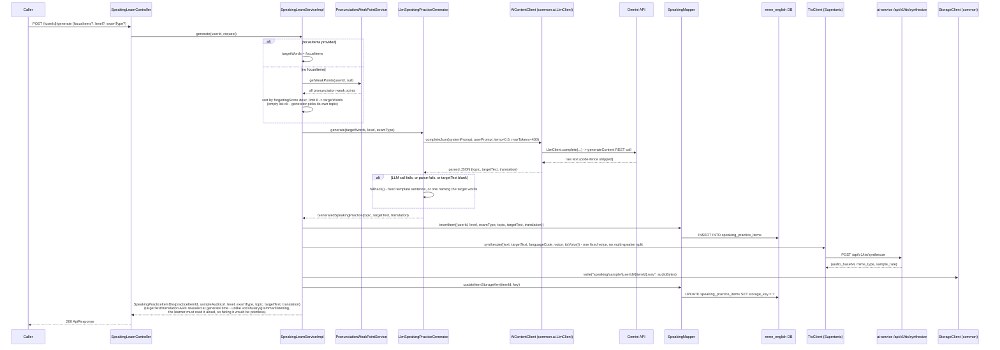
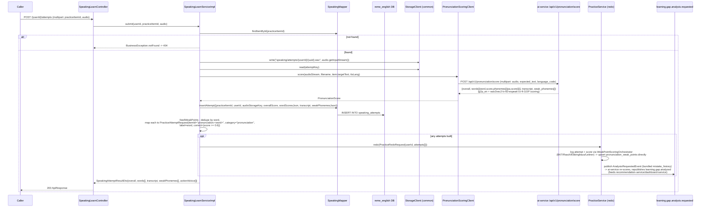
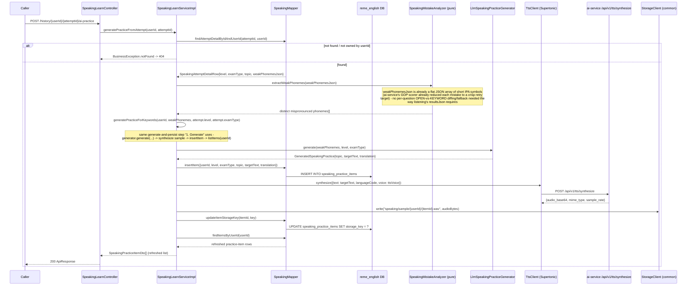
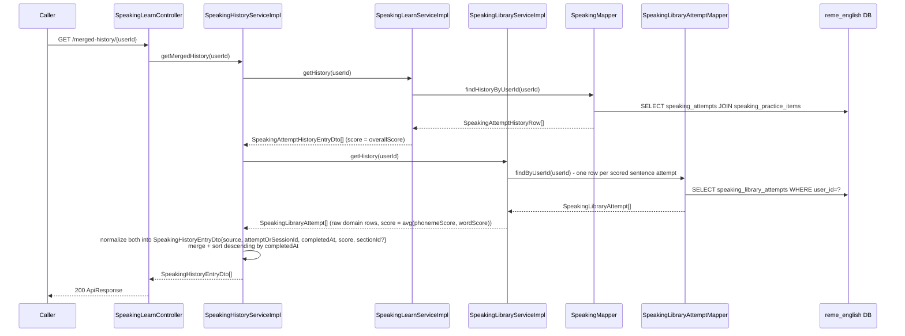

# Speaking learn: AI sentence + Supertonic sample, GOP-scored attempts

Covers `com.remelearning.english.speaking` (`SpeakingLearnController`/`SpeakingLearnServiceImpl`),
one of the four "Học &amp; Luyện tập với AI" skills (see `vocabulary-learn.md` for the shared
rationale). Generation is Gemini text + a single-voice Supertonic sample recording (simpler than
listening's multi-speaker dialogue - no `DialogueAudioSynthesizer`/`WavAudioMerger` needed, just one
direct `TtsClient.synthesize` call). Submission is a **multipart audio upload** (the learner's own
recording), scored via ai-service's wav2vec2 GOP (goodness-of-pronunciation) model through
`PronunciationScoringClient` - reusing the `pronunciation` domain's existing weak-point table/category
rather than introducing a new one (unlike listening's brand-new category). FE calls go through
`bff-service`'s `LearnerController` (`/api/v1/learners/{userId}/learn/speaking/...`); the submit
endpoint streams the uploaded `FilePart` straight through to english-service without buffering it in
bff-service, same convention as the recording-service multipart proxy - otherwise a pure pass-through,
omitted from the diagrams below as a separate hop.

This skill has no Kafka consumer/producer of its own for its request flow - grading reuses
`practice.service.PracticeService#redo`, which publishes `learning.gap.analysis.requested` exactly
like the other three skills.

## 1. Generate (`POST /api/v1/learn/speaking/{userId}/generate`)

## 2. Submit attempt (`POST /api/v1/learn/speaking/{userId}/attempts`, multipart)

## 3. Generate from one past attempt's mistakes (`POST /api/v1/learn/speaking/history/{userId}/{attemptId}/ai-practice`)

## 4. Merged history (`GET /api/v1/learn/speaking/merged-history/{userId}`)

Note: `SpeakingHistoryServiceImpl` is a standalone service, not folded into either
`SpeakingLearnServiceImpl` or `SpeakingLibraryServiceImpl`, for the same reason as
`GrammarHistoryServiceImpl`/`ListeningHistoryServiceImpl` (see `grammar-learn.md` section 4) -
`SpeakingLibraryServiceImpl` already depends on `SpeakingLearnService` (for
`generatePracticeFromSection`), so a reverse dependency would form a circular bean. Library rows are
merged at `SpeakingLibraryService#getHistory`'s existing granularity - one row per scored sentence
attempt, not rolled up per section (unlike Listening Library, which scores a whole section at once).

## External calls

| # | Call | From -> To | Notes |
|---|------|-----------|-------|
| 1 | HTTPS | english-service -> Gemini API | `LlmSpeakingPracticeGenerator` via `AiContentClient`/`LlmClient`; falls back to a template on any failure |
| 2 | HTTP | english-service -> ai-service `/api/v1/tts/synthesize` | Supertonic TTS, one fixed voice (`speaking.tts.voice`, default `F1`), single call (no per-speaker/per-line split like listening's dialogue) |
| 3 | HTTP (multipart) | english-service -> ai-service `/api/v1/pronunciation/score` | `AiServicePronunciationScoringClient` (`PronunciationScoringClient`); wav2vec2 GOP scoring against `item.targetText` |
| 4 | StorageClient write/read | english-service -> local FS (or S3) | both the Supertonic sample audio (generate/regenerate) and the learner's uploaded recording (submit) |
| 5 | Kafka produce | english-service -> `learning.gap.analysis.requested` | via `PracticeService#redo` -> `AnalysisRequestedProducer` |
| 6 | Postgres | english-service -> `reme_english` | `speaking_practice_items`, `speaking_attempts`, plus `pronunciation_weak_points` (upserted by `WeakPointScoringOrchestrator`) |

## Notes

- Speaking is the only one of the four "learn" skills whose `submit` is a multipart file upload
  rather than a JSON body of text answers - `bff-service`'s `LearnerController.submitSpeakingAttempt`
  takes a `FilePart` and relays it unbuffered.
- `targetText`/`translation` are revealed immediately in the `generate` response (not withheld until
  grading like vocabulary/grammar/listening) since the learner needs to read the sentence aloud - the
  only one of the four skills with this "reveal at generate" behavior.
- Reuses the `pronunciation` domain's existing weak-point table/service (`pronunciation_weak_points`,
  `PronunciationWeakPointService`) rather than adding a new one - the same category ai-service's
  original forgetting-pattern pipeline already produces, unlike listening's brand-new `"listening"`
  category (which - see `listening-learn.md`'s Notes - `WeakPointDispatcherImpl` doesn't actually
  route anywhere).
- Word-level correctness for the weak-point feed is binary (`score >= 0.6`), not the continuous GOP
  score itself - same simplification `ListeningLearnServiceImpl` applies to its KEYWORD questions.
- `generatePracticeForKeywords` (section 3) is the shared generate-and-persist step both
  `generatePracticeFromAttempt` and Speaking Library's own `generatePracticeFromSection` delegate to
  (see `speaking-library.md` section 3) - there is only one AI-practice destination
  (`speaking_practice_items`) per domain, regardless of which flow (learn attempt vs. library
  section) the mistake came from. Mirrors `listening-learn.md` section 3's same pattern.
- `SpeakingMistakeAnalyzer.extractWeakPhonemes` needs no OPEN-question-style fallback the way
  `ListeningMistakeAnalyzer.extractMissedTopics` does: `weakPhonemesJson` (both here and in Task 2's
  `SpeakingLibraryAttempt`) is already a flat JSON array of short IPA symbols computed by
  ai-service's GOP scorer (`WEAK_PHONEME_THRESHOLD`), never a full-sentence model answer, so it's
  always a crisp, generator-ready retry target on its own.
