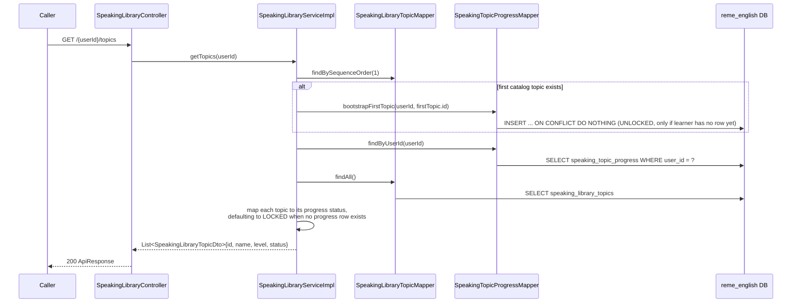
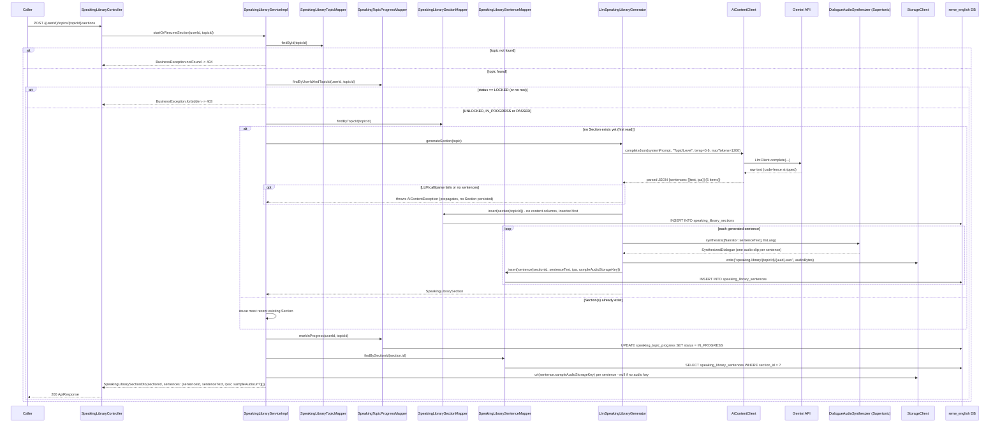
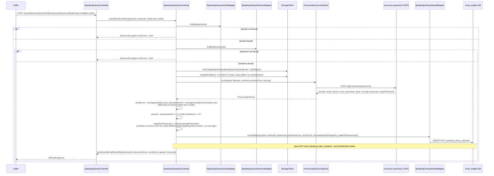
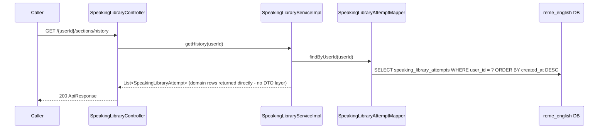
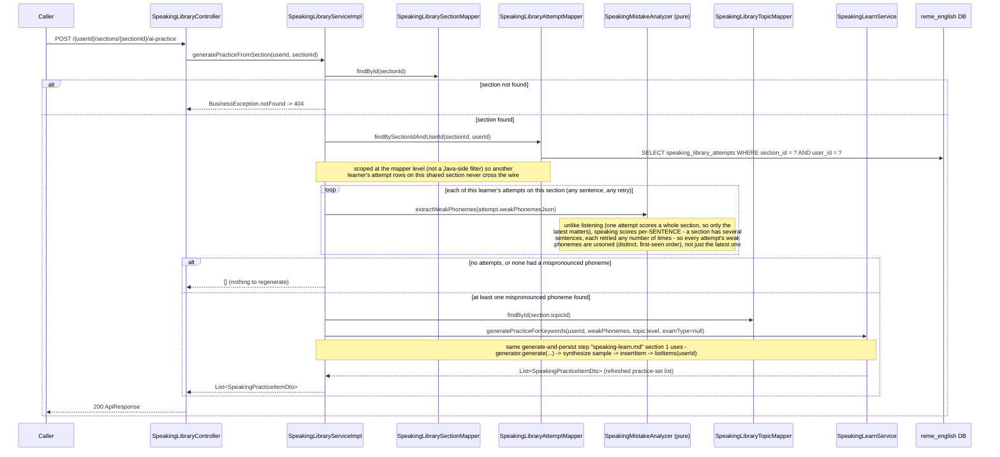

# Speaking library: fixed topic catalog + AI Section (sample sentences + per-sentence audio) + pass/unlock-next-topic

Covers `com.remelearning.english.speaking.library` (`SpeakingLibraryController`/
`SpeakingLibraryServiceImpl`), a fixed speaking-topic catalog (same names/order as
`grammar_library_topics`/`listening_library_topics`, seeded in `V20__speaking_library.sql`) crossing
the "AI content generated once, reused forever" pattern of [listening-library.md](listening-library.md)
with the same LOCKED/UNLOCKED/IN_PROGRESS/PASSED gating state machine. Each topic has one or more
Sections, each a pool of 5 sample sentences (with IPA + Supertonic-synthesized sample audio **per
sentence**, unlike listening's single passage-level audio), generated by AI on first read only. A
learner progresses topic-by-topic: only the first topic starts `UNLOCKED`. Unlike
`listening.library`, scoring is **per sentence** (`submitSentenceAttempt`, one attempt row per call,
does not itself touch topic progress) and gating only advances in a separate `finishSection` call,
which checks whether every sentence in the section has at least one attempt scoring ≥ 0.7
(`PASS_THRESHOLD`) on **both** `phonemeScore` and `wordScore` - reusing the same GOP
(Goodness-of-Pronunciation) scoring service `speaking.learn` already calls
(`common.ai.pronunciation.PronunciationScoringClient`), not a new scorer. FE calls go through
`bff-service`'s `LearnerController`, a pure pass-through, omitted below as a separate hop per
`vocabulary-library.md`'s convention - `bff-service` proxies all five of these endpoints (via
`EnglishServiceClient`/`LearnerController`), same as `listening.library`.

## 1. List topics (`GET /api/v1/learn/speaking/library/{userId}/topics`)



## 2. Start or resume a Section (`POST /{userId}/topics/{topicId}/sections`)



## 3. Submit one sentence attempt (`POST /{userId}/sections/{sectionId}/sentences/{sentenceId}/attempts`, multipart)



## 4. Finish a section (`POST /{userId}/sections/{sectionId}/finish`)

```mermaid
sequenceDiagram
    participant Caller
    participant Ctrl as SpeakingLibraryController
    participant Svc as SpeakingLibraryServiceImpl
    participant SMapper as SpeakingLibrarySectionMapper
    participant STMapper as SpeakingLibrarySentenceMapper
    participant AMapper as SpeakingLibraryAttemptMapper
    participant TMapper as SpeakingLibraryTopicMapper
    participant PMapper as SpeakingTopicProgressMapper
    participant DB as reme_english DB

    Caller->>Ctrl: POST /{userId}/sections/{sectionId}/finish
    Ctrl->>Svc: finishSection(userId, sectionId)
    Svc->>SMapper: findById(sectionId)
    alt section not found
        Svc-->>Ctrl: BusinessException.notFound -> 404
    else section found
        Svc->>STMapper: findBySectionId(sectionId)
        Svc->>AMapper: findBySectionIdAndUserId(sectionId, userId)<br/>(bugfix: scoped to the calling learner only - a section is a shared<br/>catalog object other learners may also have attempted; the unscoped<br/>findBySectionId used to let another learner's passing attempts count<br/>toward THIS learner's pass/unlock decision)
        Svc->>Svc: a sentence "passes" if any of THIS learner's own attempts scored<br/>phonemeScore >= 0.7 AND wordScore >= 0.7 (PASS_THRESHOLD)
        Svc->>Svc: passed = every sentence in the section has passed (and there is at least one sentence)
        alt passed
            Svc->>TMapper: findById(section.topicId)
            Svc->>PMapper: markPassed(userId, topic.id)
            PMapper->>DB: UPDATE speaking_topic_progress SET status = PASSED
            Svc->>TMapper: findBySequenceOrder(topic.sequenceOrder + 1)
            opt next topic exists
                Svc->>PMapper: unlockIfLocked(userId, nextTopic.id)
                PMapper->>DB: INSERT ... ON CONFLICT DO UPDATE ... WHERE status = 'LOCKED'
                Svc->>PMapper: findByUserIdAndTopicId(userId, nextTopic.id) - re-read to report honestly
            end
        end
        Svc-->>Ctrl: FinishSectionResponse{totalSentences, passedSentences, passed,<br/>nextTopicId?, nextTopicUnlocked}
        Ctrl-->>Caller: 200 ApiResponse
    end
```

## 5. History (`GET /{userId}/sections/history`)



## 6. Generate from this learner's own attempts on a section (`POST /{userId}/sections/{sectionId}/ai-practice`)



## External calls

| # | Call | From -> To | Notes |
|---|------|-----------|-------|
| 1 | HTTPS | english-service -> Gemini API | `LlmSpeakingLibraryGenerator` via `AiContentClient`, first-read Section generation only; same "no static-template fallback, `AiContentException` propagates" behavior as `LlmListeningLibraryGenerator` |
| 2 | Supertonic TTS (in-process/local call, via `DialogueAudioSynthesizer`) | english-service -> Supertonic | synthesizes each generated sentence individually as a single-speaker ("Narrator") monologue - one clip per sentence, unlike listening's one clip per whole passage |
| 3 | HTTPS | english-service -> ai-service | `PronunciationScoringClient.score(...)` -> `POST /api/v1/pronunciation/score` (wav2vec2 GOP model) - the exact same call `speaking.learn`'s `SpeakingLearnServiceImpl.submit` already makes, reused as-is rather than reimplemented |
| 4 | `StorageClient` (S3/local, per `common.storage`) | english-service -> storage backend | writes/reads each sentence's sample audio (`speaking-library/{topicId}/{uuid}.wav`) and each learner's recorded attempt audio (`speaking-library/attempts/{userId}/{uuid}.wav`), plus (flow 6) the regenerated practice item's own sample audio |
| 5 | Postgres | english-service -> `reme_english` | `speaking_library_topics`, `speaking_library_sections`, `speaking_library_sentences`, `speaking_topic_progress`, `speaking_library_attempts` |
| 6 | In-process | english-service -> `SpeakingLearnService#generatePracticeForKeywords` | fired only by flow 6 (generate-from-section); delegates the actual generate-and-persist step (including sample-audio synthesis) to `speaking.learn` so both flows feed the same `speaking_practice_items` bank |

## Notes

- `speaking_library_topics` is a fixed, hand-seeded catalog (60 rows, `V20__speaking_library.sql`,
  same topic set/order as `grammar_library_topics`/`listening_library_topics`) - nothing about the
  topic list itself is ever AI-generated; only a topic's Section (sample sentences + IPA + per-sentence
  audio) is, once.
- Unlike `listening.library`'s single answers-submission that scores a whole section and immediately
  checks pass/unlock, `speaking.library` splits this into two calls: `submitSentenceAttempt` (scores
  and persists one sentence, any number of retries allowed, no gating side-effect) and `finishSection`
  (the only call that reads `speaking_topic_progress`/marks it `PASSED`/unlocks the next topic) -
  needed because recording+scoring a whole section's worth of sentences in one request isn't a
  realistic UX for a speaking exercise (a learner records one sentence, listens back, and may re-record
  before moving to the next).
- A sentence counts as "passed" for `finishSection` if **any** of its attempts (not necessarily the
  most recent one) scored above `PASS_THRESHOLD` on both `phonemeScore` and `wordScore` - a learner
  doesn't need their last attempt to be the passing one.
- `phonemeScore`/`wordScore` are each a plain arithmetic mean over `PronunciationScore.words()`'
  per-word scores and over every word's `phonemes()`' per-phoneme scores respectively - `speaking.learn`
  keeps the full per-word/per-phoneme breakdown in its response (`WordScoreDto[]`), but this library
  skill only needs two single numbers per attempt for its pass/fail gate, so the breakdown is collapsed
  at score time rather than persisted. The per-attempt weak-phoneme list (`weak_phonemes_json`) is the
  one piece of the breakdown that *is* persisted verbatim - reused as-is from
  `PronunciationScore.weakPhonemes()` (already thresholded by ai-service's GOP scorer, see
  `speaking.learn`'s identical treatment), needed for a later "AI retry targeting past mistakes" feature.
- `unlockIfLocked` is the same guarded upsert pattern as `listening.library`/`grammar.library`
  (`INSERT ... ON CONFLICT DO UPDATE ... WHERE status = 'LOCKED'`) so it never regresses a topic the
  learner has already reached past `LOCKED` - see `SpeakingTopicProgressMapper.xml`.
- `getHistory` returns the `SpeakingLibraryAttempt` domain object directly (no dedicated history DTO),
  same simplification as `listening.library`'s `getHistory`.
- Like the other "Học &amp; Luyện tập" skills, this package has no Kafka consumer/producer of its own
  and does not call `PracticeService#redo` - scoring here only writes to `speaking_library_attempts`
  and `speaking_topic_progress`, not to `pronunciation_weak_points` (unlike `speaking.learn`, which
  does feed that table) - a deliberate scope cut mirroring `listening.library`'s equivalent gap.
- `bff-service` proxies the first five of these endpoints through its own `LearnerController` (backed
  by `EnglishServiceClient`), the same pass-through pattern already used for `listening.library`.
  Flow 6 (`ai-practice`) is new in this service and is **not yet** proxied by `bff-service` - out of
  scope for this change, same as Listening Library's own `ai-practice` endpoint when it was first added.
- Flow 6 is a new dependency of `SpeakingLibraryServiceImpl` on `SpeakingLearnService` (interface, not
  the concrete `SpeakingLearnServiceImpl`) - the only cross-package collaborator this service has,
  added specifically so both the learn and library "Luyện tập với AI" actions share exactly one
  persistence path (`speaking_practice_items`) instead of the library growing its own parallel bank.
  See `speaking-learn.md` section 3 for the shared step's own diagram.
- Unlike `listening.library`'s `findLatestAttemptForSection` (only the single most-recent attempt
  matters, since one attempt scores a whole section) and unlike Grammar/Listening Library's
  topic-name fallback (needed when the per-question/per-prompt text is too diffuse a retry target),
  flow 6 neither takes only the latest attempt nor falls back to the topic name: every one of this
  learner's own attempts on the section is unioned (a section has several sentences, each retried any
  number of times, so different attempts can each surface different mispronunciations), and the
  phonemes themselves - already short IPA symbols computed by ai-service's GOP scorer - are always a
  good-enough generator target on their own, with no per-sentence taxonomy needed.
- `attemptMapper.findBySectionId` returns every attempt on a Section from every learner who has ever
  tried it (a Section is a shared catalog object) and is no longer used by either `finishSection` or
  flow 6's `generatePracticeFromSection` - both call the user-scoped
  `findBySectionIdAndUserId(sectionId, userId)` mapper query instead, added specifically to close a
  cross-user data leak: `finishSection` used to determine THIS learner's pass/unlock status from
  every learner's attempts combined, so Learner B could be marked as having passed a sentence (and
  have their topic gated forward) purely because Learner A had a passing attempt on it, never having
  attempted it themselves. `findBySectionId` is kept in the mapper as a general-purpose query but has
  no remaining caller in this service.
