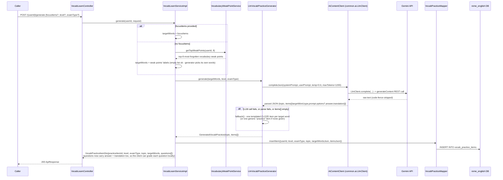
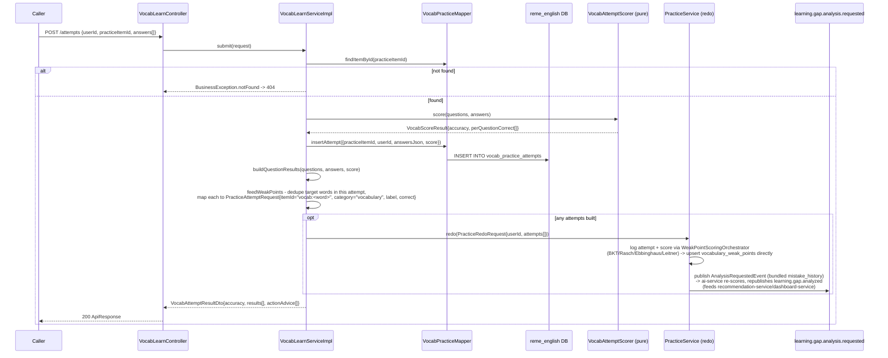

# Vocabulary learn: AI-generated practice sets + graded attempts

Covers `com.remelearning.english.vocabulary.learn` (`VocabLearnController`/`VocabLearnServiceImpl`),
one of four "Học &amp; Luyện tập với AI" skills built this session (vocabulary/grammar/listening/
speaking), all structurally identical: generate one AI practice set targeting the learner's own top
weak points (or an explicit focus list), grade a submitted attempt, and feed each graded word back
into the existing spaced-repetition/weak-point pipeline via `PracticeService#redo` instead of a
bespoke publisher. FE calls go through `bff-service`'s `LearnerController` (`/api/v1/learners/
{userId}/learn/vocabulary/...`), which is a pure pass-through (`EnglishServiceClient`, no
transformation beyond stamping `userId` onto the request body) — omitted from the diagrams below as
a separate hop, same as `dictation-practice.md`'s convention of a generic `Caller`.

This skill is AI-only: there's no rule-based generator, only `LlmVocabPracticeGenerator` with a
static-template fallback on any LLM call/parse failure, so generating a set never breaks. Unlike
`dictation`, this skill has no Kafka consumer/producer of its own for its request flow — grading
reuses `practice.service.PracticeService#redo`, which is what actually publishes
`learning.gap.analysis.requested` (see `overview.md` section 3 / `practice-redo.md`).

## 1. Generate (`POST /api/v1/learn/vocabulary/{userId}/generate`)

## 2. Submit attempt (`POST /api/v1/learn/vocabulary/attempts`)

## External calls

| # | Call | From -> To | Notes |
|---|------|-----------|-------|
| 1 | HTTPS | english-service -> Gemini API | `LlmVocabPracticeGenerator` via `AiContentClient`/`LlmClient`; falls back to a templated CLOZE item on any failure |
| 2 | Kafka produce | english-service -> `learning.gap.analysis.requested` | via `PracticeService#redo` -> `AnalysisRequestedProducer`, same mechanism as the practice/redo flow (`practice-redo.md`) |
| 3 | Postgres | english-service -> `reme_english` | `vocab_practice_items`, `vocab_practice_attempts`, plus `vocabulary_weak_points` (upserted by `WeakPointScoringOrchestrator`, not this package's own mapper) |

## Notes

- No new Kafka consumer/producer for this skill's own request flow - it reuses `vocabulary`'s
  existing `VocabularyWeakPointService` (read) and `practice.service.PracticeService#redo` (write +
  publish) in-process, same reuse pattern `dictation` and the other three "learn" skills follow.
- `feedWeakPoints` treats each question's target word as one binary correct/incorrect attempt (not a
  continuous score) - the same simplification `SpeakingLearnServiceImpl`/`ListeningLearnServiceImpl`
  apply to their own graded units.
- **Client-side grading (contract change):** the practice-set response (`generate`/`getItem`/
  `listItems`) now carries `answer` + `translation` per question, so the client checks each answer
  locally for instant feedback before ever calling `submit`. The call order above is unchanged - this
  is purely a client-side behaviour on top of the same payload - and the authoritative score is still
  produced only by the `submit` step (which persists history + weak points and fires Kafka).
- Not independently confirmed in code for this report: whether the FE ever calls `GET /items/{itemId}`
  directly versus always going through `generate` immediately followed by rendering its own response -
  both endpoints exist (`VocabLearnController`) but only `generate`/`submit` are diagrammed above per
  the requested scope.
