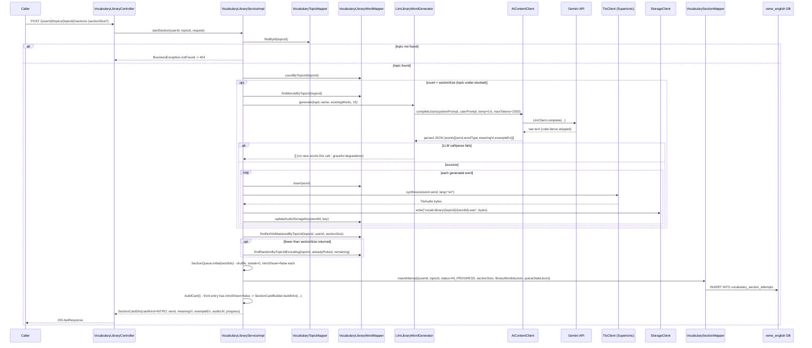

# Vocabulary library: topic word bank + Leitner-lite Section practice

Covers `com.remelearning.english.vocabulary.library` (`VocabularyLibraryController`/
`VocabularyLibraryServiceImpl`), which extends the "Học &amp; Luyện tập với AI" vocabulary skill
(see `vocabulary-learn.md`) with a persistent, topic-organized word bank plus a Duolingo/Anki-style
"Section" practice mode: a queue of words drilled with intra-session repetition (a word leaves the
queue once answered correctly twice in a row; a wrong answer resets its streak and requeues it
sooner than a correct-but-not-yet-mastered answer does - see `SectionQueue`). Library words and the
ad-hoc "Học & Luyện tập" flow share one mastery record per word (`vocabulary_weak_points`, keyed by
`item_id = "vocab:" + word`) - this skill introduces no second mastery table. FE calls go through
`bff-service`'s `LearnerController`, a pure pass-through (`EnglishServiceClient`), omitted below as
a separate hop per `vocabulary-learn.md`'s convention.

## 1. Start a Section (`POST /api/v1/learn/vocabulary/library/{userId}/topics/{topicId}/sections`)



## 2. Submit an answer (`POST /api/v1/learn/vocabulary/library/sections/{sectionId}/answers`)

```mermaid
sequenceDiagram
    participant Caller
    participant Ctrl as VocabularyLibraryController
    participant Svc as VocabularyLibraryServiceImpl
    participant SMapper as VocabularySectionMapper
    participant WMapper as VocabularyLibraryWordMapper
    participant Scorer as SectionAnswerScoring (pure)
    participant Grader as OpenAnswerGrader (LLM, TRANSLATE_EN_TO_VI only)
    participant Queue as SectionQueue (pure)
    participant PSvc as PracticeService (redo)
    participant DB as reme_english DB

    Caller->>Ctrl: POST /sections/{sectionId}/answers {submittedAnswer?}
    Ctrl->>Svc: submitAnswer(sectionId, request)
    Svc->>SMapper: findAttemptById(sectionId)
    alt not found or not IN_PROGRESS
        Svc-->>Ctrl: BusinessException.notFound/conflict -> 404/409
    else in progress
        Svc->>Svc: readQueue(attempt.queueStateJson); entry = SectionQueue.current(queue)
        alt entry.introShown == false (first exposure)
            Svc->>Queue: acknowledgeIntro(queue)
            Svc->>SMapper: updateAttemptQueueState(...)
            Svc->>Svc: buildCard() -> QUIZ of a freshly-rolled exercise type
            Svc-->>Ctrl: SectionAnswerResultDto{correct=true, completed=false, nextCard=QUIZ card}
        else quiz already shown (entry.pendingExerciseType set)
            alt type == TRANSLATE_EN_TO_VI
                Svc->>Grader: grade(exampleEn, question, meaningVi, submittedAnswer)
                Grader-->>Svc: OpenAnswerGrade{score, feedback}
            else every other type
                Svc->>Scorer: scoreClosed(type, correctAnswer, submittedAnswer)
                Scorer-->>Svc: score (WER accuracy or exact-match 1.0/0.0)
            end
            Svc->>SMapper: insertAnswer({sectionAttemptId, libraryWordId, exerciseType, submittedAnswer, score, correct})
            SMapper->>DB: INSERT INTO vocabulary_section_answers
            Svc->>Queue: applyResult(queue, correct)
            alt correct and streak reaches MASTERY_STREAK=2
                Note over Queue: word dropped from queue (mastered this session)
            else correct, not yet mastered
                Note over Queue: requeued +6 cards (capped by remaining length)
            else wrong
                Note over Queue: streak reset to 0, requeued +2 cards
            end
            alt queue now empty (SectionQueue.isComplete)
                Svc->>SMapper: completeAttempt(sectionId, "COMPLETED")
                Svc->>SMapper: findAnswersByAttemptId(sectionId)
                Svc->>WMapper: findById(libraryWordId) per answer
                Svc->>PSvc: redo(PracticeRedoRequest{userId, attempts[] - one per answer, NOT deduped by word})
                Note over PSvc: a repeated itemId in this batch sets recurredInBatch=true<br/>(WeakPointScoringEngine's recurrence boost) - the whole point of in-session repetition
                Svc-->>Ctrl: SectionAnswerResultDto{completed=true, nextCard=null, progress=100%}
            else queue still has words
                Svc->>SMapper: updateAttemptQueueState(...)
                Svc->>Svc: buildCard() for the new front entry
                Svc-->>Ctrl: SectionAnswerResultDto{correct, correctAnswer, completed=false, nextCard}
            end
        end
        Ctrl-->>Caller: 200 ApiResponse
    end
```

## External calls

| # | Call | From -> To | Notes |
|---|------|-----------|-------|
| 1 | HTTPS | english-service -> Gemini API | `LlmLibraryWordGenerator` via `AiContentClient`; degrades to no new words on failure (not a templated fallback - a library word needs a real dictionary meaning) |
| 2 | HTTPS/gRPC | english-service -> Supertonic TTS | `TtsClient.synthesize`, once per newly-generated word (never at Section-runtime) |
| 3 | S3/MinIO or local disk | english-service -> `StorageClient` | one `.wav` per library word, key `vocab-library/{topicId}/{wordId}.wav` |
| 4 | In-process | english-service -> `PracticeService#redo` | same mechanism as `vocabulary-learn.md` §2, but attempts are NOT deduped by word (see note above) |
| 5 | Postgres | english-service -> `reme_english` | `vocabulary_topics`, `vocabulary_library_words`, `vocabulary_section_attempts`, `vocabulary_section_answers`, plus `vocabulary_weak_points` (shared with `vocabulary-learn.md`) |

## Notes

- `finishSection` (`POST /sections/{sectionId}/finish`) is the same flow as the "queue now empty"
  branch above, except it can fire mid-queue (learner quits early) and marks the attempt `ABANDONED`
  instead of `COMPLETED`; it still feeds whatever was answered into `PracticeService#redo`.
- `SectionCardBuilder` never sets a field on a QUIZ card that would hand the learner the answer
  (e.g. no `audioUrl` for CLOZE/MCQ, since pronouncing the word aloud would defeat those exercises) -
  see the design spec's leak table for the full per-type rule.
