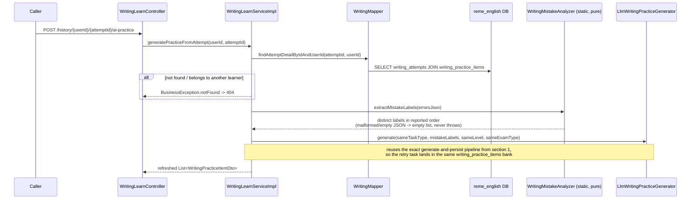

# Writing learn: AI-generated writing/translation tasks, criterion-based grading, next-sentence hints

Covers `com.remelearning.english.writing` (`WritingLearnController`/`WritingLearnServiceImpl`), the
fifth "Học & Luyện tập với AI" skill (see `vocabulary-learn.md` for the shared rationale). One domain
serves **three task types** — `COMPOSE` (write English from a Vietnamese brief), `TRANSLATE_VI_EN`,
`TRANSLATE_EN_VI` — because all three share the generate → write → grade flow entirely; the task type
only changes what `promptText` means and which fourth criterion is scored. FE calls go through
`bff-service`'s `LearnerController` (`/api/v1/learners/{userId}/learn/writing/...`), a pure
pass-through, omitted from the diagrams below (same convention as the other skill docs).

**The one structural difference from every other skill: this domain has no weak-point table of its
own.** Every mistake the grader reports already carries its own `category` (`"grammar"` or
`"vocabulary"`), so errors are routed into the existing `grammar_weak_points`/
`vocabulary_weak_points` rows via `PracticeService#redo` → `WeakPointDispatcher`. That is what makes
a "past perfect" slip while writing add to the same label already accumulated from
dictation/listening, instead of starting a parallel tally. The routing itself lives in
`WritingErrorPipeline`, shared with the library tab (section 5) so the two cannot drift apart.

No new Kafka topic, producer or consumer was added for this skill.

## 1. Generate (`POST /api/v1/learn/writing/{userId}/generate`)

```mermaid
sequenceDiagram
    participant Caller
    participant Ctrl as WritingLearnController
    participant Svc as WritingLearnServiceImpl
    participant GWP as GrammarWeakPointService
    participant VWP as VocabularyWeakPointService
    participant Gen as LlmWritingPracticeGenerator
    participant Ai as AiContentClient (common.ai.LlmClient)
    participant Gemini as Gemini API
    participant WMapper as WritingMapper
    participant DB as reme_english DB

    Caller->>Ctrl: POST /{userId}/generate {taskType, level?, examType?, focusItems?}
    Ctrl->>Svc: generate(userId, request)
    alt focusItems provided
        Svc->>Svc: targetLabels = focusItems
    else no focusItems
        Svc->>GWP: getTopWeakPoints(userId, 8)
        GWP->>DB: SELECT grammar_weak_points ORDER BY forgetting_score DESC
        Svc->>VWP: getTopWeakPoints(userId, 8)
        VWP->>DB: SELECT vocabulary_weak_points ORDER BY forgetting_score DESC
        Svc->>Svc: concat both, distinct, limit 8<br/>(writing is the one skill exercising grammar AND vocabulary at once;<br/>empty list is fine - the generator picks its own topic)
    end
    Svc->>Gen: generate(taskType, targetLabels, level, examType)
    Gen->>Ai: completeJson(systemPrompt, userPrompt, temp=0.6, maxTokens=1400)
    Ai->>Gemini: LlmClient.complete(...) -> generateContent REST call
    Gemini-->>Ai: raw text (code-fence stripped)
    Ai-->>Gen: parsed JSON {topic, promptText, referenceAnswer}
    alt LLM call fails, parse fails, or promptText blank
        Gen->>Gen: fallback(taskType) - fixed template per task type,<br/>still carrying its Vietnamese instruction line
    end
    Gen-->>Svc: GeneratedWritingPractice{topic, promptText, referenceAnswer}
    Svc->>WMapper: insertItem(WritingPracticeItem{taskType, sourceLang, targetLang, referenceAnswer, targetLabelsJson})
    WMapper->>DB: INSERT writing_practice_items
    Svc-->>Ctrl: WritingPracticeItemDto (NO referenceAnswer field at all)
    Ctrl-->>Caller: ApiResponse<WritingPracticeItemDto>
```

`sourceLang`/`targetLang` are derived from the task type (`WritingTaskType.sourceLang()/targetLang()`),
not sent by the client. `promptText` always begins with a Vietnamese instruction line — including in
the offline fallback — per the project rule that every practice item states its requirement in
Vietnamese.

## 2. Suggest next sentence (`POST /api/v1/learn/writing/suggest`)

One LLM call per press of the "Gợi ý câu tiếp theo" button. There is no debounce, no ghost-text and
no background polling, so a learner who never asks for a hint costs nothing.

```mermaid
sequenceDiagram
    participant Caller
    participant Ctrl as WritingLearnController
    participant Svc as WritingLearnServiceImpl
    participant WMapper as WritingMapper
    participant DB as reme_english DB
    participant Sug as LlmNextSentenceSuggester
    participant Ai as AiContentClient
    participant Gemini as Gemini API

    Caller->>Ctrl: POST /suggest {practiceItemId, draftText?}
    Ctrl->>Svc: suggest(request)
    Svc->>WMapper: findItemById(practiceItemId)
    WMapper->>DB: SELECT writing_practice_items
    Note over Svc,Sug: Only taskType/promptText/draftText/level are passed on.<br/>referenceAnswer is deliberately NOT a parameter of the suggester -<br/>for a translation task, handing it over would make the hint the answer.
    Svc->>Sug: suggest(taskType, promptText, draftText, level)
    alt taskType is TRANSLATE_VI_EN or TRANSLATE_EN_VI
        Sug->>Sug: pick TRANSLATE_SYSTEM_PROMPT - may only name the required<br/>structure and gloss <=2 hard words; never translate a sentence
    else taskType is COMPOSE
        Sug->>Sug: pick COMPOSE_SYSTEM_PROMPT - scaffolding, never a finished sentence
    end
    Sug->>Ai: completeJson(systemPrompt, userPrompt, temp=0.7, maxTokens=900)
    Ai->>Gemini: LlmClient.complete(...)
    Gemini-->>Ai: raw JSON array
    Ai-->>Sug: LlmSuggestion[]
    alt LLM/parse failure
        Sug->>Sug: return empty list (never throws - a flaky hint<br/>must not interrupt the writing session)
    end
    Sug-->>Svc: List<WritingSuggestion>{ideaVi, structureHint, usefulPhrases[]}
    Svc-->>Ctrl: same list (suggestions are never recorded as a mistake)
    Ctrl-->>Caller: ApiResponse<List<WritingSuggestion>>
```

## 3. Submit + grade (`POST /api/v1/learn/writing/attempts`)

The core of the feature: this is where a writing mistake becomes a weak point.

```mermaid
sequenceDiagram
    participant Caller
    participant Ctrl as WritingLearnController
    participant Svc as WritingLearnServiceImpl
    participant WMapper as WritingMapper
    participant DB as reme_english DB
    participant Grader as LlmWritingGrader
    participant Ai as AiContentClient
    participant Gemini as Gemini API
    participant Pipe as WritingErrorPipeline
    participant Practice as PracticeService (practice package)

    Caller->>Ctrl: POST /attempts {userId, practiceItemId, submittedText}
    Ctrl->>Svc: submit(request)
    Svc->>WMapper: findItemById(practiceItemId)
    WMapper->>DB: SELECT writing_practice_items
    Svc->>Grader: grade(taskType, promptText, referenceAnswer, submittedText)
    Note over Grader: The grader DOES get the reference answer -<br/>it cannot mark a translation without it.
    Grader->>Ai: completeJson(systemPrompt, userPrompt, temp=0.2, maxTokens=2400)
    Ai->>Gemini: LlmClient.complete(...)
    Gemini-->>Ai: raw JSON {criteria, correctedText, feedbackVi, errors[]}
    Ai-->>Grader: LlmPayload
    Grader->>Grader: clamp each criterion to [0,1]; missing criterion -> 0 + log.warn
    Grader->>Grader: keep only the 4th criterion matching the task type<br/>(accuracy for TRANSLATE_*, taskResponse for COMPOSE)
    Grader->>Grader: drop errors with a blank label or a category<br/>outside grammar/vocabulary (nothing owns them)
    alt LLM/parse failure
        Grader->>Grader: neutral 0.5 across the board, empty error list,<br/>Vietnamese explanation - nothing bogus reaches weak points
    end
    Grader-->>Svc: WritingGrade{criteria, correctedText, errors[], feedbackVi}
    Svc->>Pipe: averageCriteria(criteria)
    Note over Svc,Pipe: overallScore is the mean of the POPULATED criteria, computed in Java -<br/>the LLM's own overall figure is ignored, it routinely contradicts<br/>the criteria it just scored.
    Svc->>WMapper: insertAttempt(WritingAttempt{criteriaJson, errorsJson, feedback, overallScore})
    WMapper->>DB: INSERT writing_attempts
    Svc->>Pipe: feedWeakPoints(userId, errors)
    Pipe->>Pipe: per error: prefix = {grammar -> "grammar:", vocabulary -> "vocab:"}<br/>itemId = prefix + label.toLowerCase(); dedupe by (category, label)
    Note over Pipe: The prefixes are NOT the category names - vocabulary's existing rows<br/>are keyed "vocab:". Deriving a prefix from the category would key writing<br/>mistakes under "vocabulary:" and quietly fork the learner's history.
    alt at least one routable error
        Pipe->>Practice: redo(PracticeRedoRequest{userId, attempts[]})
        Note over Practice: see practice-redo.md - updates grammar/vocabulary weak points,<br/>refreshes mistake_history's Leitner schedule (review queue),<br/>and publishes learning.gap.analysis.requested
    else no routable error (e.g. flawless submission)
        Pipe->>Pipe: no call at all - no pointless event
    end
    Svc-->>Ctrl: WritingAttemptResultDto (referenceAnswer revealed only now)
    Ctrl-->>Caller: ApiResponse<WritingAttemptResultDto>
```

### External calls (section 3)

| Target | Call | Failure handling |
|---|---|---|
| Gemini (via `AiContentClient`) | 1 completion per submission | Neutral 0.5 grade, empty errors, Vietnamese notice; attempt is still recorded |
| `reme_english` DB | `SELECT writing_practice_items`, `INSERT writing_attempts` | Transactional (`@Transactional` on `submit`) |
| `practice` package (in-process) | `PracticeService#redo` | Same as the other skills — see [practice-redo.md](practice-redo.md) |

## 4. History, detail and retry

`GET /api/v1/learn/writing/history/{userId}` and `.../history/{userId}/{attemptId}` read straight off
`writing_attempts`; the detail endpoint deserializes the stored `criteria`/`errors` JSON rather than
re-grading, so opening history costs no LLM call and always shows exactly what the learner saw. A
mismatched `userId` is a 404, not another learner's row.



## 5. Library tab

See [writing-library.md](writing-library.md) — the fixed catalogue side, notable for being the only
library with three independent taxonomy axes. It grades through the very same `WritingGrader` and
`WritingErrorPipeline` used above.
