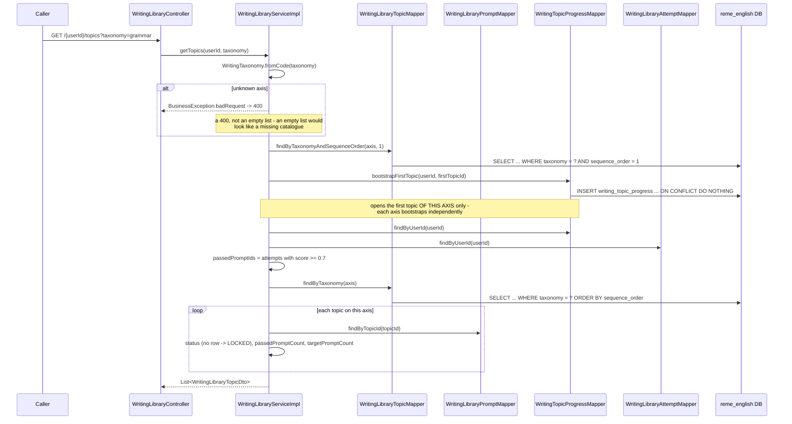
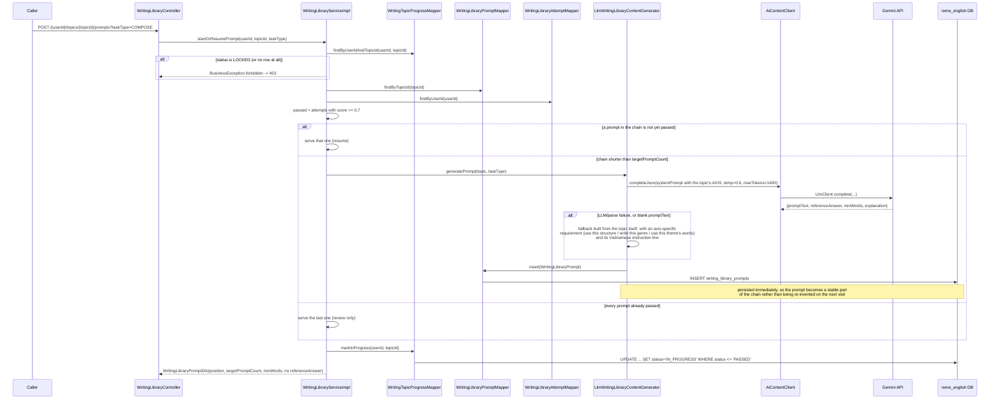
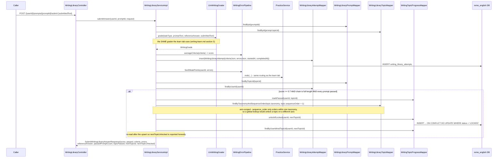

# Writing library: fixed catalogue over three independent taxonomy axes

Covers `com.remelearning.english.writing.library`
(`WritingLibraryController`/`WritingLibraryServiceImpl`), the "Thư viện" side of the writing skill —
see [writing-learn.md](writing-learn.md) for the "học thường" side and for why this domain has no
weak-point table of its own.

Structurally this clones `listening-library.md`'s LOCKED/UNLOCKED/IN_PROGRESS/PASSED gating and its
lazily-generated content chain. **The one behavioural difference from every other library: three
independent axes.**

| `taxonomy` | Content | Topics |
|---|---|---|
| `grammar` | The same 60-topic taxonomy as `grammar_library_topics`/`listening_library_topics` (same codes/names/order, independent ids) — each task must actually use that structure | 60 |
| `genre` | Real-world text types: personal message, formal email, descriptive/narrative paragraph, opinion & pros-cons essay, IELTS Task 1/2, complaint letter, cover letter, report, argumentative essay | 12 |
| `vocab_theme` | The `vocabulary_topics` theme set (V16): daily-life, food, travel, business, technology, health, education, environment | 8 |

`writing_library_topics.sequence_order` is unique **per taxonomy only** and restarts at 1 on each
axis; `UNIQUE (taxonomy, code)` likewise. Everything axis-related is therefore scoped: bootstrapping
opens the first topic of *each* axis independently, and "unlock the next topic" only ever looks within
the passed topic's own axis. A global `findBySequenceOrder` (as the other libraries have) would jump
between axes here, which is why the mapper takes the taxonomy as part of the key.

A topic is a chain of **3–6 prompts** (`targetPromptCount`, derived deterministically from `topicId`
so it is stable across calls without needing a column). The catalogue ships topics, not content: each
prompt is LLM-generated the first time a learner reaches that position and then persisted, so leaving
and coming back shows the same task. A topic only flips to `PASSED` once the chain has reached full
length **and** every prompt in it is passed (score ≥ 0.7).

## 1. List topics on one axis (`GET /api/v1/learn/writing/library/{userId}/topics?taxonomy=...`)

## 2. Start or resume a prompt (`POST .../topics/{topicId}/prompts?taskType=...`)

The axis is part of the generation prompt, so a `grammar` topic forces its structure, a `genre` topic
produces a real piece of that text type, and a `vocab_theme` topic pushes that theme's vocabulary.

## 3. Submit + advance (`POST .../prompts/{promptId}/submit`)

## 4. Retry from a library attempt (`POST .../attempts/{attemptId}/ai-practice`)

Mirrors `ListeningLibraryServiceImpl#generatePracticeFromSection`: verifies the attempt belongs to
this learner, extracts its error labels via the pure `WritingMistakeAnalyzer`, then delegates to
`WritingLearnService#generatePracticeForLabels` so the regenerated task lands in the same
`writing_practice_items` bank the learn tab uses. An attempt with no mistakes returns an empty list
rather than generating something unrelated.

## External calls

| Target | Call | Failure handling |
|---|---|---|
| Gemini (via `AiContentClient`) | 1 completion per newly generated prompt; 1 per submission (grading) | Generation falls back to a topic-derived template; grading falls back to a neutral score with no errors |
| `reme_english` DB | topics/prompts/progress/attempts | `@Transactional` on every mutating method |
| `practice` package (in-process) | `PracticeService#redo` via `WritingErrorPipeline` | See [practice-redo.md](practice-redo.md) |
| `writing` package (in-process) | `WritingLearnService#generatePracticeForLabels` for the retry action | Propagates the learn tab's own fallbacks |
