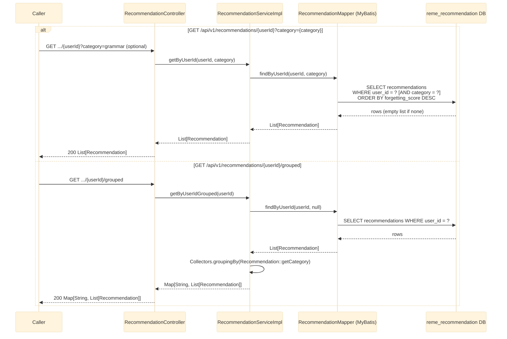

# GET /api/v1/recommendations/{userId} and /{userId}/grouped

Returns the recommendation rows persisted for a user, written by `LearningGapAnalyzedConsumer` (see
[learning-gap-analyzed.md](learning-gap-analyzed.md)). Covers every category (vocabulary, grammar,
pronunciation) since `recommendation-service` doesn't filter by category on ingestion. See
`recommendation-service`'s `controller/RecommendationController.java`.

## Notes

- `category` is a free-form string (`vocabulary`, `grammar`, `pronunciation`) mirrored from
  `WeakPointPayload.category` as-is, not a Java enum like `english-service`'s per-domain
  `VocabularyType`/`GrammarType`/`PronunciationType` — recommendation-service aggregates across
  domains rather than classifying within one.
- `Recommendation` fields: `id, userId, recordingId, itemId, category, label, forgettingScore,
  recommendationText, updatedAt`.
- No validation/exception path beyond a normal DB query — no matching data simply returns an empty
  list, not a 404.
