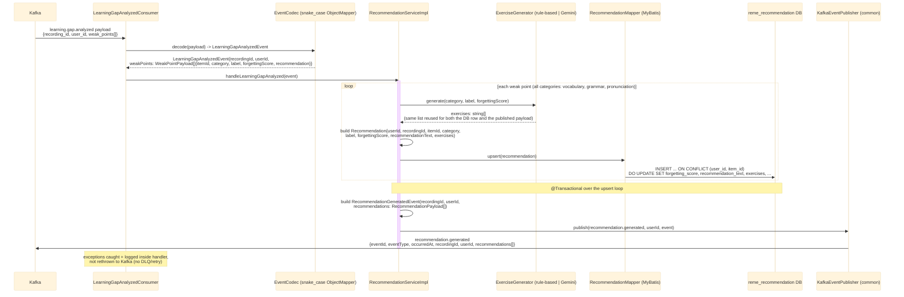

# Kafka consumer: learning.gap.analyzed -> recommendation.generated

`LearningGapAnalyzedConsumer` (package `recommendation.kafka`, `groupId: recommendation-service`)
listens on the `learning.gap.analyzed` topic (published by `ai-service` after forgetting-pattern
analysis — see [../Ai_service/overview.md](../Ai_service/overview.md) and
[../Ai_service/analyze.md](../Ai_service/analyze.md)). Unlike `english-service`'s per-domain
consumers, it does **not** filter by `category` — every weak point in the event becomes a
recommendation row. For each weak point it also calls `ExerciseGenerator` (package
`recommendation.exercise`) — one category-agnostic component covering vocabulary/grammar/
pronunciation and any future category — to produce concrete practice `exercises`; rule-based
templates by default, or Gemini via `common`'s `LlmClient` when
`recommendation.exercise-generator.mode=llm` (falling back to the templates on any LLM failure).
After persisting the batch it publishes a new `recommendation.generated` event. See
`recommendation-service`'s `kafka/LearningGapAnalyzedConsumer.java`,
`service/impl/RecommendationServiceImpl.java`, and `exercise/*.java`.

## External calls

| # | Call | From -> To | Notes |
|---|------|-----------|-------|
| 1 | Kafka consume `learning.gap.analyzed` | Kafka broker -> recommendation-service | published by `ai-service`, see [../Ai_service/overview.md](../Ai_service/overview.md) |
| 2 | Postgres UPSERT | recommendation-service -> `reme_recommendation` DB | writes/updates `recommendations`, one row per weak point |
| 3 | Kafka publish `recommendation.generated` | recommendation-service -> Kafka broker | via `common`'s `EventPublisher`/`KafkaEventPublisher`; consumed by `dashboard-service` (see [../Dashboard_service/recommendation-generated.md](../Dashboard_service/recommendation-generated.md)) |
| 4 | LLM call (optional) | recommendation-service -> Gemini `generateContent` | only when `recommendation.exercise-generator.mode=llm`; via `common`'s `LlmClient`/`GeminiLlmClient` |

## Notes

- Idempotency key: `(user_id, item_id)` — re-analyzing the same item across sessions updates its
  score instead of creating a new row (same convention as `english-service`'s weak-point tables).
- No category filtering: `english-service`'s `vocabulary`/`grammar`/`pronunciation` domains each keep
  only their own category from this same event; `recommendation-service` persists all of them as
  recommendations, since its job is aggregation across domains rather than per-skill classification.
- Consumer `groupId` (`recommendation-service`) is distinct from `english-service`'s consumer groups
  on the same topic, so Kafka delivers a full copy of every message to each service instead of
  splitting partitions between them.
- `ExerciseGenerator` is called **once** per weak point and the resulting `exercises` list is reused
  for both the persisted `Recommendation` row and the published `RecommendationPayload` — the LLM
  impl is non-deterministic, so calling it twice could otherwise persist a different list than the
  one published. Default (`mode=rule-based`) is static per-category templates (no LLM cost); opt-in
  `mode=llm` calls Gemini for 3-5 concrete Vietnamese exercises and falls back to the same templates
  on any call/parse failure.
- `RecommendationGeneratedEvent` extends `common`'s `BaseEvent` (`eventId`, `eventType =
  "recommendation.generated"`, `occurredAt` auto-populated) and adds `recordingId`, `userId`,
  `recommendations: RecommendationPayload[]{itemId, category, label, recommendationText,
  exercises, forgettingScore}`.
- For the producer side (`RuleBasedAnalyzer`) and the full cross-service picture, see
  [../Ai_service/overview.md](../Ai_service/overview.md).
