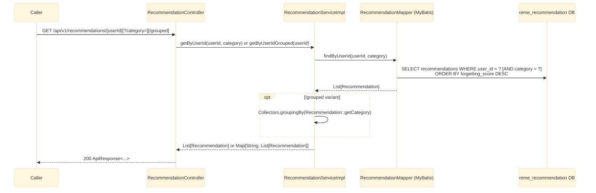

# recommendation-service — Overview

`recommendation-service` (Java/Spring Boot, port 8086, `reme_recommendation` DB) consumes the SAME
`learning.gap.analyzed` event that `english-service`'s `vocabulary`/`grammar`/`pronunciation` domains
consume (ai-service ranks a learner's recurring/forgotten weak points across ALL categories in one
event) — but unlike those per-domain consumers, it does **not** filter by category. Every weak point
in the event is persisted as a "recommendation" row, regardless of whether its `category` is
`vocabulary`, `grammar`, or `pronunciation`. After persisting a batch, it publishes a new
`recommendation.generated` event — `recommendation-service` is the first (and so far only) producer
of that topic. See `RemeLearning/services/recommendation-service/src/main/java/com/remelearning/recommendation/`.

This file covers `recommendation-service`'s own internals only. The `learning.gap.analyzed` topic it
consumes is published upstream by `ai-service` — for that side's internal handling, see
[../Ai_service/overview.md](../Ai_service/overview.md); for how `english-service`'s per-domain
consumers handle the same event, see [../English_service/overview.md](../English_service/overview.md).
Per-endpoint/per-consumer detail lives in
[learning-gap-analyzed.md](learning-gap-analyzed.md) (the Kafka consume -> upsert -> publish flow)
and [get-recommendations.md](get-recommendations.md) (the REST read-out).

## 1. Kafka consumer (ingestion) + producer (downstream event)

```mermaid
---
config:
  theme: base
  themeVariables:
    background: '#ffffff'
---
sequenceDiagram
    participant Kafka
    participant Consumer as LearningGapAnalyzedConsumer (groupId=recommendation-service)
    participant Svc as RecommendationServiceImpl
    participant Gen as ExerciseGenerator (rule-based | Gemini)
    participant Mapper as RecommendationMapper (MyBatis)
    participant DB as reme_recommendation DB
    participant Publisher as KafkaEventPublisher

    Kafka->>Consumer: learning.gap.analyzed<br/>(published by ai-service, see ../Ai_service/overview.md)
    Consumer->>Svc: handleLearningGapAnalyzed(event)
    activate Svc
    loop each weak point (no category filter)
        Svc->>Gen: generate(category, label, forgettingScore)
        Gen-->>Svc: exercises: string[]
        Svc->>Mapper: upsert(userId, itemId, category, label,<br/>forgettingScore, recommendationText, exercises)
        Mapper->>DB: INSERT ... ON CONFLICT (user_id, item_id) DO UPDATE
    end
    Svc->>Publisher: publish(recommendation.generated, userId, RecommendationGeneratedEvent)
    Publisher->>Kafka: recommendation.generated<br/>{recordingId, userId, recommendations[]}
    Note over Svc,DB: @Transactional (upserts only; publish happens after commit-scope method returns)
    deactivate Svc

    Note over Consumer: exceptions caught + logged inside handler,<br/>not rethrown to Kafka (no DLQ/retry)
```

## 2. REST controller (read-out)



## Notes

- Idempotency key: `(user_id, item_id)` — re-analyzing the same item across sessions updates its
  score instead of creating a new row (same convention as `english-service`'s weak-point tables).
- Kafka consumer `groupId` is `recommendation-service` — a distinct group from `english-service`'s
  `english-service`/`english-service-grammar`/`english-service-pronunciation` groups, so all
  consumers get a full copy of every `learning.gap.analyzed` message instead of Kafka splitting
  partitions between them.
- `recommendation.generated` is consumed by `dashboard-service` into its own `recent_recommendations`
  snapshot (see [../Dashboard_service/recommendation-generated.md](../Dashboard_service/recommendation-generated.md)).
- `exercises` (concrete practice exercises per weak point) is produced in-process by
  `ExerciseGenerator` before the upsert — rule-based per-category templates by default, or Gemini
  (via `common`'s `LlmClient`) when `recommendation.exercise-generator.mode=llm`, with fallback to the
  templates on any LLM failure. Generated once per weak point and reused for both the DB row and the
  published payload.
- For the producer side of `learning.gap.analyzed` (`RuleBasedAnalyzer`) and the full cross-service
  picture, see [../Ai_service/overview.md](../Ai_service/overview.md).
