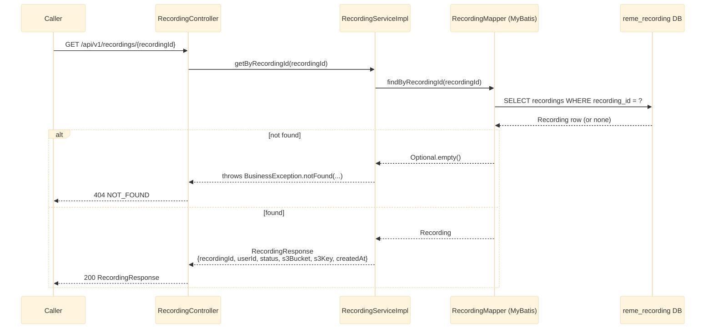

# GET /api/v1/recordings/{recordingId}

Returns a single recording's stored metadata. See `recording-service`'s
`controller/RecordingController.java` and `service/impl/RecordingServiceImpl.java`.

## Notes

- This data is written by `POST /api/v1/recordings` — see [upload.md](upload.md).
- `RecordingResponse` intentionally omits `originalFilename`/`contentType` (internal metadata not
  needed by callers today) — extend the DTO if a future caller needs them.
