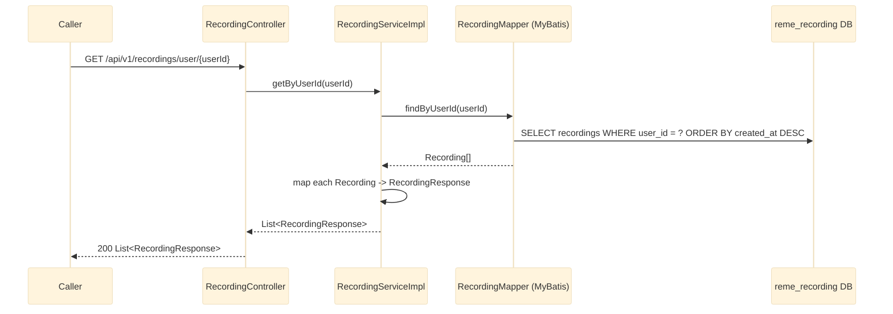

# GET /api/v1/recordings/user/{userId}

Lists every recording uploaded by a given user, most recent first. See `recording-service`'s
`controller/RecordingController.java` and `service/impl/RecordingServiceImpl.java`.

## Notes

- No pagination yet — returns every recording for the user in one response. Fine for the current
  early/greenfield state; revisit if a user's recording count grows large.
- Empty list (not 404) is returned when the user has no recordings.
