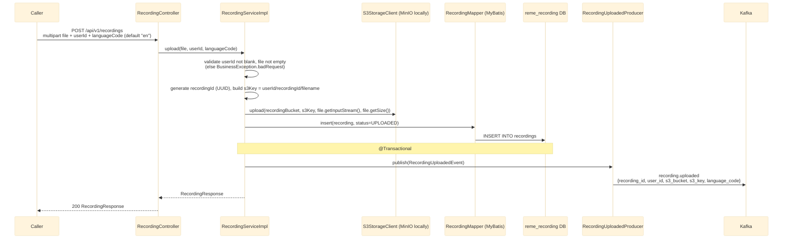
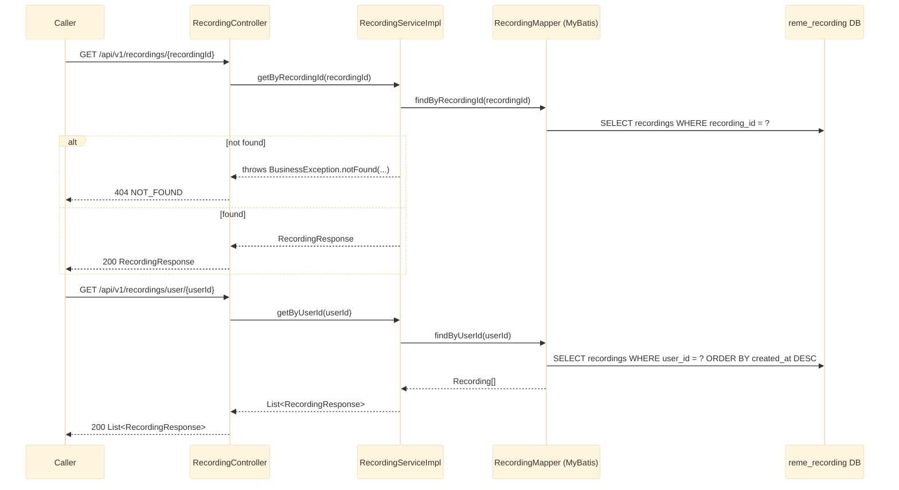

# recording-service — Overview

`recording-service` (Java/Spring Boot, port 8082, `reme_recording` DB) is the entry point of the
whole pipeline: a client uploads an audio/video file, the service stores it in S3 (MinIO locally),
persists metadata, and publishes `recording.uploaded` for `ai-service` to consume for STT +
diarization. Single flattened package `com.remelearning.recording.*` (no domain nesting, unlike
`english-service`, since this service has only one domain). See
`RemeLearning/services/recording-service/src/main/java/com/remelearning/recording/`.

This file covers `recording-service`'s own internals only. `recording.uploaded` is consumed
downstream by `ai-service` — for that side's internal handling, see
[../Ai_service/overview.md](../Ai_service/overview.md). Per-endpoint detail lives in
[upload.md](upload.md), [get-by-id.md](get-by-id.md), [get-by-user.md](get-by-user.md).

## 1. Upload + publish (write path)

## 2. Read-out (REST)

## Notes

- No idempotency key on write today: each `POST /api/v1/recordings` call always generates a fresh
  `recordingId` (UUID) and inserts a new row — unlike `english-service`'s consumers, there's no
  at-least-once Kafka redelivery to guard against here since the upload is a synchronous REST call.
- `reme.s3.recording-bucket` (env `S3_RECORDING_BUCKET`, default `reme-recordings`) is a new
  configuration convention introduced by this service — no other service had an S3 bucket property
  before it.
- For how `ai-service` consumes `recording.uploaded` (S3 download, Whisper, diarization), see
  [../Ai_service/overview.md](../Ai_service/overview.md).
