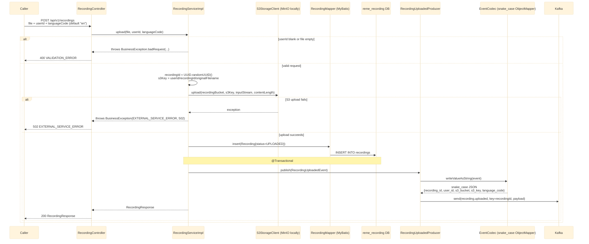

# POST /api/v1/recordings

Accepts a video/audio file (`multipart/form-data`), stores it in S3 (MinIO locally), persists its
metadata, and publishes `recording.uploaded` for `ai-service` to consume. See
`recording-service`'s `controller/RecordingController.java` and `service/impl/RecordingServiceImpl.java`.

## External calls

| # | Call | From -> To | Notes |
|---|------|-----------|-------|
| 1 | S3 `PutObject` | recording-service -> S3/MinIO | key = `{userId}/{recordingId}/{originalFilename}`, bucket from `reme.s3.recording-bucket` |
| 2 | Postgres INSERT | recording-service -> `reme_recording` DB | writes the `recordings` row |
| 3 | Kafka publish `recording.uploaded` | recording-service -> Kafka broker | consumed by `ai-service`, see [../Ai_service/overview.md](../Ai_service/overview.md) |

## Notes

- `recordingId` is always freshly generated (`UUID.randomUUID()`) — there is no idempotency check
  on this write path, unlike `english-service`'s Kafka consumers which guard against at-least-once
  redelivery.
- The event payload's JSON keys are snake_case (`recording_id`, `s3_bucket`, ...) via `EventCodec`,
  matching `ai-service`'s pydantic `RecordingUploadedEvent` (`app/schemas/events.py`) exactly.
- If S3 upload fails, nothing is persisted and no event is published (the exception is thrown
  before the mapper insert) — the client gets a 502 and can retry the whole request.
