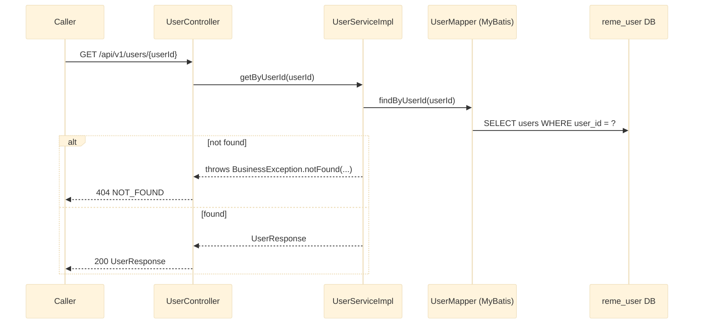
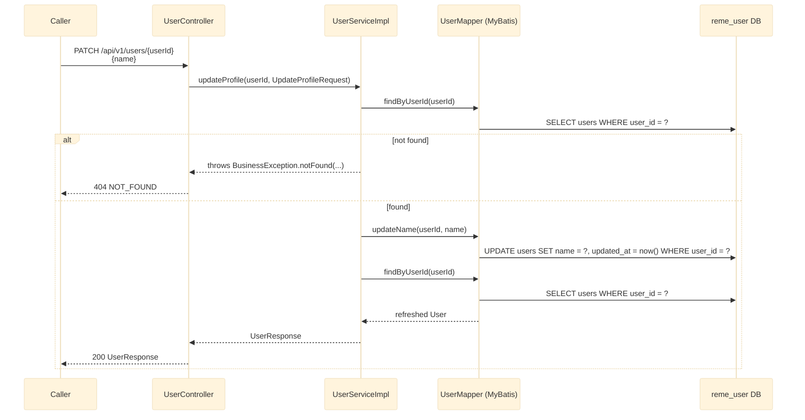

# GET /api/v1/users/{userId} and PATCH /api/v1/users/{userId}

Profile read and update. See `user-service`'s `controller/UserController.java` and
`service/impl/UserServiceImpl.java`.

## External calls

| # | Call | From -> To | Notes |
|---|------|-----------|-------|
| 1 | Postgres SELECT | user-service -> `reme_user` DB | `GET` and the pre-check + post-check on `PATCH` |
| 2 | Postgres UPDATE | user-service -> `reme_user` DB | `PATCH` only, updates `name` + `updated_at` |

## Notes

- `UpdateProfileRequest` only carries `name` today — no email/role/password change endpoint exists
  in this pass (out of scope per the confirmed spec).
- `updateProfile` does an existence check, then the update, then re-reads the row so the returned
  `UserResponse` reflects the new `updated_at`/`name` rather than stale in-memory state.
