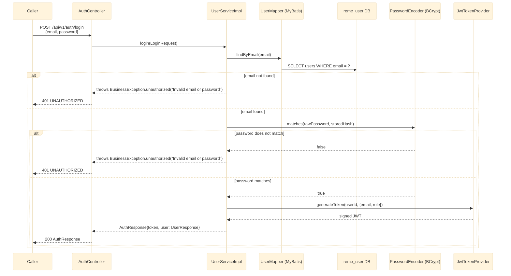

# POST /api/v1/auth/login

Authenticates with email + password and issues a fresh signed JWT. See `user-service`'s
`controller/AuthController.java` and `service/impl/UserServiceImpl.java`.

## External calls

| # | Call | From -> To | Notes |
|---|------|-----------|-------|
| 1 | Postgres SELECT | user-service -> `reme_user` DB | looks up by email |

## Notes

- **Deliberate security property:** "email not found" and "password does not match" throw the
  exact same `BusinessException.unauthorized("Invalid email or password")` — the client can never
  distinguish an unregistered email from a wrong password. Covered explicitly by
  `UserServiceImplTest.loginWithUnknownEmailThrowsUnauthorized` and
  `loginWithWrongPasswordThrowsSameUnauthorizedAsUnknownEmail`.
- Login issues a brand-new JWT on every successful call (no refresh-token / session-reuse concept
  exists yet).
- Nothing in the repo validates this (or any) JWT yet — see `overview.md`'s scope note.
