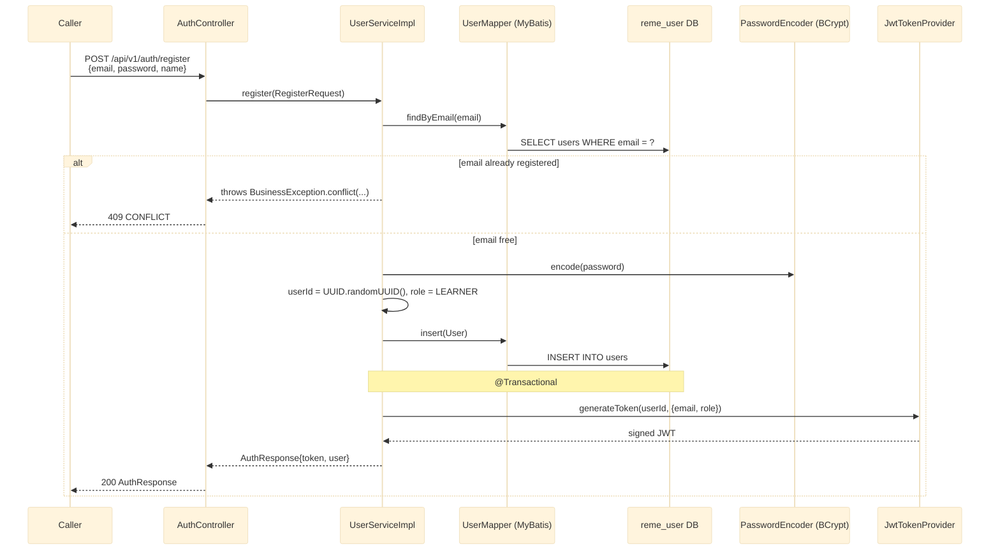
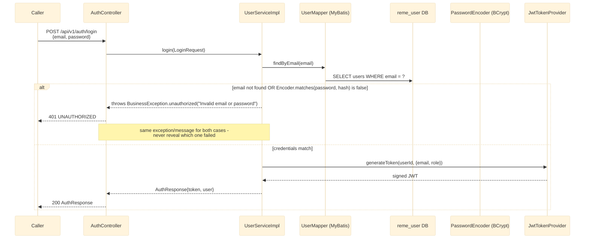
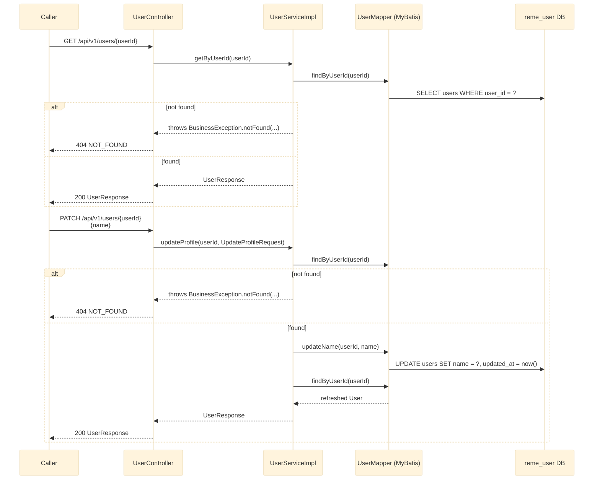

# user-service — Overview

`user-service` (Java/Spring Boot, port 8081, `reme_user` DB) is authentication + basic user
profile management: register/login issue a real signed JWT, and profile read/update is plain
CRUD. Single flattened package `com.remelearning.user.*` (no domain nesting, unlike
`english-service`, since this service has only one domain). See
`RemeLearning/services/user-service/src/main/java/com/remelearning/user/`.

**Scope note:** this service *issues* JWTs (via `common`'s `JwtTokenProvider`) but nothing —
not this service, not any other — validates/enforces them yet. There is no `SecurityConfig`, no
filter, no Spring Security starter anywhere in the repo (only `spring-security-crypto`, for
`BCryptPasswordEncoder`). Every endpoint here is unauthenticated at the HTTP layer today.

This file covers `user-service`'s own internals only. Per-endpoint detail lives in
[register.md](register.md), [login.md](login.md), [get-profile.md](get-profile.md),
[photo-upload.md](photo-upload.md).

`user-service` now also stores a profile photo (`photo_s3_key`/`photo_url` on `users`, via
`POST /api/v1/users/{userId}/photo`, S3-backed the same way `recording-service` stores its files) -
added so `ai-service`'s face-recognition feature has a reference image to enroll per userId, sourced
from this service rather than requiring a caller to supply the image directly (see
[photo-upload.md](photo-upload.md) and `../Ai_service/enroll-face.md`).

## 1. Register (write path)

## 2. Login (read path)

## 3. Profile read + update

## 4. Photo upload (write path)

See [photo-upload.md](photo-upload.md) for the full sequence diagram - uploads to S3 via `common`'s
`S3StorageClient` (same client `recording-service` uses), then persists `photo_s3_key`/`photo_url`.

## Notes

- No Kafka producer/consumer in this service yet — everything here is a synchronous REST call
  against `reme_user`. Unlike `recording-service`/`english-service`, there is no event published
  when a user registers or updates their profile.
- `password`/`passwordHash` never appear in any response DTO (`UserResponse`, `AuthResponse`) — only
  `RegisterRequest`/`LoginRequest` carry the raw password, and only inbound.
- `JwtTokenProvider`/`JwtProperties` (`common/security/`) were already fully implemented before this
  service existed; `user-service` is their first real caller. `reme.jwt.secret`/
  `reme.jwt.expiration-minutes` (env `JWT_SECRET`) control signing.
