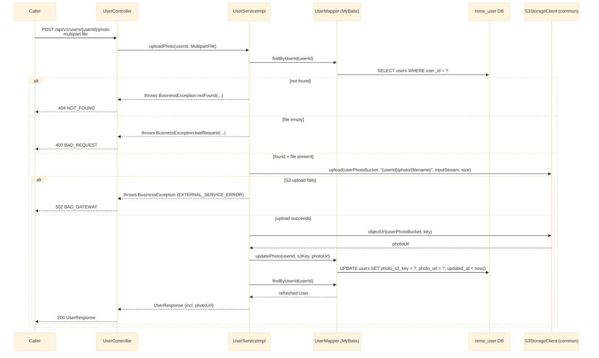

# POST /api/v1/users/{userId}/photo

Uploads/replaces a user's profile photo to S3 and persists its key + public URL. This is the
reference photo `ai-service`'s face-recognition enrollment (`POST /api/v1/faces/enroll`, see
[../Ai_service/enroll-face.md](../Ai_service/enroll-face.md)) later fetches by `userId`. See
`user-service`'s `controller/UserController.java` and `service/impl/UserServiceImpl.java`.

## External calls

| # | Call | From -> To | Notes |
|---|------|-----------|-------|
| 1 | Postgres SELECT/UPDATE | user-service -> `reme_user` DB | existence check, then `photo_s3_key`/`photo_url` update, then re-read |
| 2 | S3 PutObject | user-service -> S3/MinIO (`reme.s3.user-photo-bucket`, default `reme-user-photos`) | via `common`'s `S3StorageClient`, same client `recording-service` uses |

## Notes

- Re-uploading with the same filename overwrites the previous photo at the same S3 key; a different
  filename creates a new object (the old one is orphaned in S3, not deleted) - no cleanup logic
  exists for this today.
- No content-type/size validation beyond "not empty" - same level of validation
  `recording-service`'s upload has for its own file parameter.
- This is the only known producer of `photoUrl`; `ai-service`'s `UserServiceClient` is the only known
  consumer today (see [../Ai_service/enroll-face.md](../Ai_service/enroll-face.md)).
