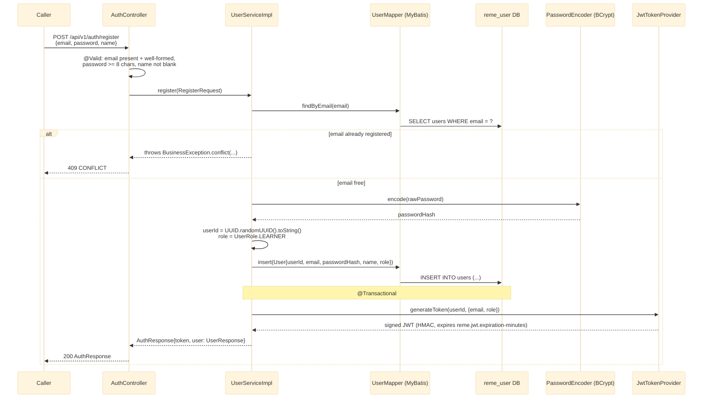

# POST /api/v1/auth/register

Registers a new learner account (hashing the password, persisting the row) and issues a signed
JWT so the caller is authenticated immediately. See `user-service`'s
`controller/AuthController.java` and `service/impl/UserServiceImpl.java`.

## External calls

| # | Call | From -> To | Notes |
|---|------|-----------|-------|
| 1 | Postgres SELECT | user-service -> `reme_user` DB | duplicate-email check via `idx_users_email` |
| 2 | Postgres INSERT | user-service -> `reme_user` DB | writes the `users` row, `role` defaults to `LEARNER` |

## Notes

- No downstream Kafka event is published on registration — `user-service` has no producers yet.
- Bean-validation (`@NotBlank`, `@Email`, `@Size(min = 8)`) rejects malformed input before the
  service layer runs, via Spring's default `MethodArgumentNotValidException` -> 400 mapping (see
  `common/web/GlobalExceptionHandler`).
- Password is only ever handled as `char`/`String` in memory long enough to hash it; only
  `passwordHash` is persisted, and no response DTO ever echoes password or passwordHash.
