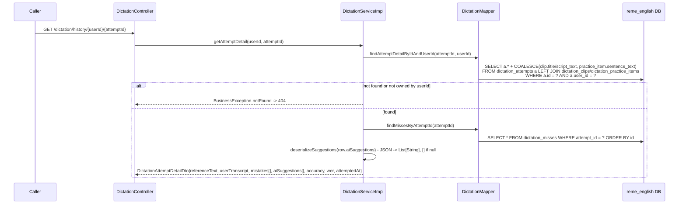

# Dictation History Attempt Detail Implementation Plan

> **For agentic workers:** REQUIRED SUB-SKILL: Use superpowers:subagent-driven-development (recommended) or superpowers:executing-plans to implement this plan task-by-task. Steps use checkbox (`- [ ]`) syntax for tracking.

**Goal:** Let a learner click a past dictation attempt in the "Lịch sử" (History) tab and see what they got wrong — reference text, their transcript, the specific mistaken words, and the AI suggestions generated at the time.

**Architecture:** english-service persists `ai_suggestions` (JSON text) on `dictation_attempts` at submit time and exposes a new ownership-scoped `GET /api/v1/dictation/history/{userId}/{attemptId}` endpoint that joins the attempt with its resolved reference text and reads mistakes from the existing `dictation_misses` table. bff-service thin-proxies it. The FE fetches it lazily inside a shadcn `Dialog` opened by clicking a History card.

**Tech Stack:** Java 21 / Spring Boot 4 / MyBatis / Flyway (english-service), Spring WebFlux (bff-service), React 19 / TypeScript / TanStack Query / shadcn (`@base-ui/react`) (RemeLearning_FE).

## Global Constraints

- Spec: `docs/superpowers/specs/2026-07-20-dictation-history-detail-design.md`.
- No inline word-position diff — mistakes are a flat list sourced from `dictation_misses`, not a re-derived positional array (see spec's "Diff representation" section for why).
- Every Java class uses constructor injection (no field injection), matches the existing plain-JUnit-5 + AssertJ + `Mockito.mock(...)` test style (no `@SpringBootTest`, no Mockito annotations).
- Per `CLAUDE.md`: update `openapi.yaml` (both services), `docs/API.md`, `docs/sequence/`, `docs/flow/`, both services' `README.md`, and `Business.md` (in `RemeLearning_BA`) in the same change — done in Task 4.
- FE has no test runner configured (`package.json` has no `test` script, no Vitest/Jest) — verification for FE tasks is `npm run build` (`tsc -b && vite build`) + `npm run lint` (`oxlint`), not new test files. Don't introduce a new test framework as a side effect of this plan.
- All new Java DTOs/domain classes follow the existing Lombok style: `@Data`/`@Builder`+`@Getter` per the sibling class being mirrored, one-line Javadoc above the class explaining its purpose.

---

### Task 1: Persist AI suggestions on submitAttempt

**Files:**
- Create: `RemeLearning/services/english-service/src/main/resources/db/migration/V9__dictation_attempt_suggestions.sql`
- Modify: `RemeLearning/services/english-service/src/main/java/com/remelearning/english/dictation/mapper/DictationMapper.java`
- Modify: `RemeLearning/services/english-service/src/main/resources/mapper/dictation/DictationMapper.xml`
- Modify: `RemeLearning/services/english-service/src/main/java/com/remelearning/english/dictation/service/DictationServiceImpl.java`
- Modify: `RemeLearning/services/english-service/src/test/java/com/remelearning/english/dictation/service/DictationServiceImplTest.java`

**Interfaces:**
- Produces: `DictationMapper.updateAttemptAiSuggestions(Long attemptId, String aiSuggestionsJson)` — used by Task 2's read path indirectly (the column it writes is what Task 2 reads back).
- Produces: `DictationServiceImpl` gains a `com.fasterxml.jackson.databind.ObjectMapper objectMapper` constructor parameter (inserted right after `sentenceAlignmentClient`, before the `@Value` params) — Task 2 reuses this same field for deserializing suggestions back out.

- [ ] **Step 1: Add the migration**

```sql
-- File: RemeLearning/services/english-service/src/main/resources/db/migration/V9__dictation_attempt_suggestions.sql

-- Persists the AI suggestions generated at submit time (previously only returned in the HTTP
-- response, never saved) so a learner can replay them later from History detail.
ALTER TABLE dictation_attempts ADD COLUMN ai_suggestions TEXT;
```

- [ ] **Step 2: Add the mapper method (interface + XML) — scaffolding, no behavior yet**

In `DictationMapper.java`, add this method right after `insertMisses`:

```java
	/** Persists the JSON-encoded AI suggestions generated for one attempt, so History detail can replay them later. */
	void updateAttemptAiSuggestions(@Param("attemptId") Long attemptId, @Param("aiSuggestions") String aiSuggestions);
```

In `DictationMapper.xml`, add this right after the `insertMisses` `<insert>` block:

```xml
    <update id="updateAttemptAiSuggestions">
        UPDATE dictation_attempts SET ai_suggestions = #{aiSuggestions} WHERE id = #{attemptId}
    </update>
```

- [ ] **Step 3: Add the `ObjectMapper` constructor dependency (no behavior change yet)**

In `DictationServiceImpl.java`, add the import and field, and thread the new constructor parameter through:

```java
import com.fasterxml.jackson.core.JsonProcessingException;
import com.fasterxml.jackson.core.type.TypeReference;
import com.fasterxml.jackson.databind.ObjectMapper;
```

Change the constructor and field list to:

```java
	private final DictationMapper dictationMapper;
	private final DictationAnalyzer dictationAnalyzer;
	private final DictationGapEventPublisher gapEventPublisher;
	private final TtsClient ttsClient;
	private final StorageClient storageClient;
	private final SentenceAlignmentClient sentenceAlignmentClient;
	private final ObjectMapper objectMapper;
	private final String ttsVoice;
	private final String ttsLang;
	private final int missWindow;
	private final int minListensForHint;

	public DictationServiceImpl(
			DictationMapper dictationMapper,
			DictationAnalyzer dictationAnalyzer,
			DictationGapEventPublisher gapEventPublisher,
			TtsClient ttsClient,
			StorageClient storageClient,
			SentenceAlignmentClient sentenceAlignmentClient,
			ObjectMapper objectMapper,
			@Value("${dictation.tts.voice:F1}") String ttsVoice,
			@Value("${dictation.tts.lang:en}") String ttsLang,
			@Value("${dictation.ai-practice.miss-window:8}") int missWindow,
			@Value("${dictation.hint.min-listens:3}") int minListensForHint) {
		this.dictationMapper = dictationMapper;
		this.dictationAnalyzer = dictationAnalyzer;
		this.gapEventPublisher = gapEventPublisher;
		this.ttsClient = ttsClient;
		this.storageClient = storageClient;
		this.sentenceAlignmentClient = sentenceAlignmentClient;
		this.objectMapper = objectMapper;
		this.ttsVoice = ttsVoice;
		this.ttsLang = ttsLang;
		this.missWindow = missWindow;
		this.minListensForHint = minListensForHint;
	}
```

Add these two helpers at the end of the "--- helpers ---" section (right before the closing brace of the class, after `toAudioResource`):

```java
	// Serializes the AI suggestions to a JSON array string for the ai_suggestions column.
	private String serializeSuggestions(List<String> suggestions) {
		try {
			return objectMapper.writeValueAsString(suggestions);
		} catch (JsonProcessingException ex) {
			throw new IllegalStateException("Failed to serialize AI suggestions", ex);
		}
	}

	// Deserializes the ai_suggestions column back into a list; empty (not an error) for null/blank,
	// which covers attempts submitted before this column existed.
	private List<String> deserializeSuggestions(String aiSuggestionsJson) {
		if (aiSuggestionsJson == null || aiSuggestionsJson.isBlank()) {
			return List.of();
		}
		try {
			return objectMapper.readValue(aiSuggestionsJson, new TypeReference<List<String>>() { });
		} catch (JsonProcessingException ex) {
			log.warn("Failed to deserialize AI suggestions, returning empty list", ex);
			return List.of();
		}
	}
```

In `DictationServiceImplTest.java`, update `setUp()` to pass a real `ObjectMapper` (no interface to mock against; a plain Jackson instance is deterministic and not worth mocking):

```java
	private final DictationMapper dictationMapper = mock(DictationMapper.class);
	private final DictationAnalyzer dictationAnalyzer = mock(DictationAnalyzer.class);
	private final DictationGapEventPublisher gapEventPublisher = mock(DictationGapEventPublisher.class);
	private final TtsClient ttsClient = mock(TtsClient.class);
	private final StorageClient storageClient = mock(StorageClient.class);
	private final SentenceAlignmentClient sentenceAlignmentClient = mock(SentenceAlignmentClient.class);
	private final com.fasterxml.jackson.databind.ObjectMapper objectMapper = new com.fasterxml.jackson.databind.ObjectMapper();
	private DictationServiceImpl service;

	@BeforeEach
	void setUp() {
		service = new DictationServiceImpl(dictationMapper, dictationAnalyzer, gapEventPublisher,
				ttsClient, storageClient, sentenceAlignmentClient, objectMapper, "F1", "en", 8, 3);
	}
```

- [ ] **Step 4: Run the existing suite to confirm the scaffolding didn't break anything**

Run: `cd RemeLearning && ./mvnw -pl services/english-service -am test -Dtest=DictationServiceImplTest -Dsurefire.failIfNoSpecifiedTests=false`
Expected: `BUILD SUCCESS`, all existing tests in `DictationServiceImplTest` still pass.

- [ ] **Step 5: Write the failing test for suggestion persistence**

Add this test to `DictationServiceImplTest.java` (needs `import com.fasterxml.jackson.core.type.TypeReference;` and `import java.util.List;` is already present):

```java
	@Test
	void submitAttemptPersistsAiSuggestionsAsJson() throws Exception {
		when(dictationMapper.findClipById(42L)).thenReturn(DictationClip.builder()
				.id(42L).code("c-1").scriptText("She was reluctant to admit it.").build());
		simulateGeneratedAttemptId(600L);
		when(dictationAnalyzer.analyzeAttempt(anyString(), anyList())).thenReturn(DictationAnalysis.builder()
				.suggestions(List.of("Nghe lại từ 'reluctant'.", "Chú ý âm cuối 'admit'."))
				.practiceSentences(List.of())
				.build());
		when(dictationMapper.countMissesForWord(eq("user-1"), anyString())).thenReturn(1);

		DictationAttemptRequest request = new DictationAttemptRequest();
		request.setUserId("user-1");
		request.setClipId(42L);
		request.setUserTranscript("She was to admit it.");

		service.submitAttempt(request);

		ArgumentCaptor<String> jsonCaptor = ArgumentCaptor.forClass(String.class);
		verify(dictationMapper).updateAttemptAiSuggestions(eq(600L), jsonCaptor.capture());
		List<String> persisted = objectMapper.readValue(jsonCaptor.getValue(), new TypeReference<List<String>>() { });
		assertThat(persisted).containsExactly("Nghe lại từ 'reluctant'.", "Chú ý âm cuối 'admit'.");
	}
```

- [ ] **Step 6: Run to verify it fails**

Run: `cd RemeLearning && ./mvnw -pl services/english-service -am test -Dtest=DictationServiceImplTest#submitAttemptPersistsAiSuggestionsAsJson -Dsurefire.failIfNoSpecifiedTests=false`
Expected: FAIL — `Wanted but not invoked: dictationMapper.updateAttemptAiSuggestions(...)` (the service doesn't call it yet).

- [ ] **Step 7: Implement the persistence call**

In `DictationServiceImpl.submitAttempt`, change:

```java
		List<String> missedWords = distinctMissedWords(misses);
		DictationAnalysis analysis = dictationAnalyzer.analyzeAttempt(target.referenceText(), missedWords);
		persistPracticeSentences(request.getUserId(), analysis.getPracticeSentences());
		publishWeakPoints(target.recordingId(), request.getUserId(), missedWords, analysis.getSuggestions());
```

to:

```java
		List<String> missedWords = distinctMissedWords(misses);
		DictationAnalysis analysis = dictationAnalyzer.analyzeAttempt(target.referenceText(), missedWords);
		persistPracticeSentences(request.getUserId(), analysis.getPracticeSentences());
		dictationMapper.updateAttemptAiSuggestions(attempt.getId(), serializeSuggestions(analysis.getSuggestions()));
		publishWeakPoints(target.recordingId(), request.getUserId(), missedWords, analysis.getSuggestions());
```

- [ ] **Step 8: Run to verify it passes**

Run: `cd RemeLearning && ./mvnw -pl services/english-service -am test -Dtest=DictationServiceImplTest -Dsurefire.failIfNoSpecifiedTests=false`
Expected: `BUILD SUCCESS`, all tests (including the new one) pass.

- [ ] **Step 9: Commit**

```bash
git add RemeLearning/services/english-service/src/main/resources/db/migration/V9__dictation_attempt_suggestions.sql \
        RemeLearning/services/english-service/src/main/java/com/remelearning/english/dictation/mapper/DictationMapper.java \
        RemeLearning/services/english-service/src/main/resources/mapper/dictation/DictationMapper.xml \
        RemeLearning/services/english-service/src/main/java/com/remelearning/english/dictation/service/DictationServiceImpl.java \
        RemeLearning/services/english-service/src/test/java/com/remelearning/english/dictation/service/DictationServiceImplTest.java
git commit -m "feat(dictation): persist AI suggestions generated at attempt time"
```

---

### Task 2: History attempt-detail read path (english-service)

**Files:**
- Create: `RemeLearning/services/english-service/src/main/java/com/remelearning/english/dictation/domain/DictationAttemptDetailRow.java`
- Create: `RemeLearning/services/english-service/src/main/java/com/remelearning/english/dictation/dto/DictationMistakeDto.java`
- Create: `RemeLearning/services/english-service/src/main/java/com/remelearning/english/dictation/dto/DictationAttemptDetailDto.java`
- Modify: `RemeLearning/services/english-service/src/main/java/com/remelearning/english/dictation/mapper/DictationMapper.java`
- Modify: `RemeLearning/services/english-service/src/main/resources/mapper/dictation/DictationMapper.xml`
- Modify: `RemeLearning/services/english-service/src/main/java/com/remelearning/english/dictation/service/DictationService.java`
- Modify: `RemeLearning/services/english-service/src/main/java/com/remelearning/english/dictation/service/DictationServiceImpl.java`
- Modify: `RemeLearning/services/english-service/src/main/java/com/remelearning/english/dictation/controller/DictationController.java`
- Modify: `RemeLearning/services/english-service/src/test/java/com/remelearning/english/dictation/service/DictationServiceImplTest.java`

**Interfaces:**
- Consumes: `DictationServiceImpl.deserializeSuggestions(String)` and the `objectMapper`/`dictationMapper` fields from Task 1.
- Produces: `DictationService.getAttemptDetail(String userId, Long attemptId): DictationAttemptDetailDto` — used by Task 3's bff proxy as the contract it mirrors, and by the controller endpoint `GET /api/v1/dictation/history/{userId}/{attemptId}`.
- Produces: `DictationAttemptDetailDto` shape: `{attemptId: Long, title: String, skill: String, level: String, examType: String, referenceText: String, userTranscript: String, accuracy: double, wer: double, mistakes: List<DictationMistakeDto>, aiSuggestions: List<String>, attemptedAt: Instant}`; `DictationMistakeDto` shape: `{expectedWord: String, actualWord: String, tag: WordDiffTag}`.

- [ ] **Step 1: Add the new domain row**

```java
// File: RemeLearning/services/english-service/src/main/java/com/remelearning/english/dictation/domain/DictationAttemptDetailRow.java
package com.remelearning.english.dictation.domain;

import lombok.AllArgsConstructor;
import lombok.Builder;
import lombok.Data;
import lombok.NoArgsConstructor;

import java.time.Instant;

/** One attempt joined with its resolved reference text and taxonomy, for the History detail read. */
@Data
@Builder
@NoArgsConstructor
@AllArgsConstructor
public class DictationAttemptDetailRow {
	private Long attemptId;
	private Long clipId;
	private Long practiceItemId;
	private String title;
	private String skill;
	private String level;
	private String examType;
	private String referenceText;
	private String userTranscript;
	private double accuracy;
	private double wer;
	/** JSON-encoded array of suggestion strings; null for attempts made before this column existed. */
	private String aiSuggestions;
	private Instant createdAt;
}
```

- [ ] **Step 2: Add the mapper queries (interface + XML) — scaffolding**

In `DictationMapper.java`, add these two methods right after `findHistoryByUserId`:

```java
	/**
	 * One attempt's full detail (resolved reference text + taxonomy), scoped by user so a learner can
	 * only ever read their own attempts; null if the id doesn't exist or belongs to a different user.
	 */
	DictationAttemptDetailRow findAttemptDetailByIdAndUserId(@Param("attemptId") Long attemptId, @Param("userId") String userId);

	/** Every miss recorded for one attempt, in insertion order. */
	List<DictationMiss> findMissesByAttemptId(@Param("attemptId") Long attemptId);
```

Add the import in `DictationMapper.java`:

```java
import com.remelearning.english.dictation.domain.DictationAttemptDetailRow;
```

In `DictationMapper.xml`, add these two queries right after `findHistoryByUserId`:

```xml
    <select id="findAttemptDetailByIdAndUserId" resultType="com.remelearning.english.dictation.domain.DictationAttemptDetailRow">
        SELECT a.id AS attempt_id, a.clip_id AS clip_id, a.practice_item_id AS practice_item_id,
               COALESCE(c.title, 'AI practice') AS title,
               c.skill AS skill, c.level AS level, c.exam_type AS exam_type,
               COALESCE(c.script_text, p.sentence_text) AS reference_text,
               a.user_transcript AS user_transcript,
               a.accuracy AS accuracy, a.wer AS wer, a.ai_suggestions AS ai_suggestions, a.created_at AS created_at
        FROM dictation_attempts a
        LEFT JOIN dictation_clips c ON c.id = a.clip_id
        LEFT JOIN dictation_practice_items p ON p.id = a.practice_item_id
        WHERE a.id = #{attemptId} AND a.user_id = #{userId}
    </select>

    <select id="findMissesByAttemptId" resultType="com.remelearning.english.dictation.domain.DictationMiss">
        SELECT id, attempt_id, user_id, clip_id, expected_word, actual_word, tag, created_at
        FROM dictation_misses
        WHERE attempt_id = #{attemptId}
        ORDER BY id
    </select>
```

- [ ] **Step 3: Add the DTOs**

```java
// File: RemeLearning/services/english-service/src/main/java/com/remelearning/english/dictation/dto/DictationMistakeDto.java
package com.remelearning.english.dictation.dto;

import lombok.Builder;
import lombok.Getter;

/** One word the learner got wrong in a past attempt, for GET /api/v1/dictation/history/{userId}/{attemptId}. */
@Getter
@Builder
public class DictationMistakeDto {
	private String expectedWord;
	private String actualWord;
	private WordDiffTag tag;
}
```

```java
// File: RemeLearning/services/english-service/src/main/java/com/remelearning/english/dictation/dto/DictationAttemptDetailDto.java
package com.remelearning.english.dictation.dto;

import lombok.Builder;
import lombok.Getter;

import java.time.Instant;
import java.util.List;

/** Full detail for one past dictation attempt, for GET /api/v1/dictation/history/{userId}/{attemptId}. */
@Getter
@Builder
public class DictationAttemptDetailDto {
	private Long attemptId;
	private String title;
	private String skill;
	private String level;
	private String examType;
	private String referenceText;
	private String userTranscript;
	private double accuracy;
	private double wer;
	private List<DictationMistakeDto> mistakes;
	private List<String> aiSuggestions;
	private Instant attemptedAt;
}
```

- [ ] **Step 4: Add the service interface method**

In `DictationService.java`, add the import and method:

```java
import com.remelearning.english.dictation.dto.DictationAttemptDetailDto;
```

```java
	/**
	 * Full detail for one of the learner's own past attempts (reference text, transcript, mistakes,
	 * AI suggestions); throws {@code BusinessException.notFound} if it doesn't exist or belongs to a
	 * different user.
	 */
	DictationAttemptDetailDto getAttemptDetail(String userId, Long attemptId);
```

- [ ] **Step 5: Write the failing tests**

Add these imports to `DictationServiceImplTest.java`:

```java
import com.remelearning.english.dictation.domain.DictationAttemptDetailRow;
import com.remelearning.english.dictation.dto.DictationAttemptDetailDto;
import com.remelearning.english.dictation.dto.WordDiffTag;
```

Add these three tests:

```java
	@Test
	void getAttemptDetailReturnsFullDetailForOwnedAttempt() {
		when(dictationMapper.findAttemptDetailByIdAndUserId(500L, "user-1")).thenReturn(
				DictationAttemptDetailRow.builder()
						.attemptId(500L).clipId(42L).title("Photocopy").skill("Listening").level("B1").examType("TOEIC")
						.referenceText("She was reluctant to admit it.")
						.userTranscript("She was to admit it.")
						.accuracy(0.8).wer(0.2)
						.aiSuggestions("[\"Nghe lại từ 'reluctant'.\"]")
						.build());
		when(dictationMapper.findMissesByAttemptId(500L)).thenReturn(List.of(
				DictationMiss.builder().attemptId(500L).userId("user-1").clipId(42L)
						.expectedWord("reluctant").actualWord(null).tag("MISSING").build()));

		DictationAttemptDetailDto detail = service.getAttemptDetail("user-1", 500L);

		assertThat(detail.getTitle()).isEqualTo("Photocopy");
		assertThat(detail.getReferenceText()).isEqualTo("She was reluctant to admit it.");
		assertThat(detail.getMistakes()).hasSize(1);
		assertThat(detail.getMistakes().get(0).getExpectedWord()).isEqualTo("reluctant");
		assertThat(detail.getMistakes().get(0).getTag()).isEqualTo(WordDiffTag.MISSING);
		assertThat(detail.getAiSuggestions()).containsExactly("Nghe lại từ 'reluctant'.");
	}

	@Test
	void getAttemptDetailThrowsNotFoundWhenMissingOrNotOwned() {
		when(dictationMapper.findAttemptDetailByIdAndUserId(999L, "user-1")).thenReturn(null);

		assertThatThrownBy(() -> service.getAttemptDetail("user-1", 999L)).isInstanceOf(BusinessException.class);
	}

	@Test
	void getAttemptDetailDefaultsToEmptySuggestionsWhenColumnIsNull() {
		when(dictationMapper.findAttemptDetailByIdAndUserId(501L, "user-1")).thenReturn(
				DictationAttemptDetailRow.builder()
						.attemptId(501L).referenceText("Hi.").userTranscript("Hi.")
						.accuracy(1.0).wer(0.0).aiSuggestions(null)
						.build());
		when(dictationMapper.findMissesByAttemptId(501L)).thenReturn(List.of());

		DictationAttemptDetailDto detail = service.getAttemptDetail("user-1", 501L);

		assertThat(detail.getAiSuggestions()).isEmpty();
		assertThat(detail.getMistakes()).isEmpty();
	}
```

- [ ] **Step 6: Run to verify it fails to compile**

Run: `cd RemeLearning && ./mvnw -pl services/english-service -am test -Dtest=DictationServiceImplTest -Dsurefire.failIfNoSpecifiedTests=false`
Expected: COMPILE ERROR — `DictationServiceImpl is not abstract and does not override abstract method getAttemptDetail(...)` (the interface method has no implementation yet).

- [ ] **Step 7: Implement `getAttemptDetail`**

Add these imports to `DictationServiceImpl.java`:

```java
import com.remelearning.english.dictation.domain.DictationAttemptDetailRow;
import com.remelearning.english.dictation.dto.DictationAttemptDetailDto;
import com.remelearning.english.dictation.dto.DictationMistakeDto;
import com.remelearning.english.dictation.dto.WordDiffTag;
```

Add this method right after `getHistory`:

```java
	@Override
	public DictationAttemptDetailDto getAttemptDetail(String userId, Long attemptId) {
		DictationAttemptDetailRow row = dictationMapper.findAttemptDetailByIdAndUserId(attemptId, userId);
		if (row == null) {
			throw BusinessException.notFound("Dictation attempt not found: id=" + attemptId);
		}
		List<DictationMistakeDto> mistakes = dictationMapper.findMissesByAttemptId(attemptId).stream()
				.map(miss -> DictationMistakeDto.builder()
						.expectedWord(miss.getExpectedWord())
						.actualWord(miss.getActualWord())
						.tag(WordDiffTag.valueOf(miss.getTag()))
						.build())
				.toList();
		return DictationAttemptDetailDto.builder()
				.attemptId(row.getAttemptId())
				.title(row.getTitle())
				.skill(row.getSkill())
				.level(row.getLevel())
				.examType(row.getExamType())
				.referenceText(row.getReferenceText())
				.userTranscript(row.getUserTranscript())
				.accuracy(row.getAccuracy())
				.wer(row.getWer())
				.mistakes(mistakes)
				.aiSuggestions(deserializeSuggestions(row.getAiSuggestions()))
				.attemptedAt(row.getCreatedAt())
				.build();
	}
```

- [ ] **Step 8: Add the controller endpoint**

Add the import to `DictationController.java`:

```java
import com.remelearning.english.dictation.dto.DictationAttemptDetailDto;
```

Add this method right after `getHistory`:

```java
	@Operation(summary = "Full detail for one of a learner's own past attempts - reference text, transcript, "
			+ "mistakes, and the AI suggestions generated at the time")
	@GetMapping("/history/{userId}/{attemptId}")
	public ApiResponse<DictationAttemptDetailDto> getAttemptDetail(
			@PathVariable String userId, @PathVariable Long attemptId) {
		return ApiResponse.ok(dictationService.getAttemptDetail(userId, attemptId));
	}
```

- [ ] **Step 9: Run to verify it passes**

Run: `cd RemeLearning && ./mvnw -pl services/english-service -am test -Dtest=DictationServiceImplTest -Dsurefire.failIfNoSpecifiedTests=false`
Expected: `BUILD SUCCESS`, all tests pass including the three new ones.

- [ ] **Step 10: Commit**

```bash
git add RemeLearning/services/english-service/src/main/java/com/remelearning/english/dictation/domain/DictationAttemptDetailRow.java \
        RemeLearning/services/english-service/src/main/java/com/remelearning/english/dictation/dto/DictationMistakeDto.java \
        RemeLearning/services/english-service/src/main/java/com/remelearning/english/dictation/dto/DictationAttemptDetailDto.java \
        RemeLearning/services/english-service/src/main/java/com/remelearning/english/dictation/mapper/DictationMapper.java \
        RemeLearning/services/english-service/src/main/resources/mapper/dictation/DictationMapper.xml \
        RemeLearning/services/english-service/src/main/java/com/remelearning/english/dictation/service/DictationService.java \
        RemeLearning/services/english-service/src/main/java/com/remelearning/english/dictation/service/DictationServiceImpl.java \
        RemeLearning/services/english-service/src/main/java/com/remelearning/english/dictation/controller/DictationController.java \
        RemeLearning/services/english-service/src/test/java/com/remelearning/english/dictation/service/DictationServiceImplTest.java
git commit -m "feat(dictation): add GET history/{userId}/{attemptId} attempt-detail endpoint"
```

---

### Task 3: bff-service proxy

**Files:**
- Create: `RemeLearning/services/bff-service/src/main/java/com/remelearning/bff/dto/DictationMistakeDto.java`
- Create: `RemeLearning/services/bff-service/src/main/java/com/remelearning/bff/dto/DictationAttemptDetailDto.java`
- Modify: `RemeLearning/services/bff-service/src/main/java/com/remelearning/bff/client/EnglishServiceClient.java`
- Modify: `RemeLearning/services/bff-service/src/main/java/com/remelearning/bff/controller/LearnerController.java`

**Interfaces:**
- Consumes: english-service's `GET /api/v1/dictation/history/{userId}/{attemptId}` from Task 2 (same JSON shape, proxied verbatim per the repo's "DTOs, never shared domain classes" convention — `tag` is a plain `String` here, not the `WordDiffTag` enum, matching how `WordDiffDto.tag` is already proxied as `String` in this package).
- Produces: `GET /api/v1/learners/{userId}/dictation/history/{attemptId}` — this is what Task 6 (FE) calls.

No test file exists today for `EnglishServiceClient` or `LearnerController`'s dictation methods (confirmed: no `EnglishServiceClientTest.java` or `LearnerControllerTest.java` in the repo) — this task follows that existing convention and adds no new test file; verification is compiling + the existing bff-service suite staying green.

- [ ] **Step 1: Add the bff DTOs**

```java
// File: RemeLearning/services/bff-service/src/main/java/com/remelearning/bff/dto/DictationMistakeDto.java
package com.remelearning.bff.dto;

import lombok.Data;

/** One word the learner got wrong in a past attempt, proxied from english-service. */
@Data
public class DictationMistakeDto {
	private String expectedWord;
	private String actualWord;
	private String tag;
}
```

```java
// File: RemeLearning/services/bff-service/src/main/java/com/remelearning/bff/dto/DictationAttemptDetailDto.java
package com.remelearning.bff.dto;

import lombok.Data;

import java.time.Instant;
import java.util.List;

/** Full detail for one past dictation attempt, proxied from english-service. */
@Data
public class DictationAttemptDetailDto {
	private Long attemptId;
	private String title;
	private String skill;
	private String level;
	private String examType;
	private String referenceText;
	private String userTranscript;
	private double accuracy;
	private double wer;
	private List<DictationMistakeDto> mistakes;
	private List<String> aiSuggestions;
	private Instant attemptedAt;
}
```

- [ ] **Step 2: Add the client method**

Add the import to `EnglishServiceClient.java`:

```java
import com.remelearning.bff.dto.DictationAttemptDetailDto;
```

Add this method right after `getDictationHistory`:

```java
	/** Fetches full detail (reference text, transcript, mistakes, AI suggestions) for one of a learner's own past attempts. */
	public Mono<DictationAttemptDetailDto> getDictationAttemptDetail(String userId, Long attemptId) {
		return englishServiceClient.get()
				.uri("/api/v1/dictation/history/{userId}/{attemptId}", userId, attemptId)
				.retrieve()
				.bodyToMono(new ParameterizedTypeReference<ApiResponse<DictationAttemptDetailDto>>() {})
				.map(ApiResponse::getData)
				.doOnError(ex -> log.error("Failed to fetch dictation attempt detail for userId={}, attemptId={}", userId, attemptId, ex));
	}
```

- [ ] **Step 3: Add the controller route**

Add the import to `LearnerController.java`:

```java
import com.remelearning.bff.dto.DictationAttemptDetailDto;
```

Add this method right after `getDictationHistory`:

```java
	@Operation(summary = "Full detail for one of a learner's own past dictation attempts; thin proxy to english-service")
	@GetMapping("/{userId}/dictation/history/{attemptId}")
	public Mono<ApiResponse<DictationAttemptDetailDto>> getDictationAttemptDetail(
			@PathVariable String userId, @PathVariable Long attemptId) {
		return englishServiceClient.getDictationAttemptDetail(userId, attemptId).map(ApiResponse::ok);
	}
```

- [ ] **Step 4: Run the existing bff-service suite to confirm it compiles and nothing regresses**

Run: `cd RemeLearning && ./mvnw -pl services/bff-service -am test`
Expected: `BUILD SUCCESS`.

- [ ] **Step 5: Commit**

```bash
git add RemeLearning/services/bff-service/src/main/java/com/remelearning/bff/dto/DictationMistakeDto.java \
        RemeLearning/services/bff-service/src/main/java/com/remelearning/bff/dto/DictationAttemptDetailDto.java \
        RemeLearning/services/bff-service/src/main/java/com/remelearning/bff/client/EnglishServiceClient.java \
        RemeLearning/services/bff-service/src/main/java/com/remelearning/bff/controller/LearnerController.java
git commit -m "feat(bff): proxy dictation attempt-detail endpoint"
```

---

### Task 4: Documentation

**Files:**
- Modify: `RemeLearning/services/english-service/openapi.yaml`
- Modify: `RemeLearning/services/bff-service/openapi.yaml`
- Modify: `docs/API.md`
- Modify: `docs/sequence/English_service/dictation-practice.md`
- Modify: `docs/sequence/English_service/overview.md`
- Modify: `docs/flow/english-service-data-flow.md`
- Modify: `RemeLearning/services/english-service/README.md`
- Modify: `RemeLearning/services/bff-service/README.md`
- Modify: `D:\Personal Project\RemeLearning_BA\Business.md`

No automated test for this task; verification is a manual re-read of each diff for accuracy against Task 1-3's actual code, plus a `grep` sanity check per step.

- [ ] **Step 1: english-service `openapi.yaml`**

Add this path right after the existing `/api/v1/dictation/history/{userId}` block (after line 386, before `/api/v1/dictation/ai-practice/{userId}`):

```yaml
  /api/v1/dictation/history/{userId}/{attemptId}:
    get:
      tags: [Dictation]
      summary: >
        Full detail for one of a learner's own past attempts - reference text, transcript, mistakes,
        and the AI suggestions generated at the time
      operationId: getDictationAttemptDetail
      parameters:
        - name: userId
          in: path
          required: true
          schema: { type: string }
        - name: attemptId
          in: path
          required: true
          schema: { type: integer, format: int64 }
      responses:
        "200":
          description: OK
          content:
            application/json:
              schema:
                $ref: "#/components/schemas/ApiResponseDictationAttemptDetail"
        "404":
          description: No attempt with the given id, or it doesn't belong to userId
          content:
            application/json:
              schema:
                $ref: "#/components/schemas/ApiResponseError"
```

Add these schemas right after the existing `DictationHistoryEntry` schema (after line 780, before `DictationPracticeItem`):

```yaml
    DictationMistake:
      type: object
      properties:
        expectedWord: { type: string, nullable: true }
        actualWord: { type: string, nullable: true }
        tag: { type: string, enum: [CORRECT, SUBSTITUTED, MISSING, EXTRA] }

    DictationAttemptDetail:
      type: object
      properties:
        attemptId: { type: integer, format: int64 }
        title: { type: string, nullable: true }
        skill: { type: string, nullable: true }
        level: { type: string, nullable: true }
        examType: { type: string, nullable: true }
        referenceText: { type: string }
        userTranscript: { type: string }
        accuracy: { type: number, format: double }
        wer: { type: number, format: double }
        mistakes:
          type: array
          items: { $ref: "#/components/schemas/DictationMistake" }
        aiSuggestions: { type: array, items: { type: string } }
        attemptedAt: { type: string, format: date-time }
```

Add this response schema right after `ApiResponseDictationHistoryEntryList` (after line 843, before `ApiResponseDictationPracticeItemList`):

```yaml
    ApiResponseDictationAttemptDetail:
      allOf:
        - $ref: "#/components/schemas/ApiResponseBase"
        - type: object
          properties:
            data: { $ref: "#/components/schemas/DictationAttemptDetail" }
```

- [ ] **Step 2: bff-service `openapi.yaml`**

Add this path right after the existing `/api/v1/learners/{userId}/dictation/history` block (after line 346, before `/api/v1/learners/{userId}/dictation/ai-practice`):

```yaml
  /api/v1/learners/{userId}/dictation/history/{attemptId}:
    get:
      tags: [Learners]
      summary: Full detail for one of a learner's own past dictation attempts; thin proxy to english-service
      operationId: getDictationAttemptDetail
      parameters:
        - { name: userId, in: path, required: true, schema: { type: string } }
        - { name: attemptId, in: path, required: true, schema: { type: integer, format: int64 } }
      responses:
        "200":
          description: OK
          content:
            application/json:
              schema:
                $ref: "#/components/schemas/ApiResponseDictationAttemptDetail"
```

Add these schemas right after the existing `DictationHistoryEntry` schema (after line 692, before `DictationPracticeItem`):

```yaml
    DictationMistake:
      type: object
      properties:
        expectedWord: { type: string, nullable: true }
        actualWord: { type: string, nullable: true }
        tag: { type: string, enum: [CORRECT, SUBSTITUTED, MISSING, EXTRA] }

    DictationAttemptDetail:
      type: object
      properties:
        attemptId: { type: integer, format: int64 }
        title: { type: string, nullable: true }
        skill: { type: string, nullable: true }
        level: { type: string, nullable: true }
        examType: { type: string, nullable: true }
        referenceText: { type: string }
        userTranscript: { type: string }
        accuracy: { type: number, format: double }
        wer: { type: number, format: double }
        mistakes:
          type: array
          items: { $ref: "#/components/schemas/DictationMistake" }
        aiSuggestions: { type: array, items: { type: string } }
        attemptedAt: { type: string, format: date-time }
```

Add this response schema right after `ApiResponseDictationHistoryEntryList` (after line 755, before whatever follows it):

```yaml
    ApiResponseDictationAttemptDetail:
      allOf:
        - $ref: "#/components/schemas/ApiResponseBase"
        - type: object
          properties:
            data: { $ref: "#/components/schemas/DictationAttemptDetail" }
```

- [ ] **Step 3: `docs/API.md`**

Add this right after the `GET /api/v1/dictation/history/{userId}` section (after line 408, before `### GET /api/v1/dictation/ai-practice/{userId}` ...):

```markdown
### GET `/api/v1/dictation/history/{userId}/{attemptId}`

Chi tiết đầy đủ một lần chấm điểm trong lịch sử: lời thoại gốc, bản gõ của người học, danh sách từ
sai (lấy thẳng từ `dictation_misses`, không tái tạo diff theo vị trí — xem ghi chú bên dưới), và các
gợi ý AI đã sinh ra tại thời điểm đó (`ai_suggestions`, cột mới trên `dictation_attempts`).
- **Response `data`** — `DictationAttemptDetailDto`: `{attemptId, title, skill, level, examType,
  referenceText, userTranscript, accuracy, wer, mistakes: [{expectedWord, actualWord, tag}],
  aiSuggestions[], attemptedAt}`.
- **Lỗi**: `404` nếu `attemptId` không tồn tại hoặc không thuộc về `userId` (scoped ownership check).
- **Vì sao không phải diff đầy đủ theo vị trí**: `dictation_misses` không lưu vị trí từ trong câu, nên
  không dựng lại được đúng mảng diff xen kẽ CORRECT/SUBSTITUTED/MISSING như màn kết quả chấm điểm tức
  thời. Với bài chép từng câu (sentence-mode), bản gõ cuối cùng luôn đúng 100% (bắt buộc sửa đúng mới
  qua câu) nên chấm lại từ đầu (`DictationScorer.score`) sẽ cho ra 0 lỗi — che mất đúng những chỗ người
  học từng sai. Vì vậy màn chi tiết hiển thị danh sách từ sai dạng phẳng từ `dictation_misses`, đúng cho
  cả hai luồng chấm điểm, đổi lại không phải màn hình gạch chân từng từ trong câu.
```

Add this row right after the existing `/api/v1/learners/{userId}/dictation/history` bullet in the bff-service section (after line 733, before `- **GET .../dictation/ai-practice**`):

```markdown
- **GET `/api/v1/learners/{userId}/dictation/history/{attemptId}`** → `DictationAttemptDetailDto`
  (như trên) — thin proxy sang `GET /api/v1/dictation/history/{userId}/{attemptId}`.
```

Add this row right after the existing english-service `history/{userId}` row in the summary table (after line 1166):

```markdown
| english-service (dictation) | REST | GET | `/api/v1/dictation/history/{userId}/{attemptId}` | chi tiết 1 lần chấm điểm: lời thoại gốc, bản gõ, danh sách từ sai, gợi ý AI đã lưu; `404` |
```

Add this row right after the existing bff-service `dictation/history` row in the summary table (after line 1140):

```markdown
| bff-service | REST | GET | `/api/v1/learners/{userId}/dictation/history/{attemptId}` | proxy `/api/v1/dictation/history/{userId}/{attemptId}` |
```

- [ ] **Step 4: `docs/sequence/English_service/dictation-practice.md`**

Add a new section 4 right after section 3 (after line 206, before `## External calls`):

```markdown
## 4. History attempt detail (`GET /dictation/history/{userId}/{attemptId}`)



`mistakes[]` is a **flat list** (`{expectedWord, actualWord, tag}`) sourced directly from
`dictation_misses`, not a re-derived positional diff like section 1's `DictationAttemptResultDto.diff`
— `dictation_misses` has no word-position column, and re-scoring `referenceText` vs `userTranscript`
at read time would show zero mistakes for sentence-mode attempts (the final transcript there is always
forced correct). See the design spec (`docs/superpowers/specs/2026-07-20-dictation-history-detail-design.md`)
for the full reasoning.
```

Add this row to the "External calls" table (after the existing row 5, renumbering rows 6 onward is unnecessary — just append):

```markdown
| 7 | Postgres | english-service -> `reme_english` | `dictation_attempts.ai_suggestions` (new column, JSON-encoded) written by section 1, read back by section 4 |
```

- [ ] **Step 5: `docs/sequence/English_service/overview.md`**

In the "## 4. Dictation practice (`dictation` package)" section's closing prose (after its mermaid block, before `## Notes`), add:

```markdown
A fourth flow, `GET /api/v1/dictation/history/{userId}/{attemptId}`, returns full detail for one past
attempt (reference text, transcript, a flat mistake list, and the AI suggestions persisted at submit
time) — see [dictation-practice.md](dictation-practice.md) section 4.
```

- [ ] **Step 6: `docs/flow/english-service-data-flow.md`**

Update the `dictation_attempts` row shape in the data-shape table (the row currently reading
`{id, clip_id?, practice_item_id?, user_id, user_transcript, accuracy, wer, created_at}` at line 230)
to:

```markdown
| `dictation_attempts` row | `{id, clip_id?, practice_item_id?, user_id, user_transcript, accuracy, wer, ai_suggestions?, created_at}` | one row per graded submission, full history kept; `ai_suggestions` (new) is a JSON-encoded array of the suggestions generated at submit time, null for attempts made before this column existed |
```

Add this row right after the `GetDictationHistory` node/edges section (near line 114/191-192) as a new subgraph node and edges:

```markdown
        GetAttemptDetail["GET /api/v1/dictation/history/{userId}/{attemptId}<br/>findAttemptDetailByIdAndUserId + findMissesByAttemptId<br/>-> DictationAttemptDetailDto{referenceText, userTranscript, mistakes[], aiSuggestions[]}"]
```

with edges:

```markdown
    T11 --> GetAttemptDetail
    T9 --> GetAttemptDetail
    T12 --> GetAttemptDetail
    T10 --> GetAttemptDetail
```

(mirroring the existing `T11`/`T9` -> `GetDictationHistory` edges, plus `T12` for the AI-practice-item
join and `T10` for the misses read.)

- [ ] **Step 7: `RemeLearning/services/english-service/README.md`**

In the dictation paragraph (around line 26, "grading (`POST /api/v1/dictation/attempts`), history, and
AI-practice generation/audio"), change it to:

```markdown
detail), grading (`POST /api/v1/dictation/attempts`), history (including full per-attempt detail via
`GET .../history/{userId}/{attemptId}`), and AI-practice generation/audio. The
```

- [ ] **Step 8: `RemeLearning/services/bff-service/README.md`**

Change the existing dictation proxy line (line 26) from:

```markdown
| GET/POST | `/api/v1/learners/{userId}/dictation/*` | thin proxy → english-service's `dictation` package (facets/clips/sessions/attempts/history/ai-practice, plus folder → file browsing rev 2: `folders`, `folders/{folderId}/lessons`, `clips/{clipId}` detail) |
```

to:

```markdown
| GET/POST | `/api/v1/learners/{userId}/dictation/*` | thin proxy → english-service's `dictation` package (facets/clips/sessions/attempts/history/ai-practice, plus folder → file browsing rev 2: `folders`, `folders/{folderId}/lessons`, `clips/{clipId}` detail, and per-attempt History detail: `history/{attemptId}`) |
```

- [ ] **Step 9: `Business.md`**

Add a new subsection right after `11.2` (after line 340, following the same `### 11.x Cập nhật (rev N): ...` pattern):

```markdown
### 11.3. Cập nhật: xem chi tiết một lần luyện cũ trong mục "Lịch sử"

Trước đây mục "Lịch sử" chỉ hiện danh sách các lần luyện đã làm (độ chính xác, kỹ năng/trình độ/dạng
đề, thời điểm) — bấm vào không có tác dụng gì. Nay bấm vào một lần luyện cũ sẽ mở ra chi tiết: lời
thoại gốc, bản người học đã gõ, danh sách từ đã gõ sai, và **gợi ý AI đã đưa ra ngay lúc đó** (trước
đây gợi ý này chỉ hiện thoáng qua ngay sau khi nộp bài rồi mất, nay được lưu lại để xem lại bất cứ
lúc nào).

> Chi tiết kỹ thuật: `docs/API.md` (mục Dictation, endpoint mới
> `GET /api/v1/dictation/history/{userId}/{attemptId}`),
> `docs/sequence/English_service/dictation-practice.md` mục 4,
> `docs/flow/english-service-data-flow.md`.
```

- [ ] **Step 10: Verify nothing was missed**

Run: `grep -rn "history/{userId}/{attemptId}\|getDictationAttemptDetail\|DictationAttemptDetail" "d:/Personal Project/RemeLearning_Project/docs" "d:/Personal Project/RemeLearning_Project/RemeLearning/services/english-service/openapi.yaml" "d:/Personal Project/RemeLearning_Project/RemeLearning/services/bff-service/openapi.yaml" "D:/Personal Project/RemeLearning_BA/Business.md"`
Expected: matches in all 9 files touched by this task.

- [ ] **Step 11: Commit**

```bash
git add RemeLearning/services/english-service/openapi.yaml \
        RemeLearning/services/bff-service/openapi.yaml \
        docs/API.md \
        docs/sequence/English_service/dictation-practice.md \
        docs/sequence/English_service/overview.md \
        docs/flow/english-service-data-flow.md \
        RemeLearning/services/english-service/README.md \
        RemeLearning/services/bff-service/README.md
git commit -m "docs(dictation): document the history attempt-detail endpoint"
```

Note: `Business.md` lives in the separate `RemeLearning_BA` folder/repo — commit it separately there if it has its own git repo (check with `git -C "D:/Personal Project/RemeLearning_BA" status` first).

---

### Task 5: FE data layer (types, API client, hook)

**Files:**
- Modify: `src/types/api.ts`
- Modify: `src/api/learners.ts`
- Modify: `src/features/dictation/hooks.ts`

**Interfaces:**
- Consumes: bff-service's `GET /api/v1/learners/{userId}/dictation/history/{attemptId}` from Task 3.
- Produces: `useDictationAttemptDetail(userId: string, attemptId: number | null)` React Query hook — used by Task 6's `AttemptDetailDialog`.

No test file to write (FE has no test runner configured — see Global Constraints). Verification is `npm run build`.

- [ ] **Step 1: Add the types**

In `src/types/api.ts`, add this right after the `DictationHistoryEntry` interface (after line 223, before `DictationPracticeItem`):

```typescript
/** One word the learner got wrong in a past attempt. */
export interface DictationMistake {
  expectedWord: string | null
  actualWord: string | null
  tag: WordDiffTag
}

/** Full detail for one past dictation attempt, shown when a History entry is clicked. */
export interface DictationAttemptDetail {
  attemptId: number
  title: string | null
  skill: string | null
  level: string | null
  examType: string | null
  referenceText: string
  userTranscript: string
  accuracy: number
  wer: number
  mistakes: DictationMistake[]
  aiSuggestions: string[]
  attemptedAt: string
}
```

- [ ] **Step 2: Add the API client function**

In `src/api/learners.ts`, add `DictationAttemptDetail` to the type import list (alphabetically, right after `DictationAttemptResult`):

```typescript
import type {
  ApiResponse,
  DictationAttemptDetail,
  DictationAttemptRequest,
  DictationAttemptResult,
  DictationClip,
  DictationClipDetail,
  DictationFacets,
  DictationFolder,
  DictationHistoryEntry,
  DictationLessonSummary,
  DictationPracticeItem,
  LearnerOverview,
  PracticeRedoRequest,
  RecommendationsByCategory,
  StartDictationSessionRequest,
  WeakPoint,
  WeakPointsByCategory,
} from "@/types/api"
```

Add this function right after `getDictationHistory`:

```typescript
// GET /api/v1/learners/{userId}/dictation/history/{attemptId} - full detail for one past attempt.
export async function getDictationAttemptDetail(
  userId: string,
  attemptId: number
): Promise<DictationAttemptDetail> {
  const { data } = await apiClient.get<ApiResponse<DictationAttemptDetail>>(
    `/learners/${userId}/dictation/history/${attemptId}`
  )
  return unwrap(data)
}
```

- [ ] **Step 3: Add the hook**

In `src/features/dictation/hooks.ts`, add `getDictationAttemptDetail` to the import list from `@/api/learners` (alphabetically, right after `generateAiPractice`):

```typescript
import {
  generateAiPractice,
  getAiPractice,
  getDictationAttemptDetail,
  getDictationClip,
  getDictationFacets,
  getDictationFolderLessons,
  getDictationFolders,
  getDictationHistory,
  startDictationSession,
  submitDictationAttempt,
} from "@/api/learners"
```

Add this hook right after `useDictationHistory`:

```typescript
export function useDictationAttemptDetail(userId: string, attemptId: number | null) {
  return useQuery({
    queryKey: ["learner", userId, "dictation", "history", attemptId],
    queryFn: () => getDictationAttemptDetail(userId, attemptId as number),
    enabled: !!userId && attemptId != null,
  })
}
```

- [ ] **Step 4: Verify it builds**

Run: `cd "d:/Personal Project/RemeLearning_FE" && npm run build`
Expected: builds successfully, no TypeScript errors.

- [ ] **Step 5: Commit**

```bash
git add src/types/api.ts src/api/learners.ts src/features/dictation/hooks.ts
git commit -m "feat(dictation): add FE data layer for attempt-detail fetch"
```

---

### Task 6: FE UI — clickable History entries + detail dialog

**Files:**
- Create: `src/features/dictation/AttemptDetailDialog.tsx`
- Modify: `src/features/dictation/DictationPage.tsx`
- Modify: `src/i18n/locales/vi.json`
- Modify: `src/i18n/locales/en.json`

**Interfaces:**
- Consumes: `useDictationAttemptDetail` from Task 5; `AiSuggestions` (existing component, `suggestions: string[]` prop) from `src/features/dictation/AiSuggestions.tsx`.
- Produces: `AttemptDetailDialog({ userId, attemptId, onOpenChange })` component, rendered from `HistorySection`.

No test file to write (see Global Constraints). Verification is `npm run build` + `npm run lint` + a manual click-through.

- [ ] **Step 1: Add the i18n keys**

In `src/i18n/locales/vi.json`, add this right after the `"historyEmpty"` line (after line 206, before `"folders": {`):

```json
    "historyDetail": {
      "referenceText": "Nội dung gốc",
      "yourTranscript": "Bài bạn đã gõ",
      "mistakes": "Những từ bạn gõ sai"
    },
```

In `src/i18n/locales/en.json`, add this right after the `"historyEmpty"` line (after line 206, before `"folders": {`):

```json
    "historyDetail": {
      "referenceText": "Reference text",
      "yourTranscript": "What you typed",
      "mistakes": "Words you got wrong"
    },
```

- [ ] **Step 2: Create `AttemptDetailDialog.tsx`**

```tsx
// File: src/features/dictation/AttemptDetailDialog.tsx
import { Loader2 } from "lucide-react"
import { useTranslation } from "react-i18next"
import { Badge } from "@/components/ui/badge"
import { Dialog, DialogContent, DialogHeader, DialogTitle } from "@/components/ui/dialog"
import { AiSuggestions } from "@/features/dictation/AiSuggestions"
import { useDictationAttemptDetail } from "@/features/dictation/hooks"

interface AttemptDetailDialogProps {
  userId: string
  attemptId: number | null
  onOpenChange: (open: boolean) => void
}

// Shows the full detail of one past dictation attempt: reference text, the learner's transcript,
// the specific words they got wrong, and the AI suggestions generated at the time. Fetched lazily
// (enabled only while attemptId is set) rather than prefetched for every History row.
export function AttemptDetailDialog({ userId, attemptId, onOpenChange }: AttemptDetailDialogProps) {
  const { t } = useTranslation()
  const { data, isLoading } = useDictationAttemptDetail(userId, attemptId)

  return (
    <Dialog open={attemptId != null} onOpenChange={onOpenChange}>
      <DialogContent className="max-w-lg">
        <DialogHeader>
          <DialogTitle>{data?.title ?? t("dictation.aiBadge")}</DialogTitle>
        </DialogHeader>

        {isLoading || !data ? (
          <div aria-busy="true" aria-live="polite" className="flex items-center justify-center py-8">
            <Loader2 className="size-6 animate-spin text-muted-foreground" />
          </div>
        ) : (
          <div className="flex flex-col gap-4">
            <div className="flex flex-wrap items-center gap-2">
              <Badge variant="secondary">
                {t("dictation.accuracy", { accuracy: Math.round(data.accuracy * 100) })}
              </Badge>
              {[data.examType, data.level, data.skill]
                .filter((value): value is string => !!value)
                .map((meta) => (
                  <Badge key={meta} variant="outline">
                    {meta}
                  </Badge>
                ))}
            </div>

            <div className="flex flex-col gap-1.5">
              <span className="text-xs font-medium text-muted-foreground">
                {t("dictation.historyDetail.referenceText")}
              </span>
              <p className="rounded-2xl bg-muted/40 p-4 text-sm leading-relaxed">{data.referenceText}</p>
            </div>

            <div className="flex flex-col gap-1.5">
              <span className="text-xs font-medium text-muted-foreground">
                {t("dictation.historyDetail.yourTranscript")}
              </span>
              <p className="rounded-2xl bg-muted/40 p-4 text-sm leading-relaxed">{data.userTranscript}</p>
            </div>

            {data.mistakes.length > 0 && (
              <div className="flex flex-col gap-1.5">
                <span className="text-xs font-medium text-muted-foreground">
                  {t("dictation.historyDetail.mistakes")}
                </span>
                <div className="flex flex-wrap gap-2">
                  {data.mistakes.map((mistake, i) => (
                    <span
                      key={i}
                      className="rounded-full bg-destructive/10 px-3 py-1 text-xs text-destructive"
                    >
                      {mistake.expectedWord}
                      {mistake.actualWord ? ` → ${mistake.actualWord}` : ""}
                    </span>
                  ))}
                </div>
              </div>
            )}

            {data.aiSuggestions.length > 0 && <AiSuggestions suggestions={data.aiSuggestions} />}
          </div>
        )}
      </DialogContent>
    </Dialog>
  )
}
```

- [ ] **Step 3: Make History entries clickable**

In `DictationPage.tsx`, add the import right after the `AttemptResultPanel` import:

```typescript
import { AttemptDetailDialog } from "@/features/dictation/AttemptDetailDialog"
```

Replace the entire `HistorySection` function with:

```tsx
function HistorySection({ userId }: { userId: string }) {
  const { t } = useTranslation()
  const { data, isLoading } = useDictationHistory(userId)
  const [selectedAttemptId, setSelectedAttemptId] = useState<number | null>(null)

  if (!isLoading && (!data || data.length === 0)) {
    return (
      <EmptyState
        icon={<Headphones className="size-6" />}
        title={t("dictation.historyEmpty")}
      />
    )
  }

  return (
    <>
      <RevealGroup className="flex flex-col gap-3">
        {(data ?? []).map((entry) => {
          const accuracyPercent = Math.round(entry.accuracy * 100)
          const isStrong = accuracyPercent >= 80
          return (
            <RevealItem key={entry.attemptId}>
              <button
                type="button"
                onClick={() => setSelectedAttemptId(entry.attemptId)}
                className="flex w-full items-center gap-4 rounded-2xl bg-card p-4 text-left shadow-clay transition hover:shadow-clay-warm"
              >
                {/* Accuracy donut indicator — compact visual for scanning. */}
                <div
                  className={cn(
                    "flex size-12 shrink-0 items-center justify-center rounded-full text-sm font-bold tabular-nums",
                    isStrong
                      ? "bg-primary/10 text-primary ring-1 ring-primary/20"
                      : accuracyPercent >= 50
                        ? "bg-amber-50 text-amber-700 ring-1 ring-amber-200 dark:bg-amber-950/20 dark:text-amber-400"
                        : "bg-destructive/5 text-destructive ring-1 ring-destructive/10"
                  )}
                  aria-label={t("dictation.accuracy", { accuracy: accuracyPercent })}
                >
                  {accuracyPercent}
                </div>

                {/* Attempt metadata. */}
                <div className="flex min-w-0 flex-1 flex-col gap-0.5">
                  <p className="truncate font-medium">
                    {entry.title ?? t("dictation.aiBadge")}
                  </p>
                  <p className="text-xs text-muted-foreground">
                    {[entry.examType, entry.level, entry.skill].filter(Boolean).join(" · ")}
                  </p>
                </div>

                {/* Strong matches get a star accent per the One Accent Rule – only one per card. */}
                {isStrong && (
                  <Star className="size-4 shrink-0 fill-accent-warm/30 text-accent-warm" aria-hidden="true" />
                )}
              </button>
            </RevealItem>
          )
        })}
      </RevealGroup>
      <AttemptDetailDialog
        userId={userId}
        attemptId={selectedAttemptId}
        onOpenChange={(open) => !open && setSelectedAttemptId(null)}
      />
    </>
  )
}
```

- [ ] **Step 4: Verify it builds and lints**

Run: `cd "d:/Personal Project/RemeLearning_FE" && npm run build`
Expected: builds successfully, no TypeScript errors.

Run: `cd "d:/Personal Project/RemeLearning_FE" && npm run lint`
Expected: no new lint errors.

- [ ] **Step 5: Manual verification**

Run: `cd "d:/Personal Project/RemeLearning_FE" && npm run dev`
Expected: navigate to the Dictation page → History tab, click a past attempt, confirm the dialog opens showing reference text, transcript, mistake chips (if any), and AI suggestions (if any were persisted after Task 1 ships); clicking outside or the close button closes it and clears the URL-free selection state.

- [ ] **Step 6: Commit**

```bash
git add src/features/dictation/AttemptDetailDialog.tsx src/features/dictation/DictationPage.tsx src/i18n/locales/vi.json src/i18n/locales/en.json
git commit -m "feat(dictation): show attempt detail when a History entry is clicked"
```
