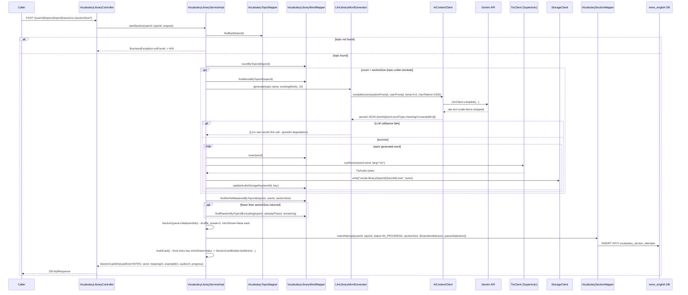

# Thư viện từ vựng theo chủ đề + Luyện tập theo Section — Implementation Plan

> **For agentic workers:** REQUIRED SUB-SKILL: Use superpowers:subagent-driven-development (recommended) or superpowers:executing-plans to implement this plan task-by-task. Steps use checkbox (`- [ ]`) syntax for tracking.

**Goal:** Add a persistent, topic-organized vocabulary library plus a Duolingo/Anki-style "Section" practice mode (Leitner-lite intra-session repetition) to `english-service`'s existing `vocabulary.learn` feature, proxied through `bff-service`, with a matching `RemeLearning_FE` UI.

**Architecture:** New package `com.remelearning.english.vocabulary.library` in `english-service` (domain/mapper/session/scoring/generator/dto/service/controller), reusing existing infra (`AiContentClient`, `TtsClient`, `StorageClient`, `PracticeService.redo`, `DictationScorer`, `OpenAnswerGrader`, `VocabularyType`). `bff-service` gets thin proxy DTOs/routes. `RemeLearning_FE` gets a new "Thư viện" flow under `src/features/learn/vocabulary/library/`.

**Tech Stack:** Java 21 / Spring Boot 4 / MyBatis / Flyway / PostgreSQL (english-service, bff-service); React/TypeScript/Vite/react-query/axios (RemeLearning_FE).

## Global Constraints

- Comment every non-trivial code block/method (Java and, where applicable, TS) per `CLAUDE.md` — not just non-obvious "why".
- No new abstractions beyond what's specified below (YAGNI) — do not add a job queue, a second weak-point table, or a rule-based (non-LLM) content generator.
- Reuse `item_id = "vocab:" + word.toLowerCase()` for every weak-point feed so library words and ad-hoc "Học & Luyện tập" words share one mastery record in `vocabulary_weak_points` — never introduce a second mastery table.
- Tests: plain JUnit 5 + AssertJ, `Mockito.mock(...)` (no `@Mock`/`@ExtendWith(MockitoExtension.class)`), no `@SpringBootTest`, no MyBatis mapper tests (repo convention — mappers are exercised indirectly via service tests only).
- Update in the **same commit** as the code they document: `english-service/openapi.yaml`, `bff-service/openapi.yaml`, `docs/API.md`, `docs/sequence/English_service/*.md`, `docs/flow/english-service-data-flow.md`, `Business.md` (`D:\Personal Project\RemeLearning_BA\Business.md`), and `english-service/README.md`.
- Spec: `docs/superpowers/specs/2026-07-22-vocabulary-library-sections-design.md`.

---

## Task 1: Flyway migration + new enums

**Files:**
- Create: `RemeLearning/services/english-service/src/main/resources/db/migration/V16__vocabulary_library.sql`
- Create: `RemeLearning/services/english-service/src/main/java/com/remelearning/english/vocabulary/library/domain/SectionExerciseType.java`
- Create: `RemeLearning/services/english-service/src/main/java/com/remelearning/english/vocabulary/library/domain/SectionStatus.java`
- Create: `RemeLearning/services/english-service/src/main/java/com/remelearning/english/vocabulary/library/domain/SectionCardKind.java`

**Interfaces:**
- Produces: tables `vocabulary_topics`, `vocabulary_library_words`, `vocabulary_section_attempts`, `vocabulary_section_answers`; enums `SectionExerciseType{MCQ,CLOZE,MATCHING,LISTENING_DICTATION,TRANSLATE_EN_TO_VI,TRANSLATE_VI_TO_EN}`, `SectionStatus{IN_PROGRESS,COMPLETED,ABANDONED}`, `SectionCardKind{INTRO,QUIZ}`.

- [ ] **Step 1: Write the migration**

```sql
-- Thư viện từ vựng theo chủ đề + luyện tập theo Section (Leitner-lite trong phiên). Mở rộng
-- english.vocabulary.learn: từ vựng cố định theo chủ đề (mới) chia sẻ mastery với
-- vocabulary_weak_points qua cùng quy ước item_id = "vocab:" + word (không có bảng mastery riêng).

CREATE TABLE vocabulary_topics (
    id BIGSERIAL PRIMARY KEY,
    code VARCHAR(60) NOT NULL UNIQUE,
    name VARCHAR(200) NOT NULL,
    description VARCHAR(500),
    level VARCHAR(10),
    created_at TIMESTAMPTZ NOT NULL DEFAULT now()
);

INSERT INTO vocabulary_topics (code, name, description, level) VALUES
    ('travel', 'Travel', 'Từ vựng về du lịch, sân bay, khách sạn, chuyến đi.', 'B1'),
    ('business', 'Business', 'Từ vựng về công việc, họp hành, email công sở.', 'B1'),
    ('daily-life', 'Daily Life', 'Từ vựng sinh hoạt hàng ngày.', 'A2'),
    ('food', 'Food', 'Từ vựng về ẩm thực, nấu ăn, nhà hàng.', 'A2'),
    ('technology', 'Technology', 'Từ vựng về công nghệ, thiết bị, internet.', 'B1'),
    ('health', 'Health', 'Từ vựng về sức khỏe, y tế, thể dục.', 'B1'),
    ('education', 'Education', 'Từ vựng về học tập, trường lớp, thi cử.', 'B1'),
    ('environment', 'Environment', 'Từ vựng về môi trường, thiên nhiên, khí hậu.', 'B2');

CREATE TABLE vocabulary_library_words (
    id BIGSERIAL PRIMARY KEY,
    topic_id BIGINT NOT NULL REFERENCES vocabulary_topics (id),
    word VARCHAR(200) NOT NULL,
    word_type VARCHAR(20) NOT NULL,
    meaning_vi VARCHAR(500) NOT NULL,
    example_en VARCHAR(500) NOT NULL,
    ipa VARCHAR(100),
    audio_storage_key VARCHAR(500),
    created_at TIMESTAMPTZ NOT NULL DEFAULT now()
);

CREATE INDEX idx_vocabulary_library_words_topic_id ON vocabulary_library_words (topic_id);

CREATE TABLE vocabulary_section_attempts (
    id BIGSERIAL PRIMARY KEY,
    user_id VARCHAR(100) NOT NULL,
    topic_id BIGINT NOT NULL REFERENCES vocabulary_topics (id),
    status VARCHAR(20) NOT NULL,
    section_size INT NOT NULL,
    library_word_ids TEXT NOT NULL,
    queue_state TEXT NOT NULL,
    correct_count INT NOT NULL DEFAULT 0,
    total_answers INT NOT NULL DEFAULT 0,
    started_at TIMESTAMPTZ NOT NULL DEFAULT now(),
    completed_at TIMESTAMPTZ
);

CREATE INDEX idx_vocabulary_section_attempts_user_id ON vocabulary_section_attempts (user_id);

CREATE TABLE vocabulary_section_answers (
    id BIGSERIAL PRIMARY KEY,
    section_attempt_id BIGINT NOT NULL REFERENCES vocabulary_section_attempts (id),
    library_word_id BIGINT NOT NULL REFERENCES vocabulary_library_words (id),
    exercise_type VARCHAR(30) NOT NULL,
    submitted_answer VARCHAR(500),
    score DOUBLE PRECISION NOT NULL,
    correct BOOLEAN NOT NULL,
    answered_at TIMESTAMPTZ NOT NULL DEFAULT now()
);

CREATE INDEX idx_vocabulary_section_answers_attempt_id ON vocabulary_section_answers (section_attempt_id);
```

- [ ] **Step 2: Write the three enums**

```java
package com.remelearning.english.vocabulary.library.domain;

/**
 * The six exercise shapes a Section QUIZ card can take. {@code TRANSLATE_EN_TO_VI} is graded by an
 * LLM (free-text meaning); every other type is graded by exact/normalized match or word-error-rate.
 */
public enum SectionExerciseType {
	MCQ,
	CLOZE,
	MATCHING,
	LISTENING_DICTATION,
	TRANSLATE_EN_TO_VI,
	TRANSLATE_VI_TO_EN
}
```

```java
package com.remelearning.english.vocabulary.library.domain;

/** Lifecycle of one {@code vocabulary_section_attempts} row. */
public enum SectionStatus {
	IN_PROGRESS,
	COMPLETED,
	ABANDONED
}
```

```java
package com.remelearning.english.vocabulary.library.domain;

/**
 * {@code INTRO}: an unscored flashcard shown the first time a word appears in a section.
 * {@code QUIZ}: a graded exercise of one {@link SectionExerciseType}.
 */
public enum SectionCardKind {
	INTRO,
	QUIZ
}
```

- [ ] **Step 3: Verify the migration applies**

Run: `cd RemeLearning && ./mvnw -pl services/english-service -am compile`
Expected: BUILD SUCCESS (Flyway validates the migration at context startup, but a plain compile at
least catches SQL file placement/naming — full validation happens when the service is next run
against the dev Postgres instance).

- [ ] **Step 4: Commit**

```bash
git add RemeLearning/services/english-service/src/main/resources/db/migration/V16__vocabulary_library.sql \
        RemeLearning/services/english-service/src/main/java/com/remelearning/english/vocabulary/library/domain/SectionExerciseType.java \
        RemeLearning/services/english-service/src/main/java/com/remelearning/english/vocabulary/library/domain/SectionStatus.java \
        RemeLearning/services/english-service/src/main/java/com/remelearning/english/vocabulary/library/domain/SectionCardKind.java
git commit -m "feat(vocabulary-library): add schema and enums for topic library + sections"
```

---

## Task 2: Domain POJOs

**Files:**
- Create: `RemeLearning/services/english-service/src/main/java/com/remelearning/english/vocabulary/library/domain/VocabularyTopic.java`
- Create: `RemeLearning/services/english-service/src/main/java/com/remelearning/english/vocabulary/library/domain/VocabularyLibraryWord.java`
- Create: `RemeLearning/services/english-service/src/main/java/com/remelearning/english/vocabulary/library/domain/VocabularySectionAttempt.java`
- Create: `RemeLearning/services/english-service/src/main/java/com/remelearning/english/vocabulary/library/domain/VocabularySectionAnswer.java`
- Create: `RemeLearning/services/english-service/src/main/java/com/remelearning/english/vocabulary/library/domain/SectionQueueEntry.java`
- Create: `RemeLearning/services/english-service/src/main/java/com/remelearning/english/vocabulary/library/domain/TopicMasterySummaryRow.java`

**Interfaces:**
- Consumes: `SectionExerciseType`, `SectionStatus` from Task 1; `com.remelearning.english.vocabulary.domain.VocabularyType` (existing).
- Produces: these six POJOs, used by every later task (mappers, queue algorithm, scoring, service, controller).

- [ ] **Step 1: Write the POJOs**

```java
package com.remelearning.english.vocabulary.library.domain;

import lombok.AllArgsConstructor;
import lombok.Builder;
import lombok.Data;
import lombok.NoArgsConstructor;

import java.time.Instant;

/** One row in {@code vocabulary_topics} — a fixed, seeded subject area (e.g. "Travel"). */
@Data
@Builder
@NoArgsConstructor
@AllArgsConstructor
public class VocabularyTopic {
	private Long id;
	private String code;
	private String name;
	private String description;
	private String level;
	private Instant createdAt;
}
```

```java
package com.remelearning.english.vocabulary.library.domain;

import com.remelearning.english.vocabulary.domain.VocabularyType;
import lombok.AllArgsConstructor;
import lombok.Builder;
import lombok.Data;
import lombok.NoArgsConstructor;

import java.time.Instant;

/** One row in {@code vocabulary_library_words} — a single word/phrase in a topic's word bank. */
@Data
@Builder
@NoArgsConstructor
@AllArgsConstructor
public class VocabularyLibraryWord {
	private Long id;
	private Long topicId;
	private String word;
	private VocabularyType wordType;
	private String meaningVi;
	private String exampleEn;
	private String ipa;
	private String audioStorageKey;
	private Instant createdAt;
}
```

```java
package com.remelearning.english.vocabulary.library.domain;

import lombok.AllArgsConstructor;
import lombok.Builder;
import lombok.Data;
import lombok.NoArgsConstructor;

import java.time.Instant;

/**
 * One row in {@code vocabulary_section_attempts} — a learner's in-progress or finished Section
 * (a queue of library words drilled with intra-session repetition). {@code queueStateJson} is the
 * serialized {@code List<SectionQueueEntry>} driving {@code SectionQueue}.
 */
@Data
@Builder
@NoArgsConstructor
@AllArgsConstructor
public class VocabularySectionAttempt {
	private Long id;
	private String userId;
	private Long topicId;
	private SectionStatus status;
	private int sectionSize;
	private String libraryWordIdsJson;
	private String queueStateJson;
	private int correctCount;
	private int totalAnswers;
	private Instant startedAt;
	private Instant completedAt;
}
```

```java
package com.remelearning.english.vocabulary.library.domain;

import lombok.AllArgsConstructor;
import lombok.Builder;
import lombok.Data;
import lombok.NoArgsConstructor;

import java.time.Instant;

/** One graded answer inside a Section (row in {@code vocabulary_section_answers}). */
@Data
@Builder
@NoArgsConstructor
@AllArgsConstructor
public class VocabularySectionAnswer {
	private Long id;
	private Long sectionAttemptId;
	private Long libraryWordId;
	private SectionExerciseType exerciseType;
	private String submittedAnswer;
	private double score;
	private boolean correct;
	private Instant answeredAt;
}
```

```java
package com.remelearning.english.vocabulary.library.domain;

import lombok.AllArgsConstructor;
import lombok.Builder;
import lombok.Data;
import lombok.NoArgsConstructor;

/**
 * One entry in a Section's in-session queue (the unit {@code SectionQueue} reorders). Serialized
 * as JSON inside {@link VocabularySectionAttempt#getQueueStateJson()}.
 *
 * <p>{@code pendingExerciseType} freezes the randomly-chosen {@link SectionExerciseType} for this
 * word's *current* occurrence at the front of the queue — set once when its QUIZ card is built,
 * read back when the learner's answer is graded, and always {@code null} on a freshly-requeued
 * entry so the next occurrence re-rolls a (possibly different) exercise type.
 */
@Data
@Builder
@NoArgsConstructor
@AllArgsConstructor
public class SectionQueueEntry {
	private Long libraryWordId;
	private int streak;
	private boolean introShown;
	private SectionExerciseType pendingExerciseType;
}
```

```java
package com.remelearning.english.vocabulary.library.domain;

import lombok.AllArgsConstructor;
import lombok.Builder;
import lombok.Data;
import lombok.NoArgsConstructor;

/** One row of the per-user, per-topic mastery aggregate query (mapper result row, not a table). */
@Data
@Builder
@NoArgsConstructor
@AllArgsConstructor
public class TopicMasterySummaryRow {
	private Long topicId;
	private int wordCount;
	private int masteredCount;
}
```

- [ ] **Step 2: Compile**

Run: `cd RemeLearning && ./mvnw -pl services/english-service -am compile`
Expected: BUILD SUCCESS

- [ ] **Step 3: Commit**

```bash
git add RemeLearning/services/english-service/src/main/java/com/remelearning/english/vocabulary/library/domain/
git commit -m "feat(vocabulary-library): add domain POJOs for topics, words, sections, queue entries"
```

---

## Task 3: `SectionQueue` — the Leitner-lite in-session algorithm

**Files:**
- Create: `RemeLearning/services/english-service/src/main/java/com/remelearning/english/vocabulary/library/session/SectionQueue.java`
- Test: `RemeLearning/services/english-service/src/test/java/com/remelearning/english/vocabulary/library/session/SectionQueueTest.java`

**Interfaces:**
- Consumes: `SectionQueueEntry` (Task 2).
- Produces: `SectionQueue.initial(List<Long>)`, `.isComplete(List<SectionQueueEntry>)`, `.current(List<SectionQueueEntry>)`, `.acknowledgeIntro(List<SectionQueueEntry>)`, `.applyResult(List<SectionQueueEntry>, boolean)`, constants `MASTERY_STREAK=2`, `CORRECT_REQUEUE_GAP=6`, `WRONG_REQUEUE_GAP=2` — used by Task 8/9 (`VocabularyLibraryServiceImpl`).

- [ ] **Step 1: Write the failing tests**

```java
package com.remelearning.english.vocabulary.library.session;

import com.remelearning.english.vocabulary.library.domain.SectionQueueEntry;
import org.junit.jupiter.api.Test;

import java.util.ArrayList;
import java.util.List;

import static org.assertj.core.api.Assertions.assertThat;
import static org.assertj.core.api.Assertions.assertThatThrownBy;

class SectionQueueTest {

	@Test
	void initialContainsEveryWordExactlyOnceWithZeroStreakAndNoIntro() {
		List<SectionQueueEntry> queue = SectionQueue.initial(List.of(1L, 2L, 3L));

		assertThat(queue).hasSize(3);
		assertThat(queue).extracting(SectionQueueEntry::getLibraryWordId).containsExactlyInAnyOrder(1L, 2L, 3L);
		assertThat(queue).allMatch(entry -> entry.getStreak() == 0 && !entry.isIntroShown());
	}

	@Test
	void isCompleteTrueOnlyForEmptyQueue() {
		assertThat(SectionQueue.isComplete(List.of())).isTrue();
		assertThat(SectionQueue.isComplete(SectionQueue.initial(List.of(1L)))).isFalse();
	}

	@Test
	void currentReturnsFrontEntryAndThrowsWhenEmpty() {
		List<SectionQueueEntry> queue = SectionQueue.initial(List.of(1L));

		assertThat(SectionQueue.current(queue).getLibraryWordId()).isEqualTo(1L);
		assertThatThrownBy(() -> SectionQueue.current(List.of())).isInstanceOf(IllegalStateException.class);
	}

	@Test
	void acknowledgeIntroMarksFrontEntryShownWithoutMovingItOrChangingStreak() {
		List<SectionQueueEntry> queue = new ArrayList<>(List.of(
				SectionQueueEntry.builder().libraryWordId(1L).streak(0).introShown(false).build(),
				SectionQueueEntry.builder().libraryWordId(2L).streak(0).introShown(false).build()));

		List<SectionQueueEntry> updated = SectionQueue.acknowledgeIntro(queue);

		assertThat(updated).hasSize(2);
		assertThat(updated.get(0).getLibraryWordId()).isEqualTo(1L);
		assertThat(updated.get(0).isIntroShown()).isTrue();
		assertThat(updated.get(0).getStreak()).isZero();
		assertThat(updated.get(1).getLibraryWordId()).isEqualTo(2L);
	}

	@Test
	void applyResultRemovesWordOnceMasteryStreakReached() {
		List<SectionQueueEntry> queue = new ArrayList<>(List.of(
				SectionQueueEntry.builder().libraryWordId(1L).streak(1).introShown(true).build(),
				SectionQueueEntry.builder().libraryWordId(2L).streak(0).introShown(true).build()));

		List<SectionQueueEntry> updated = SectionQueue.applyResult(queue, true);

		assertThat(updated).extracting(SectionQueueEntry::getLibraryWordId).containsExactly(2L);
	}

	@Test
	void applyResultRequeuesCorrectAnswerFurtherAwayThanWrongAnswer() {
		List<SectionQueueEntry> tenEntries = new ArrayList<>();
		tenEntries.add(SectionQueueEntry.builder().libraryWordId(0L).streak(0).introShown(true).build());
		for (long i = 1; i <= 9; i++) {
			tenEntries.add(SectionQueueEntry.builder().libraryWordId(i).streak(0).introShown(true).build());
		}

		List<SectionQueueEntry> afterCorrect = SectionQueue.applyResult(new ArrayList<>(tenEntries), true);
		List<SectionQueueEntry> afterWrong = SectionQueue.applyResult(new ArrayList<>(tenEntries), false);

		assertThat(afterCorrect.indexOf(afterCorrect.stream().filter(e -> e.getLibraryWordId() == 0L).findFirst().orElseThrow()))
				.isEqualTo(SectionQueue.CORRECT_REQUEUE_GAP);
		assertThat(afterWrong.indexOf(afterWrong.stream().filter(e -> e.getLibraryWordId() == 0L).findFirst().orElseThrow()))
				.isEqualTo(SectionQueue.WRONG_REQUEUE_GAP);
	}

	@Test
	void applyResultResetsStreakToZeroOnWrongAnswerAndRestartsIntroShownTrue() {
		List<SectionQueueEntry> queue = new ArrayList<>(List.of(
				SectionQueueEntry.builder().libraryWordId(1L).streak(1).introShown(true).build()));

		List<SectionQueueEntry> updated = SectionQueue.applyResult(queue, false);

		assertThat(updated).hasSize(1);
		assertThat(updated.get(0).getStreak()).isZero();
		assertThat(updated.get(0).isIntroShown()).isTrue();
	}

	@Test
	void applyResultClearsPendingExerciseTypeSoNextOccurrenceRerolls() {
		List<SectionQueueEntry> queue = new ArrayList<>(List.of(
				SectionQueueEntry.builder().libraryWordId(1L).streak(0).introShown(true)
						.pendingExerciseType(com.remelearning.english.vocabulary.library.domain.SectionExerciseType.MCQ).build(),
				SectionQueueEntry.builder().libraryWordId(2L).streak(0).introShown(true).build()));

		List<SectionQueueEntry> updated = SectionQueue.applyResult(queue, false);

		assertThat(updated).extracting(SectionQueueEntry::getPendingExerciseType).containsOnlyNulls();
	}
}
```

- [ ] **Step 2: Run tests to verify they fail**

Run: `cd RemeLearning && ./mvnw -pl services/english-service -am test -Dtest=SectionQueueTest -Dsurefire.failIfNoSpecifiedTests=false`
Expected: FAIL — `SectionQueue` does not exist (compilation error)

- [ ] **Step 3: Implement `SectionQueue`**

```java
package com.remelearning.english.vocabulary.library.session;

import com.remelearning.english.vocabulary.library.domain.SectionQueueEntry;

import java.util.ArrayList;
import java.util.Collections;
import java.util.List;
import java.util.stream.Collectors;

/**
 * Pure, stateless Leitner-lite scheduler for one Section's in-session word queue. A word is
 * dropped from the queue (considered "mastered for this session") once it has been answered
 * correctly {@link #MASTERY_STREAK} times in a row; any wrong answer resets its streak to zero.
 * Correct-but-not-yet-mastered answers are requeued further away than wrong answers, giving an
 * expanding-interval spacing effect within the single session (the same idea as a physical Leitner
 * box, compressed into one sitting instead of days).
 */
public final class SectionQueue {

	/** Consecutive correct answers needed before a word leaves the queue for this session. */
	public static final int MASTERY_STREAK = 2;
	/** How many cards later a correct-but-not-mastered word reappears (capped by queue length). */
	public static final int CORRECT_REQUEUE_GAP = 6;
	/** How many cards later a wrongly-answered word reappears (capped by queue length). */
	public static final int WRONG_REQUEUE_GAP = 2;

	private SectionQueue() {
	}

	/** Shuffles the given word ids into a fresh queue, each starting at streak 0, intro not yet shown. */
	public static List<SectionQueueEntry> initial(List<Long> libraryWordIds) {
		List<Long> shuffled = new ArrayList<>(libraryWordIds);
		Collections.shuffle(shuffled);
		return shuffled.stream()
				.map(id -> SectionQueueEntry.builder().libraryWordId(id).streak(0).introShown(false).build())
				.collect(Collectors.toCollection(ArrayList::new));
	}

	/** A Section is done once every word has reached {@link #MASTERY_STREAK} and left the queue. */
	public static boolean isComplete(List<SectionQueueEntry> queue) {
		return queue.isEmpty();
	}

	/** The entry currently at the front of the queue - the one to present next. */
	public static SectionQueueEntry current(List<SectionQueueEntry> queue) {
		if (queue.isEmpty()) {
			throw new IllegalStateException("Cannot read the current entry of an empty section queue");
		}
		return queue.get(0);
	}

	/** Marks the front entry's INTRO flashcard as shown, without moving it or touching its streak. */
	public static List<SectionQueueEntry> acknowledgeIntro(List<SectionQueueEntry> queue) {
		List<SectionQueueEntry> updated = new ArrayList<>(queue);
		SectionQueueEntry front = updated.get(0);
		updated.set(0, SectionQueueEntry.builder()
				.libraryWordId(front.getLibraryWordId()).streak(front.getStreak()).introShown(true).build());
		return updated;
	}

	/**
	 * Pops the front entry and, based on whether its QUIZ answer was correct, either drops it
	 * (mastered) or reinserts it further into the queue - the pending exercise type is always
	 * cleared on reinsertion so the word's next occurrence rolls a fresh (possibly different) type.
	 */
	public static List<SectionQueueEntry> applyResult(List<SectionQueueEntry> queue, boolean correct) {
		SectionQueueEntry front = queue.get(0);
		List<SectionQueueEntry> remaining = new ArrayList<>(queue.subList(1, queue.size()));

		if (correct) {
			int newStreak = front.getStreak() + 1;
			if (newStreak >= MASTERY_STREAK) {
				return remaining;
			}
			int position = Math.min(remaining.size(), CORRECT_REQUEUE_GAP);
			remaining.add(position, SectionQueueEntry.builder()
					.libraryWordId(front.getLibraryWordId()).streak(newStreak).introShown(true).build());
			return remaining;
		}

		int position = Math.min(remaining.size(), WRONG_REQUEUE_GAP);
		remaining.add(position, SectionQueueEntry.builder()
				.libraryWordId(front.getLibraryWordId()).streak(0).introShown(true).build());
		return remaining;
	}
}
```

- [ ] **Step 4: Run tests to verify they pass**

Run: `cd RemeLearning && ./mvnw -pl services/english-service -am test -Dtest=SectionQueueTest -Dsurefire.failIfNoSpecifiedTests=false`
Expected: PASS (8 tests)

- [ ] **Step 5: Commit**

```bash
git add RemeLearning/services/english-service/src/main/java/com/remelearning/english/vocabulary/library/session/SectionQueue.java \
        RemeLearning/services/english-service/src/test/java/com/remelearning/english/vocabulary/library/session/SectionQueueTest.java
git commit -m "feat(vocabulary-library): add Leitner-lite in-session queue scheduler"
```

---

## Task 4: Section exercise mechanics — scoring dispatch + card building

**Files:**
- Create: `RemeLearning/services/english-service/src/main/java/com/remelearning/english/vocabulary/library/scoring/SectionAnswerScoring.java`
- Create: `RemeLearning/services/english-service/src/main/java/com/remelearning/english/vocabulary/library/dto/SectionProgressDto.java`
- Create: `RemeLearning/services/english-service/src/main/java/com/remelearning/english/vocabulary/library/dto/SectionCardDto.java`
- Create: `RemeLearning/services/english-service/src/main/java/com/remelearning/english/vocabulary/library/scoring/SectionCardBuilder.java`
- Test: `RemeLearning/services/english-service/src/test/java/com/remelearning/english/vocabulary/library/scoring/SectionAnswerScoringTest.java`
- Test: `RemeLearning/services/english-service/src/test/java/com/remelearning/english/vocabulary/library/scoring/SectionCardBuilderTest.java`

**Interfaces:**
- Consumes: `SectionExerciseType`, `SectionCardKind`, `VocabularyLibraryWord` (Task 1/2); `com.remelearning.english.dictation.scoring.DictationScorer` (existing).
- Produces: `SectionAnswerScoring.CORRECT_THRESHOLD=0.7`, `.scoreClosed(SectionExerciseType, String correctAnswer, String submitted)`; `SectionCardBuilder.buildIntro(Long sectionId, VocabularyLibraryWord, String audioUrl, SectionProgressDto)`, `.buildQuiz(Long sectionId, VocabularyLibraryWord, SectionExerciseType, List<VocabularyLibraryWord> distractorWords, String audioUrl, SectionProgressDto)` — used by Task 8/9 (`VocabularyLibraryServiceImpl`).

**Note on the "never leak the answer" rule** (see the table in the design spec, §3): for `CLOZE`/`MCQ`/`LISTENING_DICTATION`/`TRANSLATE_VI_TO_EN`, playing pronunciation audio would hand the learner the answer, so `audioUrl` must **not** be set on the returned DTO for those types; only `MATCHING`, `TRANSLATE_EN_TO_VI` (where the word is already the visible prompt) and `LISTENING_DICTATION` (where hearing it *is* the exercise) get audio.

- [ ] **Step 1: Write the failing tests**

```java
package com.remelearning.english.vocabulary.library.scoring;

import com.remelearning.english.vocabulary.library.domain.SectionExerciseType;
import org.junit.jupiter.api.Test;

import static org.assertj.core.api.Assertions.assertThat;
import static org.assertj.core.api.Assertions.assertThatThrownBy;

class SectionAnswerScoringTest {

	@Test
	void mcqClozeMatchingAndTranslateViToEnScoreExactCaseInsensitiveMatch() {
		assertThat(SectionAnswerScoring.scoreClosed(SectionExerciseType.MCQ, "brief", "Brief")).isEqualTo(1.0);
		assertThat(SectionAnswerScoring.scoreClosed(SectionExerciseType.CLOZE, "brief", "long")).isEqualTo(0.0);
		assertThat(SectionAnswerScoring.scoreClosed(SectionExerciseType.MATCHING, "ngắn gọn", "Ngắn gọn")).isEqualTo(1.0);
		assertThat(SectionAnswerScoring.scoreClosed(SectionExerciseType.TRANSLATE_VI_TO_EN, "brief", null)).isEqualTo(0.0);
	}

	@Test
	void listeningDictationScoresViaWordErrorRateAccuracy() {
		double score = SectionAnswerScoring.scoreClosed(SectionExerciseType.LISTENING_DICTATION, "reluctant", "reluctant");

		assertThat(score).isEqualTo(1.0);
	}

	@Test
	void translateEnToViMustBeGradedByTheLlmNotThisPureDispatcher() {
		assertThatThrownBy(() -> SectionAnswerScoring.scoreClosed(SectionExerciseType.TRANSLATE_EN_TO_VI, "brief", "ngắn gọn"))
				.isInstanceOf(IllegalArgumentException.class);
	}
}
```

```java
package com.remelearning.english.vocabulary.library.scoring;

import com.remelearning.english.vocabulary.domain.VocabularyType;
import com.remelearning.english.vocabulary.library.domain.SectionExerciseType;
import com.remelearning.english.vocabulary.library.domain.VocabularyLibraryWord;
import com.remelearning.english.vocabulary.library.dto.SectionCardDto;
import com.remelearning.english.vocabulary.library.dto.SectionProgressDto;
import org.junit.jupiter.api.Test;

import java.util.List;

import static org.assertj.core.api.Assertions.assertThat;

class SectionCardBuilderTest {

	private final VocabularyLibraryWord word = VocabularyLibraryWord.builder()
			.id(1L).topicId(10L).word("reluctant").wordType(VocabularyType.ADJECTIVE)
			.meaningVi("miễn cưỡng").exampleEn("She was reluctant to admit it.").build();
	private final List<VocabularyLibraryWord> distractors = List.of(
			VocabularyLibraryWord.builder().id(2L).word("brief").meaningVi("ngắn gọn").build(),
			VocabularyLibraryWord.builder().id(3L).word("keen").meaningVi("hào hứng").build(),
			VocabularyLibraryWord.builder().id(4L).word("vague").meaningVi("mơ hồ").build());
	private final SectionProgressDto progress = SectionProgressDto.builder().totalWords(10).wordsMastered(3).wordsRemaining(7).build();

	@Test
	void buildIntroRevealsWordMeaningExampleAndAudioUnscored() {
		SectionCardDto card = SectionCardBuilder.buildIntro(100L, word, "/audio/1", progress);

		assertThat(card.getCardKind().name()).isEqualTo("INTRO");
		assertThat(card.getWord()).isEqualTo("reluctant");
		assertThat(card.getMeaningVi()).isEqualTo("miễn cưỡng");
		assertThat(card.getExampleEn()).isEqualTo("She was reluctant to admit it.");
		assertThat(card.getAudioUrl()).isEqualTo("/audio/1");
	}

	@Test
	void buildQuizClozeBlanksTheTargetWordAndNeverLeaksItOrAudio() {
		SectionCardDto card = SectionCardBuilder.buildQuiz(100L, word, SectionExerciseType.CLOZE, distractors, "/audio/1", progress);

		assertThat(card.getPrompt()).isEqualTo("She was ____ to admit it.");
		assertThat(card.getOptions()).isNull();
		assertThat(card.getWord()).isNull();
		assertThat(card.getMeaningVi()).isNull();
		assertThat(card.getAudioUrl()).isNull();
	}

	@Test
	void buildQuizMcqOffersFourShuffledWordOptionsIncludingTheCorrectOneWithNoAudio() {
		SectionCardDto card = SectionCardBuilder.buildQuiz(100L, word, SectionExerciseType.MCQ, distractors, "/audio/1", progress);

		assertThat(card.getOptions()).hasSize(4).contains("reluctant", "brief", "keen", "vague");
		assertThat(card.getAudioUrl()).isNull();
	}

	@Test
	void buildQuizMatchingPromptsWithTheWordItselfAndOffersMeaningOptionsWithAudioAllowed() {
		SectionCardDto card = SectionCardBuilder.buildQuiz(100L, word, SectionExerciseType.MATCHING, distractors, "/audio/1", progress);

		assertThat(card.getPrompt()).isEqualTo("reluctant");
		assertThat(card.getOptions()).hasSize(4).contains("miễn cưỡng", "ngắn gọn", "hào hứng", "mơ hồ");
		assertThat(card.getAudioUrl()).isEqualTo("/audio/1");
	}

	@Test
	void buildQuizListeningDictationHasNoOptionsAndAlwaysHasAudio() {
		SectionCardDto card = SectionCardBuilder.buildQuiz(100L, word, SectionExerciseType.LISTENING_DICTATION, distractors, "/audio/1", progress);

		assertThat(card.getOptions()).isNull();
		assertThat(card.getAudioUrl()).isEqualTo("/audio/1");
	}

	@Test
	void buildQuizTranslateEnToViShowsTheWordAsPromptAndAllowsAudioButHidesMeaning() {
		SectionCardDto card = SectionCardBuilder.buildQuiz(100L, word, SectionExerciseType.TRANSLATE_EN_TO_VI, distractors, "/audio/1", progress);

		assertThat(card.getPrompt()).isEqualTo("reluctant");
		assertThat(card.getMeaningVi()).isNull();
		assertThat(card.getAudioUrl()).isEqualTo("/audio/1");
	}

	@Test
	void buildQuizTranslateViToEnShowsTheMeaningAsPromptAndNeverPlaysAudio() {
		SectionCardDto card = SectionCardBuilder.buildQuiz(100L, word, SectionExerciseType.TRANSLATE_VI_TO_EN, distractors, "/audio/1", progress);

		assertThat(card.getPrompt()).isEqualTo("miễn cưỡng");
		assertThat(card.getAudioUrl()).isNull();
	}
}
```

- [ ] **Step 2: Run tests to verify they fail**

Run: `cd RemeLearning && ./mvnw -pl services/english-service -am test -Dtest=SectionAnswerScoringTest,SectionCardBuilderTest -Dsurefire.failIfNoSpecifiedTests=false`
Expected: FAIL — none of `SectionAnswerScoring`/`SectionProgressDto`/`SectionCardDto`/`SectionCardBuilder` exist yet

- [ ] **Step 3: Implement the DTOs**

```java
package com.remelearning.english.vocabulary.library.dto;

import lombok.Builder;
import lombok.Getter;

@Getter
@Builder
public class SectionProgressDto {
	private int totalWords;
	private int wordsMastered;
	private int wordsRemaining;
}
```

```java
package com.remelearning.english.vocabulary.library.dto;

import com.remelearning.english.vocabulary.library.domain.SectionCardKind;
import com.remelearning.english.vocabulary.library.domain.SectionExerciseType;
import lombok.Builder;
import lombok.Getter;

import java.util.List;

/**
 * One card in a Section's run - either an unscored {@code INTRO} flashcard (word/meaning/example/
 * audio all shown) or a graded {@code QUIZ} card (prompt/options only; word/meaning/audio are set
 * only when doing so cannot leak the answer - see {@code SectionCardBuilder}).
 */
@Getter
@Builder
public class SectionCardDto {
	private Long sectionId;
	private SectionCardKind cardKind;
	private Long libraryWordId;
	private String word;
	private String meaningVi;
	private String exampleEn;
	private String audioUrl;
	private SectionExerciseType exerciseType;
	private String prompt;
	private List<String> options;
	private SectionProgressDto progress;
}
```

- [ ] **Step 4: Implement `SectionAnswerScoring`**

```java
package com.remelearning.english.vocabulary.library.scoring;

import com.remelearning.english.dictation.scoring.DictationScorer;
import com.remelearning.english.vocabulary.library.domain.SectionExerciseType;

/**
 * Pure, stateless scoring for the five Section QUIZ types gradeable without an LLM call: exact
 * normalized match for {@code MCQ}/{@code CLOZE}/{@code MATCHING}/{@code TRANSLATE_VI_TO_EN}, and
 * word-error-rate accuracy (same {@link DictationScorer} dictation/listening-keyword use) for
 * {@code LISTENING_DICTATION}. {@code TRANSLATE_EN_TO_VI} (free-text Vietnamese meaning) has no
 * place here - it's graded by an LLM instead (see {@code VocabularyLibraryServiceImpl}).
 */
public final class SectionAnswerScoring {

	/** A continuous sub-score at/above this is treated as "correct" for the queue/weak-point feed. */
	public static final double CORRECT_THRESHOLD = 0.7;

	private SectionAnswerScoring() {
	}

	/** @throws IllegalArgumentException if {@code type} is {@code TRANSLATE_EN_TO_VI} */
	public static double scoreClosed(SectionExerciseType type, String correctAnswer, String submitted) {
		return switch (type) {
			case MCQ, CLOZE, MATCHING, TRANSLATE_VI_TO_EN ->
					normalize(correctAnswer).equals(normalize(submitted)) ? 1.0 : 0.0;
			case LISTENING_DICTATION -> DictationScorer.score(correctAnswer, submitted == null ? "" : submitted).getAccuracy();
			case TRANSLATE_EN_TO_VI ->
					throw new IllegalArgumentException("TRANSLATE_EN_TO_VI must be graded by the LLM, not scoreClosed");
		};
	}

	private static String normalize(String value) {
		return value == null ? "" : value.trim().toLowerCase().replaceAll("\\s+", " ");
	}
}
```

- [ ] **Step 5: Implement `SectionCardBuilder`**

```java
package com.remelearning.english.vocabulary.library.scoring;

import com.remelearning.english.vocabulary.library.domain.SectionCardKind;
import com.remelearning.english.vocabulary.library.domain.SectionExerciseType;
import com.remelearning.english.vocabulary.library.domain.VocabularyLibraryWord;
import com.remelearning.english.vocabulary.library.dto.SectionCardDto;
import com.remelearning.english.vocabulary.library.dto.SectionProgressDto;

import java.util.ArrayList;
import java.util.Collections;
import java.util.List;
import java.util.function.Function;
import java.util.regex.Pattern;

/**
 * Builds the client-facing {@link SectionCardDto} for one queue entry - either the unscored INTRO
 * flashcard or one of the six QUIZ shapes. Deliberately never sets a field on the QUIZ path that
 * would hand the learner the answer (see the design spec's leak table): CLOZE/MCQ/LISTENING_
 * DICTATION/TRANSLATE_VI_TO_EN never get {@code audioUrl}, and no QUIZ card ever gets {@code word}/
 * {@code meaningVi} except where that value already *is* the visible prompt.
 */
public final class SectionCardBuilder {

	private SectionCardBuilder() {
	}

	/** The unscored first-exposure flashcard: everything about the word is shown. */
	public static SectionCardDto buildIntro(Long sectionId, VocabularyLibraryWord word, String audioUrl, SectionProgressDto progress) {
		return SectionCardDto.builder()
				.sectionId(sectionId).cardKind(SectionCardKind.INTRO).libraryWordId(word.getId())
				.word(word.getWord()).meaningVi(word.getMeaningVi()).exampleEn(word.getExampleEn())
				.audioUrl(audioUrl).progress(progress).build();
	}

	/** One graded QUIZ card of the given type; {@code distractorWords} must have at least 3 entries for MCQ/MATCHING. */
	public static SectionCardDto buildQuiz(Long sectionId, VocabularyLibraryWord word, SectionExerciseType type,
			List<VocabularyLibraryWord> distractorWords, String audioUrl, SectionProgressDto progress) {
		SectionCardDto.SectionCardDtoBuilder builder = SectionCardDto.builder()
				.sectionId(sectionId).cardKind(SectionCardKind.QUIZ).libraryWordId(word.getId())
				.exerciseType(type).progress(progress);

		switch (type) {
			case CLOZE -> builder.prompt(blank(word));
			case MCQ -> builder.prompt(blank(word))
					.options(shuffledOptions(word.getWord(), distractorWords, VocabularyLibraryWord::getWord));
			case MATCHING -> builder.prompt(word.getWord())
					.options(shuffledOptions(word.getMeaningVi(), distractorWords, VocabularyLibraryWord::getMeaningVi))
					.audioUrl(audioUrl);
			case LISTENING_DICTATION -> builder.prompt("Nghe và gõ lại từ bạn nghe được.").audioUrl(audioUrl);
			case TRANSLATE_EN_TO_VI -> builder.prompt(word.getWord()).audioUrl(audioUrl);
			case TRANSLATE_VI_TO_EN -> builder.prompt(word.getMeaningVi());
		}
		return builder.build();
	}

	// Case-insensitive whole-word replace of the target word with a blank, for CLOZE/MCQ prompts.
	private static String blank(VocabularyLibraryWord word) {
		return word.getExampleEn().replaceAll("(?i)\\b" + Pattern.quote(word.getWord()) + "\\b", "____");
	}

	// Combines the correct value with the sibling words' corresponding field, then shuffles.
	private static List<String> shuffledOptions(String correct, List<VocabularyLibraryWord> distractorWords,
			Function<VocabularyLibraryWord, String> field) {
		List<String> options = new ArrayList<>(distractorWords.stream().map(field).toList());
		options.add(correct);
		Collections.shuffle(options);
		return options;
	}
}
```

- [ ] **Step 6: Run tests to verify they pass**

Run: `cd RemeLearning && ./mvnw -pl services/english-service -am test -Dtest=SectionAnswerScoringTest,SectionCardBuilderTest -Dsurefire.failIfNoSpecifiedTests=false`
Expected: PASS (11 tests)

- [ ] **Step 7: Commit**

```bash
git add RemeLearning/services/english-service/src/main/java/com/remelearning/english/vocabulary/library/scoring/ \
        RemeLearning/services/english-service/src/main/java/com/remelearning/english/vocabulary/library/dto/SectionProgressDto.java \
        RemeLearning/services/english-service/src/main/java/com/remelearning/english/vocabulary/library/dto/SectionCardDto.java \
        RemeLearning/services/english-service/src/test/java/com/remelearning/english/vocabulary/library/scoring/
git commit -m "feat(vocabulary-library): add section scoring dispatch and answer-safe card builder"
```

---

## Task 5: MyBatis mappers (topics, library words, sections)

**Files:**
- Create: `RemeLearning/services/english-service/src/main/java/com/remelearning/english/vocabulary/library/mapper/VocabularyTopicMapper.java`
- Create: `RemeLearning/services/english-service/src/main/resources/mapper/vocabulary/library/VocabularyTopicMapper.xml`
- Create: `RemeLearning/services/english-service/src/main/java/com/remelearning/english/vocabulary/library/mapper/VocabularyLibraryWordMapper.java`
- Create: `RemeLearning/services/english-service/src/main/resources/mapper/vocabulary/library/VocabularyLibraryWordMapper.xml`
- Create: `RemeLearning/services/english-service/src/main/java/com/remelearning/english/vocabulary/library/mapper/VocabularySectionMapper.java`
- Create: `RemeLearning/services/english-service/src/main/resources/mapper/vocabulary/library/VocabularySectionMapper.xml`

**Interfaces:**
- Consumes: `VocabularyTopic`, `VocabularyLibraryWord`, `VocabularySectionAttempt`, `VocabularySectionAnswer`, `TopicMasterySummaryRow` (Task 2). `english-service`'s existing `mybatis.configuration.map-underscore-to-camel-case: true` (application.yml) means no explicit `resultMap`/column aliasing is needed anywhere below.
- Produces: three `@Mapper` interfaces consumed by Task 8-11 (`VocabularyLibraryServiceImpl`). No dedicated mapper tests (repo convention — see Global Constraints); wiring is verified indirectly by the service-level tests in Tasks 8-11.

No test steps in this task per the "no MyBatis mapper tests" convention (see `VocabPracticeMapper`/`ListeningMapper` — no test files exist for them either). Compile after writing, then commit.

- [ ] **Step 1: `VocabularyTopicMapper`**

```java
package com.remelearning.english.vocabulary.library.mapper;

import com.remelearning.english.vocabulary.library.domain.TopicMasterySummaryRow;
import com.remelearning.english.vocabulary.library.domain.VocabularyTopic;
import org.apache.ibatis.annotations.Mapper;
import org.apache.ibatis.annotations.Param;

import java.util.List;

@Mapper
public interface VocabularyTopicMapper {

	List<VocabularyTopic> findAll();

	VocabularyTopic findById(@Param("id") Long id);

	/** Word count and mastered-count (mastery_level >= 0.7 in vocabulary_weak_points) per topic, for this learner. */
	List<TopicMasterySummaryRow> findMasterySummaryByUserId(@Param("userId") String userId);
}
```

```xml
<?xml version="1.0" encoding="UTF-8" ?>
<!DOCTYPE mapper PUBLIC "-//mybatis.org//DTD Mapper 3.0//EN" "https://mybatis.org/dtd/mybatis-3-mapper.dtd">
<mapper namespace="com.remelearning.english.vocabulary.library.mapper.VocabularyTopicMapper">

    <select id="findAll" resultType="com.remelearning.english.vocabulary.library.domain.VocabularyTopic">
        SELECT id, code, name, description, level, created_at FROM vocabulary_topics ORDER BY name
    </select>

    <select id="findById" resultType="com.remelearning.english.vocabulary.library.domain.VocabularyTopic">
        SELECT id, code, name, description, level, created_at FROM vocabulary_topics WHERE id = #{id}
    </select>

    <!-- Computed at read time (no running counter), same convention dashboard-service uses for
         per-category progress: a topic's mastered_count is how many of its words currently have a
         vocabulary_weak_points row (shared across the ad-hoc "Học & Luyện tập" flow and this
         library, via the same item_id = "vocab:" + word convention) with mastery_level >= 0.7. -->
    <select id="findMasterySummaryByUserId" resultType="com.remelearning.english.vocabulary.library.domain.TopicMasterySummaryRow">
        SELECT t.id AS topic_id,
               COUNT(w.id) AS word_count,
               COUNT(*) FILTER (WHERE wp.mastery_level IS NOT NULL AND wp.mastery_level >= 0.7) AS mastered_count
        FROM vocabulary_topics t
        LEFT JOIN vocabulary_library_words w ON w.topic_id = t.id
        LEFT JOIN vocabulary_weak_points wp ON wp.user_id = #{userId} AND wp.item_id = 'vocab:' || lower(w.word)
        GROUP BY t.id
    </select>

</mapper>
```

- [ ] **Step 2: `VocabularyLibraryWordMapper`**

```java
package com.remelearning.english.vocabulary.library.mapper;

import com.remelearning.english.vocabulary.library.domain.VocabularyLibraryWord;
import org.apache.ibatis.annotations.Mapper;
import org.apache.ibatis.annotations.Param;

import java.util.List;

@Mapper
public interface VocabularyLibraryWordMapper {

	/** Inserts one word; the generated id is written back into {@code word.id}. */
	void insert(VocabularyLibraryWord word);

	VocabularyLibraryWord findById(@Param("id") Long id);

	List<VocabularyLibraryWord> findByTopicId(@Param("topicId") Long topicId);

	int countByTopicId(@Param("topicId") Long topicId);

	/** Bare word strings already in a topic, so a top-up generation call can avoid repeating them. */
	List<String> findWordsByTopicId(@Param("topicId") Long topicId);

	/** Words in a topic this learner has not yet mastered (or never attempted), soonest-picked first, random order. */
	List<VocabularyLibraryWord> findNotYetMasteredByTopicId(
			@Param("topicId") Long topicId, @Param("userId") String userId, @Param("limit") int limit);

	/** Random words in a topic excluding the given ids - used both to fill out a section and to sample MCQ/MATCHING distractors. */
	List<VocabularyLibraryWord> findRandomByTopicIdExcluding(
			@Param("topicId") Long topicId, @Param("excludeIds") List<Long> excludeIds, @Param("limit") int limit);

	void updateAudioStorageKey(@Param("id") Long id, @Param("audioStorageKey") String audioStorageKey);
}
```

```xml
<?xml version="1.0" encoding="UTF-8" ?>
<!DOCTYPE mapper PUBLIC "-//mybatis.org//DTD Mapper 3.0//EN" "https://mybatis.org/dtd/mybatis-3-mapper.dtd">
<mapper namespace="com.remelearning.english.vocabulary.library.mapper.VocabularyLibraryWordMapper">

    <insert id="insert" parameterType="com.remelearning.english.vocabulary.library.domain.VocabularyLibraryWord"
            useGeneratedKeys="true" keyProperty="id">
        INSERT INTO vocabulary_library_words (topic_id, word, word_type, meaning_vi, example_en, ipa, audio_storage_key)
        VALUES (#{topicId}, #{word}, #{wordType}, #{meaningVi}, #{exampleEn}, #{ipa}, #{audioStorageKey})
    </insert>

    <select id="findById" resultType="com.remelearning.english.vocabulary.library.domain.VocabularyLibraryWord">
        SELECT id, topic_id, word, word_type, meaning_vi, example_en, ipa, audio_storage_key, created_at
        FROM vocabulary_library_words WHERE id = #{id}
    </select>

    <select id="findByTopicId" resultType="com.remelearning.english.vocabulary.library.domain.VocabularyLibraryWord">
        SELECT id, topic_id, word, word_type, meaning_vi, example_en, ipa, audio_storage_key, created_at
        FROM vocabulary_library_words WHERE topic_id = #{topicId} ORDER BY word
    </select>

    <select id="countByTopicId" resultType="int">
        SELECT COUNT(*) FROM vocabulary_library_words WHERE topic_id = #{topicId}
    </select>

    <select id="findWordsByTopicId" resultType="string">
        SELECT word FROM vocabulary_library_words WHERE topic_id = #{topicId}
    </select>

    <select id="findNotYetMasteredByTopicId" resultType="com.remelearning.english.vocabulary.library.domain.VocabularyLibraryWord">
        SELECT w.id, w.topic_id, w.word, w.word_type, w.meaning_vi, w.example_en, w.ipa, w.audio_storage_key, w.created_at
        FROM vocabulary_library_words w
        LEFT JOIN vocabulary_weak_points wp ON wp.user_id = #{userId} AND wp.item_id = 'vocab:' || lower(w.word)
        WHERE w.topic_id = #{topicId} AND (wp.mastery_level IS NULL OR wp.mastery_level < 0.7)
        ORDER BY random()
        LIMIT #{limit}
    </select>

    <select id="findRandomByTopicIdExcluding" resultType="com.remelearning.english.vocabulary.library.domain.VocabularyLibraryWord">
        SELECT id, topic_id, word, word_type, meaning_vi, example_en, ipa, audio_storage_key, created_at
        FROM vocabulary_library_words
        WHERE topic_id = #{topicId}
        <if test="excludeIds != null and !excludeIds.isEmpty()">
            AND id NOT IN
            <foreach item="excludeId" collection="excludeIds" open="(" separator="," close=")">#{excludeId}</foreach>
        </if>
        ORDER BY random()
        LIMIT #{limit}
    </select>

    <update id="updateAudioStorageKey">
        UPDATE vocabulary_library_words SET audio_storage_key = #{audioStorageKey} WHERE id = #{id}
    </update>

</mapper>
```

- [ ] **Step 3: `VocabularySectionMapper`**

```java
package com.remelearning.english.vocabulary.library.mapper;

import com.remelearning.english.vocabulary.library.domain.VocabularySectionAnswer;
import com.remelearning.english.vocabulary.library.domain.VocabularySectionAttempt;
import org.apache.ibatis.annotations.Mapper;
import org.apache.ibatis.annotations.Param;

import java.util.List;

@Mapper
public interface VocabularySectionMapper {

	/** Inserts one section attempt; the generated id is written back into {@code attempt.id}. */
	void insertAttempt(VocabularySectionAttempt attempt);

	VocabularySectionAttempt findAttemptById(@Param("id") Long id);

	void updateAttemptQueueState(@Param("id") Long id, @Param("queueStateJson") String queueStateJson,
			@Param("correctCount") int correctCount, @Param("totalAnswers") int totalAnswers);

	/** Marks the attempt finished (COMPLETED or ABANDONED) and stamps completed_at = now(). */
	void completeAttempt(@Param("id") Long id, @Param("status") String status);

	/** Inserts one graded in-section answer; the generated id is written back into {@code answer.id}. */
	void insertAnswer(VocabularySectionAnswer answer);

	List<VocabularySectionAnswer> findAnswersByAttemptId(@Param("attemptId") Long attemptId);

	/** Finished (COMPLETED/ABANDONED) attempts for a learner, newest first. */
	List<VocabularySectionAttempt> findHistoryByUserId(@Param("userId") String userId);
}
```

```xml
<?xml version="1.0" encoding="UTF-8" ?>
<!DOCTYPE mapper PUBLIC "-//mybatis.org//DTD Mapper 3.0//EN" "https://mybatis.org/dtd/mybatis-3-mapper.dtd">
<mapper namespace="com.remelearning.english.vocabulary.library.mapper.VocabularySectionMapper">

    <insert id="insertAttempt" parameterType="com.remelearning.english.vocabulary.library.domain.VocabularySectionAttempt"
            useGeneratedKeys="true" keyProperty="id">
        INSERT INTO vocabulary_section_attempts
            (user_id, topic_id, status, section_size, library_word_ids, queue_state, correct_count, total_answers)
        VALUES
            (#{userId}, #{topicId}, #{status}, #{sectionSize}, #{libraryWordIdsJson}, #{queueStateJson}, #{correctCount}, #{totalAnswers})
    </insert>

    <select id="findAttemptById" resultType="com.remelearning.english.vocabulary.library.domain.VocabularySectionAttempt">
        SELECT id, user_id, topic_id, status, section_size,
               library_word_ids AS library_word_ids_json, queue_state AS queue_state_json,
               correct_count, total_answers, started_at, completed_at
        FROM vocabulary_section_attempts WHERE id = #{id}
    </select>

    <update id="updateAttemptQueueState">
        UPDATE vocabulary_section_attempts
        SET queue_state = #{queueStateJson}, correct_count = #{correctCount}, total_answers = #{totalAnswers}
        WHERE id = #{id}
    </update>

    <update id="completeAttempt">
        UPDATE vocabulary_section_attempts SET status = #{status}, completed_at = now() WHERE id = #{id}
    </update>

    <insert id="insertAnswer" parameterType="com.remelearning.english.vocabulary.library.domain.VocabularySectionAnswer"
            useGeneratedKeys="true" keyProperty="id">
        INSERT INTO vocabulary_section_answers
            (section_attempt_id, library_word_id, exercise_type, submitted_answer, score, correct)
        VALUES
            (#{sectionAttemptId}, #{libraryWordId}, #{exerciseType}, #{submittedAnswer}, #{score}, #{correct})
    </insert>

    <select id="findAnswersByAttemptId" resultType="com.remelearning.english.vocabulary.library.domain.VocabularySectionAnswer">
        SELECT id, section_attempt_id, library_word_id, exercise_type, submitted_answer, score, correct, answered_at
        FROM vocabulary_section_answers WHERE section_attempt_id = #{attemptId} ORDER BY answered_at
    </select>

    <select id="findHistoryByUserId" resultType="com.remelearning.english.vocabulary.library.domain.VocabularySectionAttempt">
        SELECT id, user_id, topic_id, status, section_size,
               library_word_ids AS library_word_ids_json, queue_state AS queue_state_json,
               correct_count, total_answers, started_at, completed_at
        FROM vocabulary_section_attempts
        WHERE user_id = #{userId} AND status != 'IN_PROGRESS'
        ORDER BY completed_at DESC
    </select>

</mapper>
```

- [ ] **Step 4: Compile**

Run: `cd RemeLearning && ./mvnw -pl services/english-service -am compile`
Expected: BUILD SUCCESS

- [ ] **Step 5: Commit**

```bash
git add RemeLearning/services/english-service/src/main/java/com/remelearning/english/vocabulary/library/mapper/ \
        RemeLearning/services/english-service/src/main/resources/mapper/vocabulary/library/
git commit -m "feat(vocabulary-library): add MyBatis mappers for topics, library words, and sections"
```

---

## Task 6: LLM top-up word generator (content + audio)

**Files:**
- Create: `RemeLearning/services/english-service/src/main/java/com/remelearning/english/vocabulary/library/generator/GeneratedLibraryWord.java`
- Create: `RemeLearning/services/english-service/src/main/java/com/remelearning/english/vocabulary/library/generator/LibraryWordGenerator.java`
- Create: `RemeLearning/services/english-service/src/main/java/com/remelearning/english/vocabulary/library/generator/LlmLibraryWordGenerator.java`
- Test: `RemeLearning/services/english-service/src/test/java/com/remelearning/english/vocabulary/library/generator/LlmLibraryWordGeneratorTest.java`

**Interfaces:**
- Consumes: `com.remelearning.english.learn.common.AiContentClient`/`AiContentException` (existing).
- Produces: `LibraryWordGenerator.generate(String topicName, List<String> existingWords, int count) -> List<GeneratedLibraryWord>`, record `GeneratedLibraryWord(String word, String wordType, String meaningVi, String exampleEn)` — used by Task 8 (`VocabularyLibraryServiceImpl.ensureTopicHasEnoughWords`).

- [ ] **Step 1: Write the failing test**

```java
package com.remelearning.english.vocabulary.library.generator;

import com.remelearning.english.learn.common.AiContentClient;
import com.remelearning.english.learn.common.AiContentException;
import org.junit.jupiter.api.Test;

import java.util.List;

import static org.assertj.core.api.Assertions.assertThat;
import static org.mockito.ArgumentMatchers.any;
import static org.mockito.ArgumentMatchers.anyDouble;
import static org.mockito.ArgumentMatchers.anyInt;
import static org.mockito.ArgumentMatchers.anyString;
import static org.mockito.ArgumentMatchers.eq;
import static org.mockito.Mockito.mock;
import static org.mockito.Mockito.when;

class LlmLibraryWordGeneratorTest {

	private final AiContentClient aiContentClient = mock(AiContentClient.class);
	private final LlmLibraryWordGenerator generator = new LlmLibraryWordGenerator(aiContentClient);

	@Test
	void generateParsesLlmWordsIntoGeneratedLibraryWords() {
		String json = """
				{"words": [
				  {"word": "itinerary", "wordType": "NOUN", "meaningVi": "lịch trình", "exampleEn": "She planned a detailed itinerary for the trip."}
				]}""";
		when(aiContentClient.completeJson(anyString(), anyString(), anyDouble(), anyInt(), eq(LlmLibraryWordGenerator.LlmPayload.class)))
				.thenAnswer(invocation -> new com.fasterxml.jackson.databind.ObjectMapper().readValue(json, LlmLibraryWordGenerator.LlmPayload.class));

		List<GeneratedLibraryWord> result = generator.generate("Travel", List.of("passport"), 1);

		assertThat(result).hasSize(1);
		assertThat(result.get(0).word()).isEqualTo("itinerary");
		assertThat(result.get(0).wordType()).isEqualTo("NOUN");
		assertThat(result.get(0).meaningVi()).isEqualTo("lịch trình");
		assertThat(result.get(0).exampleEn()).contains("itinerary");
	}

	@Test
	void generateReturnsEmptyListRatherThanThrowingWhenTheLlmCallFails() {
		when(aiContentClient.completeJson(anyString(), anyString(), anyDouble(), anyInt(), any(Class.class)))
				.thenThrow(new AiContentException("LLM call failed", new RuntimeException("boom")));

		List<GeneratedLibraryWord> result = generator.generate("Travel", List.of(), 5);

		assertThat(result).isEmpty();
	}
}
```

- [ ] **Step 2: Run the test to verify it fails**

Run: `cd RemeLearning && ./mvnw -pl services/english-service -am test -Dtest=LlmLibraryWordGeneratorTest -Dsurefire.failIfNoSpecifiedTests=false`
Expected: FAIL — `GeneratedLibraryWord`/`LibraryWordGenerator`/`LlmLibraryWordGenerator` do not exist

- [ ] **Step 3: Implement `GeneratedLibraryWord` and `LibraryWordGenerator`**

```java
package com.remelearning.english.vocabulary.library.generator;

/** One LLM-generated word before persistence - {@code wordType} is the raw string, parsed by the caller. */
public record GeneratedLibraryWord(String word, String wordType, String meaningVi, String exampleEn) {
}
```

```java
package com.remelearning.english.vocabulary.library.generator;

import java.util.List;

/**
 * Generates new words to top up a topic's library word bank. Callers depend on this interface,
 * not the implementation, so the generation provider can change without touching them.
 */
public interface LibraryWordGenerator {

	/**
	 * Never throws - degrades to an empty list on any LLM/parse failure, since a flaky call here
	 * can't block a learner from starting a Section with whatever words already exist.
	 *
	 * @param topicName     the topic to generate words for (e.g. "Travel")
	 * @param existingWords words already in this topic's bank, to avoid repeating
	 * @param count         how many new words to request
	 */
	List<GeneratedLibraryWord> generate(String topicName, List<String> existingWords, int count);
}
```

- [ ] **Step 4: Implement `LlmLibraryWordGenerator`**

```java
package com.remelearning.english.vocabulary.library.generator;

import com.fasterxml.jackson.annotation.JsonIgnoreProperties;
import com.remelearning.english.learn.common.AiContentClient;
import com.remelearning.english.learn.common.AiContentException;
import lombok.Getter;
import lombok.RequiredArgsConstructor;
import lombok.Setter;
import lombok.extern.slf4j.Slf4j;
import org.springframework.stereotype.Component;

import java.util.ArrayList;
import java.util.List;

/**
 * The only {@link LibraryWordGenerator}: calls Gemini (via {@link AiContentClient}) for a batch of
 * new topic words. No distractor generation here - MCQ/MATCHING distractors are sampled at query
 * time from sibling words in the same topic (see {@code SectionCardBuilder}/{@code
 * VocabularyLibraryWordMapper#findRandomByTopicIdExcluding}), so the prompt only needs to produce
 * the word itself, its type, its Vietnamese meaning, and one example sentence that contains it
 * verbatim (so it can be blanked out later for CLOZE/MCQ).
 */
@Slf4j
@Component
@RequiredArgsConstructor
public class LlmLibraryWordGenerator implements LibraryWordGenerator {

	private static final String SYSTEM_PROMPT = """
			You are an English-vocabulary content writer building a topic word bank for learners. Given
			a topic name and a list of words already in the bank (to avoid repeating), produce the
			requested number of NEW English words/short phrases for that topic, each natural and useful
			for an intermediate learner. Respond with STRICTLY a raw JSON object (no markdown fences, no
			commentary) of the shape:
			{"words": [{"word": "...", "wordType": "NOUN|VERB|ADJECTIVE|ADVERB|PHRASAL_VERB|COLLOCATION|IDIOM|OTHER",
			"meaningVi": "...", "exampleEn": "..."}]}
			- "word": the target English word or short phrase, lowercase unless a proper noun.
			- "exampleEn": one natural English sentence (6-16 words) that uses "word" verbatim (same
			  casing/word-form) so it can be blanked out later - this is required, never omit it.
			- "meaningVi": the Vietnamese meaning, one short phrase.
			- Never repeat any word already in the bank.""";

	private final AiContentClient aiContentClient;

	@Override
	public List<GeneratedLibraryWord> generate(String topicName, List<String> existingWords, int count) {
		try {
			String userPrompt = "Topic: %s\nWords already in the bank: %s\nGenerate %d new words.".formatted(
					topicName, existingWords.isEmpty() ? "(none)" : existingWords, count);
			LlmPayload payload = aiContentClient.completeJson(SYSTEM_PROMPT, userPrompt, 0.6, 1500, LlmPayload.class);
			List<GeneratedLibraryWord> result = toResult(payload);
			if (result.isEmpty()) {
				throw new AiContentException("LLM returned no library words");
			}
			return result;
		} catch (AiContentException ex) {
			log.warn("LLM library word generation failed for topic '{}', returning no new words", topicName, ex);
			return List.of();
		}
	}

	private List<GeneratedLibraryWord> toResult(LlmPayload payload) {
		if (payload.words == null) {
			return List.of();
		}
		List<GeneratedLibraryWord> result = new ArrayList<>();
		for (LlmItem item : payload.words) {
			result.add(new GeneratedLibraryWord(item.word, item.wordType, item.meaningVi, item.exampleEn));
		}
		return result;
	}

	@Getter
	@Setter
	@JsonIgnoreProperties(ignoreUnknown = true)
	static class LlmPayload {
		private List<LlmItem> words;
	}

	@Getter
	@Setter
	@JsonIgnoreProperties(ignoreUnknown = true)
	static class LlmItem {
		private String word;
		private String wordType;
		private String meaningVi;
		private String exampleEn;
	}
}
```

- [ ] **Step 5: Run the test to verify it passes**

Run: `cd RemeLearning && ./mvnw -pl services/english-service -am test -Dtest=LlmLibraryWordGeneratorTest -Dsurefire.failIfNoSpecifiedTests=false`
Expected: PASS (2 tests)

- [ ] **Step 6: Commit**

```bash
git add RemeLearning/services/english-service/src/main/java/com/remelearning/english/vocabulary/library/generator/ \
        RemeLearning/services/english-service/src/test/java/com/remelearning/english/vocabulary/library/generator/
git commit -m "feat(vocabulary-library): add LLM-backed topic word top-up generator"
```

---

## Task 7: Remaining request/response DTOs

**Files:**
- Create: `RemeLearning/services/english-service/src/main/java/com/remelearning/english/vocabulary/library/dto/TopicSummaryDto.java`
- Create: `RemeLearning/services/english-service/src/main/java/com/remelearning/english/vocabulary/library/dto/StartSectionRequest.java`
- Create: `RemeLearning/services/english-service/src/main/java/com/remelearning/english/vocabulary/library/dto/SubmitSectionAnswerRequest.java`
- Create: `RemeLearning/services/english-service/src/main/java/com/remelearning/english/vocabulary/library/dto/SectionAnswerResultDto.java`
- Create: `RemeLearning/services/english-service/src/main/java/com/remelearning/english/vocabulary/library/dto/SectionHistoryEntryDto.java`
- Create: `RemeLearning/services/english-service/src/main/java/com/remelearning/english/vocabulary/library/dto/VocabularyAudioResource.java`

**Interfaces:**
- Produces: all six DTOs, consumed by Task 8-12 (`VocabularyLibraryService`/`Impl`/`Controller`).

- [ ] **Step 1: Write the DTOs**

```java
package com.remelearning.english.vocabulary.library.dto;

import lombok.Builder;
import lombok.Getter;

@Getter
@Builder
public class TopicSummaryDto {
	private Long topicId;
	private String code;
	private String name;
	private String description;
	private String level;
	private int wordCount;
	private int masteredCount;
}
```

```java
package com.remelearning.english.vocabulary.library.dto;

import lombok.Data;

/** Optional facets when starting a new Section; {@code sectionSize} is clamped server-side to [5,20], default 10. */
@Data
public class StartSectionRequest {
	private Integer sectionSize;
}
```

```java
package com.remelearning.english.vocabulary.library.dto;

import lombok.Data;

/** The learner's answer for the current card; omit/blank for an INTRO card (acknowledge-only). */
@Data
public class SubmitSectionAnswerRequest {
	private String submittedAnswer;
}
```

```java
package com.remelearning.english.vocabulary.library.dto;

import lombok.Builder;
import lombok.Getter;

/** Result of grading one Section card (or acknowledging an INTRO); {@code nextCard} is null once {@code completed}. */
@Getter
@Builder
public class SectionAnswerResultDto {
	private boolean correct;
	private String correctAnswer;
	private double score;
	private boolean completed;
	private SectionCardDto nextCard;
	private SectionProgressDto progress;
}
```

```java
package com.remelearning.english.vocabulary.library.dto;

import lombok.Builder;
import lombok.Getter;

import java.time.Instant;

@Getter
@Builder
public class SectionHistoryEntryDto {
	private Long sectionAttemptId;
	private String topicName;
	private double accuracy;
	private int wordsCount;
	private Instant completedAt;
}
```

```java
package com.remelearning.english.vocabulary.library.dto;

import java.io.InputStream;

/** A library word's synthesized-audio stream, ready to write straight into an HTTP response body. */
public record VocabularyAudioResource(InputStream stream, long size, String mimeType, String filename) {
}
```

- [ ] **Step 2: Compile**

Run: `cd RemeLearning && ./mvnw -pl services/english-service -am compile`
Expected: BUILD SUCCESS

- [ ] **Step 3: Commit**

```bash
git add RemeLearning/services/english-service/src/main/java/com/remelearning/english/vocabulary/library/dto/
git commit -m "feat(vocabulary-library): add remaining library/section request-response DTOs"
```

---

## Task 8: `VocabularyLibraryService` — `listTopics` + `startSection`

**Files:**
- Create: `RemeLearning/services/english-service/src/main/java/com/remelearning/english/vocabulary/library/service/VocabularyLibraryService.java`
- Create: `RemeLearning/services/english-service/src/main/java/com/remelearning/english/vocabulary/library/service/VocabularyLibraryServiceImpl.java`
- Test: `RemeLearning/services/english-service/src/test/java/com/remelearning/english/vocabulary/library/service/VocabularyLibraryServiceImplTest.java`

**Interfaces:**
- Consumes: `VocabularyTopicMapper`, `VocabularyLibraryWordMapper`, `VocabularySectionMapper` (Task 5); `LibraryWordGenerator` (Task 6); `SectionQueue` (Task 3); `SectionCardBuilder` (Task 4); `TtsClient`/`TtsRequest`/`TtsAudio` and `StorageClient` (existing, `common.ai.tts`/`common.storage`); `ObjectMapper` (Jackson).
- Produces: `VocabularyLibraryService` interface (full contract below, all five methods declared now); `VocabularyLibraryServiceImpl.listTopics(String)`/`.startSection(String, Long, StartSectionRequest)` implemented in this task (`submitAnswer`/`finishSection`/`getSectionHistory`/`loadWordAudio` throw `UnsupportedOperationException` here, implemented by Tasks 9-11 — this keeps each task's diff reviewable while the class always compiles and implements the full interface).

- [ ] **Step 1: Write the failing tests**

```java
package com.remelearning.english.vocabulary.library.service;

import com.fasterxml.jackson.databind.ObjectMapper;
import com.remelearning.common.ai.tts.TtsAudio;
import com.remelearning.common.ai.tts.TtsClient;
import com.remelearning.common.exception.BusinessException;
import com.remelearning.common.storage.StorageClient;
import com.remelearning.english.practice.service.PracticeService;
import com.remelearning.english.vocabulary.domain.VocabularyType;
import com.remelearning.english.vocabulary.library.domain.TopicMasterySummaryRow;
import com.remelearning.english.vocabulary.library.domain.VocabularyLibraryWord;
import com.remelearning.english.vocabulary.library.domain.VocabularyTopic;
import com.remelearning.english.vocabulary.library.dto.StartSectionRequest;
import com.remelearning.english.vocabulary.library.dto.TopicSummaryDto;
import com.remelearning.english.vocabulary.library.generator.GeneratedLibraryWord;
import com.remelearning.english.vocabulary.library.generator.LibraryWordGenerator;
import com.remelearning.english.vocabulary.library.mapper.VocabularyLibraryWordMapper;
import com.remelearning.english.vocabulary.library.mapper.VocabularySectionMapper;
import com.remelearning.english.vocabulary.library.mapper.VocabularyTopicMapper;
import org.junit.jupiter.api.Test;
import org.mockito.ArgumentCaptor;

import java.util.List;

import static org.assertj.core.api.Assertions.assertThat;
import static org.assertj.core.api.Assertions.assertThatThrownBy;
import static org.mockito.ArgumentMatchers.any;
import static org.mockito.ArgumentMatchers.anyInt;
import static org.mockito.ArgumentMatchers.eq;
import static org.mockito.Mockito.mock;
import static org.mockito.Mockito.never;
import static org.mockito.Mockito.times;
import static org.mockito.Mockito.verify;
import static org.mockito.Mockito.when;

class VocabularyLibraryServiceImplTest {

	private final VocabularyTopicMapper topicMapper = mock(VocabularyTopicMapper.class);
	private final VocabularyLibraryWordMapper libraryWordMapper = mock(VocabularyLibraryWordMapper.class);
	private final VocabularySectionMapper sectionMapper = mock(VocabularySectionMapper.class);
	private final LibraryWordGenerator libraryWordGenerator = mock(LibraryWordGenerator.class);
	private final TtsClient ttsClient = mock(TtsClient.class);
	private final StorageClient storageClient = mock(StorageClient.class);
	private final PracticeService practiceService = mock(PracticeService.class);
	private final ObjectMapper objectMapper = new ObjectMapper();
	private final VocabularyLibraryServiceImpl service = new VocabularyLibraryServiceImpl(
			topicMapper, libraryWordMapper, sectionMapper, libraryWordGenerator, ttsClient, storageClient, practiceService, objectMapper);

	@Test
	void listTopicsMergesTopicRowsWithTheLearnersMasterySummary() {
		when(topicMapper.findAll()).thenReturn(List.of(
				VocabularyTopic.builder().id(1L).code("travel").name("Travel").level("B1").build()));
		when(topicMapper.findMasterySummaryByUserId("user-1")).thenReturn(List.of(
				TopicMasterySummaryRow.builder().topicId(1L).wordCount(20).masteredCount(4).build()));

		List<TopicSummaryDto> result = service.listTopics("user-1");

		assertThat(result).hasSize(1);
		assertThat(result.get(0).getTopicId()).isEqualTo(1L);
		assertThat(result.get(0).getWordCount()).isEqualTo(20);
		assertThat(result.get(0).getMasteredCount()).isEqualTo(4);
	}

	@Test
	void listTopicsDefaultsToZeroCountsForATopicWithNoMasterySummaryRow() {
		when(topicMapper.findAll()).thenReturn(List.of(VocabularyTopic.builder().id(1L).code("travel").name("Travel").build()));
		when(topicMapper.findMasterySummaryByUserId("user-1")).thenReturn(List.of());

		List<TopicSummaryDto> result = service.listTopics("user-1");

		assertThat(result.get(0).getWordCount()).isZero();
		assertThat(result.get(0).getMasteredCount()).isZero();
	}

	@Test
	void startSectionTopsUpTheTopicWhenItHasFewerWordsThanTheRequestedSectionSize() {
		when(topicMapper.findById(1L)).thenReturn(VocabularyTopic.builder().id(1L).code("travel").name("Travel").build());
		when(libraryWordMapper.countByTopicId(1L)).thenReturn(2);
		when(libraryWordMapper.findWordsByTopicId(1L)).thenReturn(List.of("passport", "luggage"));
		when(libraryWordGenerator.generate(eq("Travel"), eq(List.of("passport", "luggage")), anyInt()))
				.thenReturn(List.of(new GeneratedLibraryWord("itinerary", "NOUN", "lịch trình", "She planned a detailed itinerary for the trip.")));
		when(ttsClient.synthesize(any())).thenReturn(TtsAudio.builder().audioBytes(new byte[]{1, 2, 3}).mimeType("audio/wav").build());
		when(libraryWordMapper.findNotYetMasteredByTopicId(eq(1L), eq("user-1"), anyInt())).thenReturn(List.of(
				VocabularyLibraryWord.builder().id(10L).topicId(1L).word("itinerary").wordType(VocabularyType.NOUN)
						.meaningVi("lịch trình").exampleEn("She planned a detailed itinerary for the trip.").build()));

		service.startSection("user-1", 1L, new StartSectionRequest());

		verify(libraryWordGenerator, times(1)).generate(eq("Travel"), eq(List.of("passport", "luggage")), anyInt());
		verify(libraryWordMapper, times(1)).insert(any());
		verify(sectionMapper, times(1)).insertAttempt(any());
	}

	@Test
	void startSectionSkipsTopUpWhenTheTopicAlreadyHasEnoughWords() {
		when(topicMapper.findById(1L)).thenReturn(VocabularyTopic.builder().id(1L).code("travel").name("Travel").build());
		when(libraryWordMapper.countByTopicId(1L)).thenReturn(50);
		when(libraryWordMapper.findNotYetMasteredByTopicId(eq(1L), eq("user-1"), anyInt())).thenReturn(List.of(
				VocabularyLibraryWord.builder().id(10L).topicId(1L).word("itinerary").wordType(VocabularyType.NOUN)
						.meaningVi("lịch trình").exampleEn("An itinerary.").build()));

		service.startSection("user-1", 1L, new StartSectionRequest());

		verify(libraryWordGenerator, never()).generate(any(), any(), anyInt());
	}

	@Test
	void startSectionFillsRemainderWithRandomWordsWhenNotEnoughUnmasteredWordsExist() {
		when(topicMapper.findById(1L)).thenReturn(VocabularyTopic.builder().id(1L).code("travel").name("Travel").build());
		when(libraryWordMapper.countByTopicId(1L)).thenReturn(50);
		when(libraryWordMapper.findNotYetMasteredByTopicId(eq(1L), eq("user-1"), anyInt())).thenReturn(List.of(
				VocabularyLibraryWord.builder().id(10L).topicId(1L).word("itinerary").wordType(VocabularyType.NOUN)
						.meaningVi("lịch trình").exampleEn("An itinerary.").build()));
		when(libraryWordMapper.findRandomByTopicIdExcluding(eq(1L), eq(List.of(10L)), anyInt())).thenReturn(List.of(
				VocabularyLibraryWord.builder().id(11L).topicId(1L).word("visa").wordType(VocabularyType.NOUN)
						.meaningVi("thị thực").exampleEn("A visa.").build()));

		StartSectionRequest request = new StartSectionRequest();
		request.setSectionSize(2);
		service.startSection("user-1", 1L, request);

		ArgumentCaptor<com.remelearning.english.vocabulary.library.domain.VocabularySectionAttempt> captor =
				ArgumentCaptor.forClass(com.remelearning.english.vocabulary.library.domain.VocabularySectionAttempt.class);
		verify(sectionMapper).insertAttempt(captor.capture());
		assertThat(captor.getValue().getSectionSize()).isEqualTo(2);
	}

	@Test
	void startSectionThrowsNotFoundForAnUnknownTopic() {
		when(topicMapper.findById(99L)).thenReturn(null);

		assertThatThrownBy(() -> service.startSection("user-1", 99L, new StartSectionRequest()))
				.isInstanceOf(BusinessException.class);
	}
}
```

- [ ] **Step 2: Run tests to verify they fail**

Run: `cd RemeLearning && ./mvnw -pl services/english-service -am test -Dtest=VocabularyLibraryServiceImplTest -Dsurefire.failIfNoSpecifiedTests=false`
Expected: FAIL — `VocabularyLibraryService`/`VocabularyLibraryServiceImpl` do not exist

- [ ] **Step 3: Write the interface**

```java
package com.remelearning.english.vocabulary.library.service;

import com.remelearning.english.vocabulary.library.dto.SectionAnswerResultDto;
import com.remelearning.english.vocabulary.library.dto.SectionCardDto;
import com.remelearning.english.vocabulary.library.dto.SectionHistoryEntryDto;
import com.remelearning.english.vocabulary.library.dto.StartSectionRequest;
import com.remelearning.english.vocabulary.library.dto.SubmitSectionAnswerRequest;
import com.remelearning.english.vocabulary.library.dto.TopicSummaryDto;
import com.remelearning.english.vocabulary.library.dto.VocabularyAudioResource;

import java.util.List;

public interface VocabularyLibraryService {

	List<TopicSummaryDto> listTopics(String userId);

	/** Starts a new Section for a topic, topping up its word bank first if needed; returns the first card. */
	SectionCardDto startSection(String userId, Long topicId, StartSectionRequest request);

	/** Grades the current card's answer (or acknowledges an INTRO) and returns the next card, or a completed result. */
	SectionAnswerResultDto submitAnswer(Long sectionId, SubmitSectionAnswerRequest request);

	/** Ends an in-progress Section early, feeding whatever was answered into the weak-point pipeline. */
	SectionAnswerResultDto finishSection(Long sectionId);

	List<SectionHistoryEntryDto> getSectionHistory(String userId);

	VocabularyAudioResource loadWordAudio(Long wordId);
}
```

- [ ] **Step 4: Write `VocabularyLibraryServiceImpl` (this task's two methods; the other three are stubbed)**

```java
package com.remelearning.english.vocabulary.library.service;

import com.fasterxml.jackson.core.JsonProcessingException;
import com.fasterxml.jackson.core.type.TypeReference;
import com.fasterxml.jackson.databind.ObjectMapper;
import com.remelearning.common.ai.tts.TtsAudio;
import com.remelearning.common.ai.tts.TtsClient;
import com.remelearning.common.ai.tts.TtsRequest;
import com.remelearning.common.exception.BusinessException;
import com.remelearning.common.storage.StorageClient;
import com.remelearning.english.practice.service.PracticeService;
import com.remelearning.english.vocabulary.domain.VocabularyType;
import com.remelearning.english.vocabulary.library.domain.SectionQueueEntry;
import com.remelearning.english.vocabulary.library.domain.TopicMasterySummaryRow;
import com.remelearning.english.vocabulary.library.domain.VocabularyLibraryWord;
import com.remelearning.english.vocabulary.library.domain.VocabularySectionAttempt;
import com.remelearning.english.vocabulary.library.domain.SectionStatus;
import com.remelearning.english.vocabulary.library.domain.VocabularyTopic;
import com.remelearning.english.vocabulary.library.dto.SectionAnswerResultDto;
import com.remelearning.english.vocabulary.library.dto.SectionCardDto;
import com.remelearning.english.vocabulary.library.dto.SectionHistoryEntryDto;
import com.remelearning.english.vocabulary.library.dto.SectionProgressDto;
import com.remelearning.english.vocabulary.library.dto.StartSectionRequest;
import com.remelearning.english.vocabulary.library.dto.SubmitSectionAnswerRequest;
import com.remelearning.english.vocabulary.library.dto.TopicSummaryDto;
import com.remelearning.english.vocabulary.library.dto.VocabularyAudioResource;
import com.remelearning.english.vocabulary.library.generator.GeneratedLibraryWord;
import com.remelearning.english.vocabulary.library.generator.LibraryWordGenerator;
import com.remelearning.english.vocabulary.library.mapper.VocabularyLibraryWordMapper;
import com.remelearning.english.vocabulary.library.mapper.VocabularySectionMapper;
import com.remelearning.english.vocabulary.library.mapper.VocabularyTopicMapper;
import com.remelearning.english.vocabulary.library.scoring.SectionCardBuilder;
import com.remelearning.english.vocabulary.library.session.SectionQueue;
import org.springframework.stereotype.Service;
import org.springframework.transaction.annotation.Transactional;

import java.io.ByteArrayInputStream;
import java.util.ArrayList;
import java.util.HashMap;
import java.util.List;
import java.util.Map;

/**
 * Orchestrates the topic library (listing + on-demand top-up) and Section practice (start/answer/
 * finish/history). See the design spec (docs/superpowers/specs/2026-07-22-vocabulary-library-
 * sections-design.md) for the full rationale; method-level comments below cover the non-obvious
 * parts only.
 */
@Service
public class VocabularyLibraryServiceImpl implements VocabularyLibraryService {

	private static final int DEFAULT_SECTION_SIZE = 10;
	private static final int MIN_SECTION_SIZE = 5;
	private static final int MAX_SECTION_SIZE = 20;
	private static final int OPTIONS_COUNT = 4;
	private static final int TOP_UP_BATCH_SIZE = 15;
	private static final String ITEM_ID_PREFIX = "vocab:";
	private static final String AUDIO_URL = "/api/v1/learn/vocabulary/library/words/%d/audio";
	private static final String GENERATED_AUDIO_KEY = "vocab-library/%d/%d.wav";

	private final VocabularyTopicMapper topicMapper;
	private final VocabularyLibraryWordMapper libraryWordMapper;
	private final VocabularySectionMapper sectionMapper;
	private final LibraryWordGenerator libraryWordGenerator;
	private final TtsClient ttsClient;
	private final StorageClient storageClient;
	private final PracticeService practiceService;
	private final ObjectMapper objectMapper;

	public VocabularyLibraryServiceImpl(VocabularyTopicMapper topicMapper, VocabularyLibraryWordMapper libraryWordMapper,
			VocabularySectionMapper sectionMapper, LibraryWordGenerator libraryWordGenerator, TtsClient ttsClient,
			StorageClient storageClient, PracticeService practiceService, ObjectMapper objectMapper) {
		this.topicMapper = topicMapper;
		this.libraryWordMapper = libraryWordMapper;
		this.sectionMapper = sectionMapper;
		this.libraryWordGenerator = libraryWordGenerator;
		this.ttsClient = ttsClient;
		this.storageClient = storageClient;
		this.practiceService = practiceService;
		this.objectMapper = objectMapper;
	}

	@Override
	public List<TopicSummaryDto> listTopics(String userId) {
		Map<Long, TopicMasterySummaryRow> summaryByTopicId = new HashMap<>();
		for (TopicMasterySummaryRow row : topicMapper.findMasterySummaryByUserId(userId)) {
			summaryByTopicId.put(row.getTopicId(), row);
		}
		return topicMapper.findAll().stream().map(topic -> {
			TopicMasterySummaryRow summary = summaryByTopicId.get(topic.getId());
			return TopicSummaryDto.builder()
					.topicId(topic.getId()).code(topic.getCode()).name(topic.getName())
					.description(topic.getDescription()).level(topic.getLevel())
					.wordCount(summary == null ? 0 : summary.getWordCount())
					.masteredCount(summary == null ? 0 : summary.getMasteredCount())
					.build();
		}).toList();
	}

	// Picks sectionSize words for the topic (not-yet-mastered first, then random fill), tops the
	// topic up via the LLM generator first if it doesn't have enough words at all, and persists a
	// fresh IN_PROGRESS attempt with a freshly-shuffled Leitner-lite queue.
	@Override
	@Transactional
	public SectionCardDto startSection(String userId, Long topicId, StartSectionRequest request) {
		requireTopic(topicId);
		int sectionSize = clampSectionSize(request == null ? null : request.getSectionSize());
		ensureTopicHasEnoughWords(topicId, sectionSize);

		List<Long> wordIds = new ArrayList<>(libraryWordMapper.findNotYetMasteredByTopicId(topicId, userId, sectionSize)
				.stream().map(VocabularyLibraryWord::getId).toList());
		if (wordIds.size() < sectionSize) {
			libraryWordMapper.findRandomByTopicIdExcluding(topicId, wordIds, sectionSize - wordIds.size())
					.forEach(word -> wordIds.add(word.getId()));
		}

		List<SectionQueueEntry> queue = SectionQueue.initial(wordIds);
		VocabularySectionAttempt attempt = VocabularySectionAttempt.builder()
				.userId(userId).topicId(topicId).status(SectionStatus.IN_PROGRESS)
				.sectionSize(wordIds.size()).libraryWordIdsJson(writeJson(wordIds))
				.queueStateJson(writeJson(queue)).correctCount(0).totalAnswers(0)
				.build();
		sectionMapper.insertAttempt(attempt);

		return buildCard(attempt, queue);
	}

	@Override
	public SectionAnswerResultDto submitAnswer(Long sectionId, SubmitSectionAnswerRequest request) {
		throw new UnsupportedOperationException("Implemented in Task 9");
	}

	@Override
	public SectionAnswerResultDto finishSection(Long sectionId) {
		throw new UnsupportedOperationException("Implemented in Task 10");
	}

	@Override
	public List<SectionHistoryEntryDto> getSectionHistory(String userId) {
		throw new UnsupportedOperationException("Implemented in Task 11");
	}

	@Override
	public VocabularyAudioResource loadWordAudio(Long wordId) {
		throw new UnsupportedOperationException("Implemented in Task 11");
	}

	// --- helpers (shared by later tasks too) ---

	private int clampSectionSize(Integer requested) {
		int size = requested == null ? DEFAULT_SECTION_SIZE : requested;
		return Math.max(MIN_SECTION_SIZE, Math.min(MAX_SECTION_SIZE, size));
	}

	// Generates + persists a fresh batch of words (with synthesized audio) via the LLM generator,
	// only when the topic doesn't even have `minCount` words in total yet - a learner who has
	// simply mastered everything already in a well-stocked topic does NOT trigger this (that case
	// is handled by falling back to random-fill in startSection instead of forcing new content).
	private void ensureTopicHasEnoughWords(Long topicId, int minCount) {
		if (libraryWordMapper.countByTopicId(topicId) >= minCount) {
			return;
		}
		VocabularyTopic topic = requireTopic(topicId);
		List<String> existingWords = libraryWordMapper.findWordsByTopicId(topicId);
		List<GeneratedLibraryWord> generated = libraryWordGenerator.generate(topic.getName(), existingWords, TOP_UP_BATCH_SIZE);
		for (GeneratedLibraryWord g : generated) {
			VocabularyLibraryWord word = VocabularyLibraryWord.builder()
					.topicId(topicId).word(g.word()).wordType(parseWordType(g.wordType()))
					.meaningVi(g.meaningVi()).exampleEn(g.exampleEn())
					.build();
			libraryWordMapper.insert(word);
			synthesizeAndStoreAudio(word);
		}
	}

	// Synthesizes the word's pronunciation once at creation time (never at Section-runtime) and
	// stores it via the shared StorageClient, mirroring ListeningLearnServiceImpl.generate.
	private void synthesizeAndStoreAudio(VocabularyLibraryWord word) {
		TtsAudio audio = ttsClient.synthesize(TtsRequest.builder().text(word.getWord()).languageCode("en").build());
		String key = GENERATED_AUDIO_KEY.formatted(word.getTopicId(), word.getId());
		storageClient.write(key, new ByteArrayInputStream(audio.getAudioBytes()), audio.getAudioBytes().length);
		libraryWordMapper.updateAudioStorageKey(word.getId(), key);
		word.setAudioStorageKey(key);
	}

	private VocabularyType parseWordType(String raw) {
		if (raw == null) {
			return VocabularyType.OTHER;
		}
		try {
			return VocabularyType.valueOf(raw.trim().toUpperCase());
		} catch (IllegalArgumentException ex) {
			return VocabularyType.OTHER;
		}
	}

	// Builds the DTO for whatever is currently at the front of the queue - an INTRO flashcard the
	// first time a word appears, otherwise a QUIZ of its (frozen-per-occurrence) exercise type.
	private SectionCardDto buildCard(VocabularySectionAttempt attempt, List<SectionQueueEntry> queue) {
		SectionQueueEntry entry = SectionQueue.current(queue);
		VocabularyLibraryWord word = requireWord(entry.getLibraryWordId());
		SectionProgressDto progress = progressFor(queue, attempt.getSectionSize());
		String audioUrl = word.getAudioStorageKey() == null ? null : AUDIO_URL.formatted(word.getId());

		if (!entry.isIntroShown()) {
			return SectionCardBuilder.buildIntro(attempt.getId(), word, audioUrl, progress);
		}
		if (entry.getPendingExerciseType() == null) {
			entry.setPendingExerciseType(randomExerciseType());
			persistQueue(attempt, queue);
		}
		List<VocabularyLibraryWord> distractors =
				libraryWordMapper.findRandomByTopicIdExcluding(word.getTopicId(), List.of(word.getId()), OPTIONS_COUNT - 1);
		return SectionCardBuilder.buildQuiz(attempt.getId(), word, entry.getPendingExerciseType(), distractors, audioUrl, progress);
	}

	private com.remelearning.english.vocabulary.library.domain.SectionExerciseType randomExerciseType() {
		var types = com.remelearning.english.vocabulary.library.domain.SectionExerciseType.values();
		return types[java.util.concurrent.ThreadLocalRandom.current().nextInt(types.length)];
	}

	private SectionProgressDto progressFor(List<SectionQueueEntry> queue, int totalWords) {
		return SectionProgressDto.builder()
				.totalWords(totalWords).wordsRemaining(queue.size()).wordsMastered(totalWords - queue.size()).build();
	}

	private void persistQueue(VocabularySectionAttempt attempt, List<SectionQueueEntry> queue) {
		persistQueue(attempt, queue, attempt.getCorrectCount(), attempt.getTotalAnswers());
	}

	private void persistQueue(VocabularySectionAttempt attempt, List<SectionQueueEntry> queue, int correctCount, int totalAnswers) {
		String json = writeJson(queue);
		sectionMapper.updateAttemptQueueState(attempt.getId(), json, correctCount, totalAnswers);
		attempt.setQueueStateJson(json);
		attempt.setCorrectCount(correctCount);
		attempt.setTotalAnswers(totalAnswers);
	}

	private VocabularyTopic requireTopic(Long topicId) {
		VocabularyTopic topic = topicMapper.findById(topicId);
		if (topic == null) {
			throw BusinessException.notFound("Vocabulary topic not found: id=" + topicId);
		}
		return topic;
	}

	private VocabularyLibraryWord requireWord(Long wordId) {
		VocabularyLibraryWord word = libraryWordMapper.findById(wordId);
		if (word == null) {
			throw new IllegalStateException("Vocabulary library word referenced by a section queue not found: id=" + wordId);
		}
		return word;
	}

	private List<SectionQueueEntry> readQueue(String json) {
		try {
			return new ArrayList<>(objectMapper.readValue(json, new TypeReference<List<SectionQueueEntry>>() { }));
		} catch (JsonProcessingException ex) {
			throw new IllegalStateException("Failed to deserialize section queue state", ex);
		}
	}

	private String writeJson(Object value) {
		try {
			return objectMapper.writeValueAsString(value);
		} catch (JsonProcessingException ex) {
			throw new IllegalStateException("Failed to serialize section content", ex);
		}
	}
}
```

Note: `readQueue` is unused by this task's two methods but is written now (not in Task 9) because it
lives alongside `writeJson` as a natural pair — Task 9 will call it directly with no further edits
to this section of the file.

- [ ] **Step 5: Run tests to verify they pass**

Run: `cd RemeLearning && ./mvnw -pl services/english-service -am test -Dtest=VocabularyLibraryServiceImplTest -Dsurefire.failIfNoSpecifiedTests=false`
Expected: PASS (6 tests). `readQueue` will show as an unused-private-method compiler warning until Task 9 — acceptable, not an error.

- [ ] **Step 6: Commit**

```bash
git add RemeLearning/services/english-service/src/main/java/com/remelearning/english/vocabulary/library/service/ \
        RemeLearning/services/english-service/src/test/java/com/remelearning/english/vocabulary/library/service/
git commit -m "feat(vocabulary-library): add VocabularyLibraryService.listTopics and startSection"
```

---

## Task 9: `VocabularyLibraryService.submitAnswer`

**Files:**
- Modify: `RemeLearning/services/english-service/src/main/java/com/remelearning/english/vocabulary/library/service/VocabularyLibraryServiceImpl.java` (replace the `submitAnswer` stub; add fields/constructor param `OpenAnswerGrader openAnswerGrader`; add helpers `correctAnswerFor`, `scoreAnswer`, `requireInProgressAttempt`)
- Modify: `RemeLearning/services/english-service/src/test/java/com/remelearning/english/vocabulary/library/service/VocabularyLibraryServiceImplTest.java` (add `OpenAnswerGrader` mock to the constructor call; add new test methods)

**Interfaces:**
- Consumes: `com.remelearning.english.listening.scoring.OpenAnswerGrader`/`OpenAnswerGrade` (existing); `SectionAnswerScoring` (Task 4); `SectionQueue.applyResult`/`isComplete` (Task 3).
- Produces: `submitAnswer(Long, SubmitSectionAnswerRequest) -> SectionAnswerResultDto` fully implemented (the `completed=true` branch is stubbed to call a `completeSection` helper that Task 10 implements — this task adds the helper's signature and a temporary body that just marks the DB row COMPLETED without the weak-point feed, so `submitAnswer` compiles and its own tests pass; Task 10 replaces the body).

- [ ] **Step 1: Update the constructor and add failing tests**

First, update every existing `new VocabularyLibraryServiceImpl(...)` call (both in `VocabularyLibraryServiceImplTest`) to add one more mock at the end:

```java
	private final com.remelearning.english.listening.scoring.OpenAnswerGrader openAnswerGrader =
			mock(com.remelearning.english.listening.scoring.OpenAnswerGrader.class);
	private final VocabularyLibraryServiceImpl service = new VocabularyLibraryServiceImpl(
			topicMapper, libraryWordMapper, sectionMapper, libraryWordGenerator, ttsClient, storageClient,
			practiceService, openAnswerGrader, objectMapper);
```

Then add these test methods to the same class:

```java
	@Test
	void submitAnswerAcknowledgesIntroWithoutScoringAndAdvancesToTheQuizForTheSameWord() {
		VocabularyLibraryWord word = VocabularyLibraryWord.builder().id(10L).topicId(1L).word("itinerary")
				.wordType(VocabularyType.NOUN).meaningVi("lịch trình").exampleEn("An itinerary for the trip.").build();
		com.remelearning.english.vocabulary.library.domain.VocabularySectionAttempt attempt =
				com.remelearning.english.vocabulary.library.domain.VocabularySectionAttempt.builder()
						.id(100L).userId("user-1").topicId(1L).status(SectionStatus.IN_PROGRESS).sectionSize(1)
						.queueStateJson(toJson(List.of(com.remelearning.english.vocabulary.library.domain.SectionQueueEntry
								.builder().libraryWordId(10L).streak(0).introShown(false).build())))
						.correctCount(0).totalAnswers(0).build();
		when(sectionMapper.findAttemptById(100L)).thenReturn(attempt);
		when(libraryWordMapper.findById(10L)).thenReturn(word);
		when(libraryWordMapper.findRandomByTopicIdExcluding(eq(1L), eq(List.of(10L)), anyInt())).thenReturn(List.of());

		SectionAnswerResultDto result = service.submitAnswer(100L, new SubmitSectionAnswerRequest());

		assertThat(result.isCorrect()).isTrue();
		assertThat(result.isCompleted()).isFalse();
		assertThat(result.getNextCard().getCardKind().name()).isEqualTo("QUIZ");
	}

	@Test
	void submitAnswerScoresAClosedFormTypeAndRequeuesOnAWrongAnswer() {
		VocabularyLibraryWord word = VocabularyLibraryWord.builder().id(10L).topicId(1L).word("itinerary")
				.wordType(VocabularyType.NOUN).meaningVi("lịch trình").exampleEn("An itinerary for the trip.").build();
		VocabularyLibraryWord other = VocabularyLibraryWord.builder().id(11L).topicId(1L).word("visa")
				.wordType(VocabularyType.NOUN).meaningVi("thị thực").exampleEn("A visa.").build();
		com.remelearning.english.vocabulary.library.domain.VocabularySectionAttempt attempt =
				com.remelearning.english.vocabulary.library.domain.VocabularySectionAttempt.builder()
						.id(100L).userId("user-1").topicId(1L).status(SectionStatus.IN_PROGRESS).sectionSize(2)
						.queueStateJson(toJson(List.of(
								com.remelearning.english.vocabulary.library.domain.SectionQueueEntry.builder()
										.libraryWordId(10L).streak(0).introShown(true)
										.pendingExerciseType(com.remelearning.english.vocabulary.library.domain.SectionExerciseType.CLOZE).build(),
								com.remelearning.english.vocabulary.library.domain.SectionQueueEntry.builder()
										.libraryWordId(11L).streak(0).introShown(false).build())))
						.correctCount(0).totalAnswers(0).build();
		when(sectionMapper.findAttemptById(100L)).thenReturn(attempt);
		when(libraryWordMapper.findById(10L)).thenReturn(word);
		when(libraryWordMapper.findById(11L)).thenReturn(other);

		SubmitSectionAnswerRequest request = new SubmitSectionAnswerRequest();
		request.setSubmittedAnswer("wrong");
		SectionAnswerResultDto result = service.submitAnswer(100L, request);

		assertThat(result.isCorrect()).isFalse();
		assertThat(result.getCorrectAnswer()).isEqualTo("itinerary");
		assertThat(result.isCompleted()).isFalse();
		verify(sectionMapper).insertAnswer(any());
	}

	@Test
	void submitAnswerUsesTheLlmGraderForTranslateEnToViAndTreatsAboveThresholdAsCorrect() {
		VocabularyLibraryWord word = VocabularyLibraryWord.builder().id(10L).topicId(1L).word("itinerary")
				.wordType(VocabularyType.NOUN).meaningVi("lịch trình").exampleEn("An itinerary for the trip.").build();
		com.remelearning.english.vocabulary.library.domain.VocabularySectionAttempt attempt =
				com.remelearning.english.vocabulary.library.domain.VocabularySectionAttempt.builder()
						.id(100L).userId("user-1").topicId(1L).status(SectionStatus.IN_PROGRESS).sectionSize(1)
						.queueStateJson(toJson(List.of(com.remelearning.english.vocabulary.library.domain.SectionQueueEntry.builder()
								.libraryWordId(10L).streak(1).introShown(true)
								.pendingExerciseType(com.remelearning.english.vocabulary.library.domain.SectionExerciseType.TRANSLATE_EN_TO_VI).build())))
						.correctCount(0).totalAnswers(0).build();
		when(sectionMapper.findAttemptById(100L)).thenReturn(attempt);
		when(libraryWordMapper.findById(10L)).thenReturn(word);
		when(openAnswerGrader.grade(any(), any(), eq("lịch trình"), eq("kế hoạch chuyến đi")))
				.thenReturn(new com.remelearning.english.listening.scoring.OpenAnswerGrade(0.9, "Đúng ý."));

		SubmitSectionAnswerRequest request = new SubmitSectionAnswerRequest();
		request.setSubmittedAnswer("kế hoạch chuyến đi");
		SectionAnswerResultDto result = service.submitAnswer(100L, request);

		// streak was already 1 and this answer is correct -> reaches MASTERY_STREAK=2 -> section completes.
		assertThat(result.isCorrect()).isTrue();
		assertThat(result.isCompleted()).isTrue();
	}

	@Test
	void submitAnswerThrowsConflictWhenTheAttemptIsNotInProgress() {
		com.remelearning.english.vocabulary.library.domain.VocabularySectionAttempt attempt =
				com.remelearning.english.vocabulary.library.domain.VocabularySectionAttempt.builder()
						.id(100L).status(SectionStatus.COMPLETED).build();
		when(sectionMapper.findAttemptById(100L)).thenReturn(attempt);

		assertThatThrownBy(() -> service.submitAnswer(100L, new SubmitSectionAnswerRequest()))
				.isInstanceOf(BusinessException.class);
	}

	private String toJson(Object value) {
		try {
			return objectMapper.writeValueAsString(value);
		} catch (com.fasterxml.jackson.core.JsonProcessingException ex) {
			throw new RuntimeException(ex);
		}
	}
```

- [ ] **Step 2: Run tests to verify they fail**

Run: `cd RemeLearning && ./mvnw -pl services/english-service -am test -Dtest=VocabularyLibraryServiceImplTest -Dsurefire.failIfNoSpecifiedTests=false`
Expected: FAIL — constructor arity mismatch / `submitAnswer` throws `UnsupportedOperationException`

- [ ] **Step 3: Add the `OpenAnswerGrader` dependency and implement `submitAnswer`**

Add the import and field/constructor parameter (after `practiceService`, before `objectMapper`):

```java
import com.remelearning.english.listening.scoring.OpenAnswerGrade;
import com.remelearning.english.listening.scoring.OpenAnswerGrader;
import com.remelearning.english.practice.dto.PracticeAttemptRequest;
import com.remelearning.english.practice.dto.PracticeRedoRequest;
import com.remelearning.common.constants.LearningCategories;
```

```java
	private final OpenAnswerGrader openAnswerGrader;
```

(add `OpenAnswerGrader openAnswerGrader` as a constructor parameter right after `practiceService`, before `objectMapper`, in both the field-assignment list and the parameter list; this is a mechanical signature edit to the constructor written in Task 8.)

Replace the `submitAnswer` stub:

```java
	@Override
	@Transactional
	public SectionAnswerResultDto submitAnswer(Long sectionId, SubmitSectionAnswerRequest request) {
		VocabularySectionAttempt attempt = requireInProgressAttempt(sectionId);
		List<SectionQueueEntry> queue = readQueue(attempt.getQueueStateJson());
		SectionQueueEntry entry = SectionQueue.current(queue);
		VocabularyLibraryWord word = requireWord(entry.getLibraryWordId());

		if (!entry.isIntroShown()) {
			List<SectionQueueEntry> updated = SectionQueue.acknowledgeIntro(queue);
			persistQueue(attempt, updated);
			return SectionAnswerResultDto.builder().correct(true).completed(false)
					.nextCard(buildCard(attempt, updated)).progress(progressFor(updated, attempt.getSectionSize())).build();
		}

		var type = entry.getPendingExerciseType();
		String correctAnswer = correctAnswerFor(word, type);
		double score = scoreAnswer(type, word, request.getSubmittedAnswer());
		boolean correct = score >= com.remelearning.english.vocabulary.library.scoring.SectionAnswerScoring.CORRECT_THRESHOLD;

		sectionMapper.insertAnswer(com.remelearning.english.vocabulary.library.domain.VocabularySectionAnswer.builder()
				.sectionAttemptId(sectionId).libraryWordId(word.getId()).exerciseType(type)
				.submittedAnswer(request.getSubmittedAnswer()).score(score).correct(correct).build());

		List<SectionQueueEntry> updated = SectionQueue.applyResult(queue, correct);
		int correctCount = attempt.getCorrectCount() + (correct ? 1 : 0);
		int totalAnswers = attempt.getTotalAnswers() + 1;

		if (SectionQueue.isComplete(updated)) {
			persistQueue(attempt, updated, correctCount, totalAnswers);
			return completeSection(attempt, correct, correctAnswer, score);
		}

		persistQueue(attempt, updated, correctCount, totalAnswers);
		return SectionAnswerResultDto.builder()
				.correct(correct).correctAnswer(correctAnswer).score(score).completed(false)
				.nextCard(buildCard(attempt, updated)).progress(progressFor(updated, attempt.getSectionSize())).build();
	}
```

Add these three helpers (near the other private helpers):

```java
	// CLOZE/MCQ/LISTENING_DICTATION/TRANSLATE_VI_TO_EN are guessing the word itself; MATCHING/
	// TRANSLATE_EN_TO_VI are guessing the meaning.
	private String correctAnswerFor(VocabularyLibraryWord word, com.remelearning.english.vocabulary.library.domain.SectionExerciseType type) {
		return switch (type) {
			case CLOZE, MCQ, LISTENING_DICTATION, TRANSLATE_VI_TO_EN -> word.getWord();
			case MATCHING, TRANSLATE_EN_TO_VI -> word.getMeaningVi();
		};
	}

	// Every type but TRANSLATE_EN_TO_VI is graded by the pure SectionAnswerScoring dispatcher;
	// TRANSLATE_EN_TO_VI (free-text Vietnamese meaning) needs the LLM grader, reusing the same
	// OpenAnswerGrader the listening skill's OPEN questions already use.
	private double scoreAnswer(com.remelearning.english.vocabulary.library.domain.SectionExerciseType type,
			VocabularyLibraryWord word, String submitted) {
		if (type == com.remelearning.english.vocabulary.library.domain.SectionExerciseType.TRANSLATE_EN_TO_VI) {
			OpenAnswerGrade grade = openAnswerGrader.grade(word.getExampleEn(),
					"Nghĩa tiếng Việt của từ '" + word.getWord() + "' là gì?", word.getMeaningVi(), submitted);
			return grade.score();
		}
		return com.remelearning.english.vocabulary.library.scoring.SectionAnswerScoring.scoreClosed(
				type, correctAnswerFor(word, type), submitted);
	}

	private VocabularySectionAttempt requireInProgressAttempt(Long sectionId) {
		VocabularySectionAttempt attempt = sectionMapper.findAttemptById(sectionId);
		if (attempt == null) {
			throw BusinessException.notFound("Vocabulary section attempt not found: id=" + sectionId);
		}
		if (attempt.getStatus() != SectionStatus.IN_PROGRESS) {
			throw BusinessException.conflict("Vocabulary section attempt is not in progress: id=" + sectionId);
		}
		return attempt;
	}

	// Temporary body for this task - Task 10 replaces this with the real weak-point feed.
	private SectionAnswerResultDto completeSection(VocabularySectionAttempt attempt, boolean lastCorrect,
			String lastCorrectAnswer, double lastScore) {
		sectionMapper.completeAttempt(attempt.getId(), SectionStatus.COMPLETED.name());
		return SectionAnswerResultDto.builder()
				.correct(lastCorrect).correctAnswer(lastCorrectAnswer).score(lastScore).completed(true).nextCard(null)
				.progress(SectionProgressDto.builder().totalWords(attempt.getSectionSize())
						.wordsMastered(attempt.getSectionSize()).wordsRemaining(0).build())
				.build();
	}
```

- [ ] **Step 4: Run tests to verify they pass**

Run: `cd RemeLearning && ./mvnw -pl services/english-service -am test -Dtest=VocabularyLibraryServiceImplTest -Dsurefire.failIfNoSpecifiedTests=false`
Expected: PASS (10 tests)

- [ ] **Step 5: Commit**

```bash
git add RemeLearning/services/english-service/src/main/java/com/remelearning/english/vocabulary/library/service/VocabularyLibraryServiceImpl.java \
        RemeLearning/services/english-service/src/test/java/com/remelearning/english/vocabulary/library/service/VocabularyLibraryServiceImplTest.java
git commit -m "feat(vocabulary-library): implement VocabularyLibraryService.submitAnswer"
```

---

## Task 10: `finishSection` + the weak-point pipeline feed

**Files:**
- Modify: `RemeLearning/services/english-service/src/main/java/com/remelearning/english/vocabulary/library/service/VocabularyLibraryServiceImpl.java` (replace `completeSection`'s temporary body; implement `finishSection`; add `feedWeakPoints`)
- Modify: `RemeLearning/services/english-service/src/test/java/com/remelearning/english/vocabulary/library/service/VocabularyLibraryServiceImplTest.java` (add tests)

**Interfaces:**
- Consumes: `com.remelearning.english.practice.service.PracticeService`/`PracticeAttemptRequest`/`PracticeRedoRequest` (existing, already injected since Task 8); `VocabularySectionMapper.findAnswersByAttemptId` (Task 5).
- Produces: `completeSection`/`finishSection` now feed every persisted answer (deliberately **not deduped by word** — see the note below) into `PracticeService.redo` in one batch.

**Critical detail — do not copy `VocabLearnServiceImpl.feedWeakPoints`'s dedup-by-word pattern here.**
That existing method dedupes because its ad-hoc practice sets have exactly one question per word.
A Section can quiz the *same* word multiple times (that's the whole point of the Leitner-lite
queue), and `PracticeServiceImpl.redo` computes `recurredInBatch` by checking for a repeated
`itemId` **within the same request's attempt list** (`!seenItemIdsInBatch.add(attempt.getItemId())`
in `PracticeServiceImpl.redo`). Deduping here would silently defeat the recurrence-boost signal the
whole feature is designed around. Include one `PracticeAttemptRequest` per answer row, unfiltered.

- [ ] **Step 1: Write the failing tests**

```java
	@Test
	void completingASectionFeedsEveryAnswerIncludingRepeatsIntoThePracticeRedoPipeline() {
		VocabularyLibraryWord word = VocabularyLibraryWord.builder().id(10L).topicId(1L).word("itinerary")
				.wordType(VocabularyType.NOUN).meaningVi("lịch trình").exampleEn("An itinerary for the trip.").build();
		com.remelearning.english.vocabulary.library.domain.VocabularySectionAttempt attempt =
				com.remelearning.english.vocabulary.library.domain.VocabularySectionAttempt.builder()
						.id(100L).userId("user-1").topicId(1L).status(SectionStatus.IN_PROGRESS).sectionSize(1)
						.queueStateJson(toJson(List.of(com.remelearning.english.vocabulary.library.domain.SectionQueueEntry.builder()
								.libraryWordId(10L).streak(1).introShown(true)
								.pendingExerciseType(com.remelearning.english.vocabulary.library.domain.SectionExerciseType.CLOZE).build())))
						.correctCount(1).totalAnswers(1).build();
		when(sectionMapper.findAttemptById(100L)).thenReturn(attempt);
		when(libraryWordMapper.findById(10L)).thenReturn(word);
		when(sectionMapper.findAnswersByAttemptId(100L)).thenReturn(List.of(
				com.remelearning.english.vocabulary.library.domain.VocabularySectionAnswer.builder()
						.libraryWordId(10L).exerciseType(com.remelearning.english.vocabulary.library.domain.SectionExerciseType.CLOZE)
						.correct(false).score(0.0).build(),
				com.remelearning.english.vocabulary.library.domain.VocabularySectionAnswer.builder()
						.libraryWordId(10L).exerciseType(com.remelearning.english.vocabulary.library.domain.SectionExerciseType.MCQ)
						.correct(true).score(1.0).build()));

		SubmitSectionAnswerRequest request = new SubmitSectionAnswerRequest();
		request.setSubmittedAnswer("itinerary");
		service.submitAnswer(100L, request);

		ArgumentCaptor<com.remelearning.english.practice.dto.PracticeRedoRequest> captor =
				ArgumentCaptor.forClass(com.remelearning.english.practice.dto.PracticeRedoRequest.class);
		verify(practiceService).redo(captor.capture());
		assertThat(captor.getValue().getUserId()).isEqualTo("user-1");
		assertThat(captor.getValue().getAttempts()).hasSize(2);
		assertThat(captor.getValue().getAttempts().get(0).getItemId()).isEqualTo("vocab:itinerary");
		assertThat(captor.getValue().getAttempts()).extracting(a -> a.isCorrect()).containsExactly(false, true);
	}

	@Test
	void finishSectionMarksAbandonedAndStillFeedsWeakPointsFromWhatWasAnswered() {
		com.remelearning.english.vocabulary.library.domain.VocabularySectionAttempt attempt =
				com.remelearning.english.vocabulary.library.domain.VocabularySectionAttempt.builder()
						.id(100L).userId("user-1").topicId(1L).status(SectionStatus.IN_PROGRESS).sectionSize(5)
						.queueStateJson(toJson(List.of(com.remelearning.english.vocabulary.library.domain.SectionQueueEntry.builder()
								.libraryWordId(10L).streak(0).introShown(true).build())))
						.build();
		when(sectionMapper.findAttemptById(100L)).thenReturn(attempt);
		when(sectionMapper.findAnswersByAttemptId(100L)).thenReturn(List.of());

		SectionAnswerResultDto result = service.finishSection(100L);

		assertThat(result.isCompleted()).isTrue();
		assertThat(result.getNextCard()).isNull();
		verify(sectionMapper).completeAttempt(100L, "ABANDONED");
		verify(practiceService, never()).redo(any());
	}

	@Test
	void finishSectionThrowsNotFoundForAnUnknownSection() {
		when(sectionMapper.findAttemptById(999L)).thenReturn(null);

		assertThatThrownBy(() -> service.finishSection(999L)).isInstanceOf(BusinessException.class);
	}
```

- [ ] **Step 2: Run tests to verify they fail**

Run: `cd RemeLearning && ./mvnw -pl services/english-service -am test -Dtest=VocabularyLibraryServiceImplTest -Dsurefire.failIfNoSpecifiedTests=false`
Expected: FAIL — no weak-point feed happens yet, `finishSection` throws `UnsupportedOperationException`

- [ ] **Step 3: Implement `feedWeakPoints`, update `completeSection`, implement `finishSection`**

Replace `completeSection`'s temporary body:

```java
	private SectionAnswerResultDto completeSection(VocabularySectionAttempt attempt, boolean lastCorrect,
			String lastCorrectAnswer, double lastScore) {
		sectionMapper.completeAttempt(attempt.getId(), SectionStatus.COMPLETED.name());
		feedWeakPoints(attempt.getUserId(), attempt.getId());
		return SectionAnswerResultDto.builder()
				.correct(lastCorrect).correctAnswer(lastCorrectAnswer).score(lastScore).completed(true).nextCard(null)
				.progress(SectionProgressDto.builder().totalWords(attempt.getSectionSize())
						.wordsMastered(attempt.getSectionSize()).wordsRemaining(0).build())
				.build();
	}

	@Override
	@Transactional
	public SectionAnswerResultDto finishSection(Long sectionId) {
		VocabularySectionAttempt attempt = requireInProgressAttempt(sectionId);
		sectionMapper.completeAttempt(sectionId, SectionStatus.ABANDONED.name());
		feedWeakPoints(attempt.getUserId(), attempt.getId());
		List<SectionQueueEntry> queue = readQueue(attempt.getQueueStateJson());
		return SectionAnswerResultDto.builder().completed(true).nextCard(null)
				.progress(progressFor(queue, attempt.getSectionSize())).build();
	}

	// Feeds EVERY persisted answer for this section (including repeats of the same word) into the
	// existing weak-point/spaced-repetition pipeline in one batch - deliberately not deduped by word
	// (see this task's plan note): PracticeServiceImpl.redo detects a repeated itemId within the
	// same attempts list to set recurredInBatch, which is exactly the recurrence signal this
	// feature's in-session repetition is designed to produce. A no-answer early finish (empty list)
	// is a no-op, matching VocabLearnServiceImpl's feedWeakPoints.
	private void feedWeakPoints(String userId, Long sectionAttemptId) {
		List<com.remelearning.english.vocabulary.library.domain.VocabularySectionAnswer> answers =
				sectionMapper.findAnswersByAttemptId(sectionAttemptId);
		if (answers.isEmpty()) {
			return;
		}
		List<PracticeAttemptRequest> attempts = new ArrayList<>();
		for (com.remelearning.english.vocabulary.library.domain.VocabularySectionAnswer answer : answers) {
			VocabularyLibraryWord word = requireWord(answer.getLibraryWordId());
			PracticeAttemptRequest attempt = new PracticeAttemptRequest();
			attempt.setItemId(ITEM_ID_PREFIX + word.getWord().toLowerCase());
			attempt.setCategory(LearningCategories.VOCABULARY);
			attempt.setLabel(word.getWord());
			attempt.setCorrect(answer.isCorrect());
			attempts.add(attempt);
		}
		PracticeRedoRequest request = new PracticeRedoRequest();
		request.setUserId(userId);
		request.setAttempts(attempts);
		practiceService.redo(request);
	}
```

- [ ] **Step 4: Run tests to verify they pass**

Run: `cd RemeLearning && ./mvnw -pl services/english-service -am test -Dtest=VocabularyLibraryServiceImplTest -Dsurefire.failIfNoSpecifiedTests=false`
Expected: PASS (13 tests)

- [ ] **Step 5: Commit**

```bash
git add RemeLearning/services/english-service/src/main/java/com/remelearning/english/vocabulary/library/service/VocabularyLibraryServiceImpl.java \
        RemeLearning/services/english-service/src/test/java/com/remelearning/english/vocabulary/library/service/VocabularyLibraryServiceImplTest.java
git commit -m "feat(vocabulary-library): feed section answers into the weak-point pipeline on finish"
```

---

## Task 11: `getSectionHistory` + `loadWordAudio`

**Files:**
- Modify: `RemeLearning/services/english-service/src/main/java/com/remelearning/english/vocabulary/library/service/VocabularyLibraryServiceImpl.java` (implement the last two stubs)
- Modify: `RemeLearning/services/english-service/src/test/java/com/remelearning/english/vocabulary/library/service/VocabularyLibraryServiceImplTest.java` (add tests)

**Interfaces:**
- Consumes: `VocabularySectionMapper.findHistoryByUserId` (Task 5); `VocabularyTopicMapper.findById` (Task 5); `StorageClient.read`/`size` (existing).
- Produces: `getSectionHistory(String) -> List<SectionHistoryEntryDto>`, `loadWordAudio(Long) -> VocabularyAudioResource` — both now fully implemented; `VocabularyLibraryService` has no more stub methods.

- [ ] **Step 1: Write the failing tests**

```java
	@Test
	void getSectionHistoryComputesAccuracyAndResolvesTopicName() {
		when(sectionMapper.findHistoryByUserId("user-1")).thenReturn(List.of(
				com.remelearning.english.vocabulary.library.domain.VocabularySectionAttempt.builder()
						.id(100L).userId("user-1").topicId(1L).status(SectionStatus.COMPLETED)
						.sectionSize(10).correctCount(8).totalAnswers(10)
						.completedAt(java.time.Instant.parse("2026-07-22T10:00:00Z")).build()));
		when(topicMapper.findById(1L)).thenReturn(VocabularyTopic.builder().id(1L).code("travel").name("Travel").build());

		List<SectionHistoryEntryDto> result = service.getSectionHistory("user-1");

		assertThat(result).hasSize(1);
		assertThat(result.get(0).getTopicName()).isEqualTo("Travel");
		assertThat(result.get(0).getAccuracy()).isEqualTo(0.8);
		assertThat(result.get(0).getWordsCount()).isEqualTo(10);
	}

	@Test
	void getSectionHistoryScoresZeroAccuracyRatherThanDividingByZeroForAnAbandonedSectionWithNoAnswers() {
		when(sectionMapper.findHistoryByUserId("user-1")).thenReturn(List.of(
				com.remelearning.english.vocabulary.library.domain.VocabularySectionAttempt.builder()
						.id(101L).userId("user-1").topicId(1L).status(SectionStatus.ABANDONED)
						.sectionSize(10).correctCount(0).totalAnswers(0).build()));
		when(topicMapper.findById(1L)).thenReturn(VocabularyTopic.builder().id(1L).name("Travel").build());

		List<SectionHistoryEntryDto> result = service.getSectionHistory("user-1");

		assertThat(result.get(0).getAccuracy()).isEqualTo(0.0);
	}

	@Test
	void loadWordAudioReturnsTheStoredAudioStreamAndSize() {
		VocabularyLibraryWord word = VocabularyLibraryWord.builder().id(10L).word("itinerary").audioStorageKey("vocab-library/1/10.wav").build();
		when(libraryWordMapper.findById(10L)).thenReturn(word);
		java.io.InputStream stream = new java.io.ByteArrayInputStream(new byte[]{1, 2, 3});
		when(storageClient.read("vocab-library/1/10.wav")).thenReturn(stream);
		when(storageClient.size("vocab-library/1/10.wav")).thenReturn(3L);

		com.remelearning.english.vocabulary.library.dto.VocabularyAudioResource resource = service.loadWordAudio(10L);

		assertThat(resource.stream()).isSameAs(stream);
		assertThat(resource.size()).isEqualTo(3L);
		assertThat(resource.mimeType()).isEqualTo("audio/wav");
	}

	@Test
	void loadWordAudioThrowsNotFoundWhenTheWordHasNoAudioYet() {
		VocabularyLibraryWord word = VocabularyLibraryWord.builder().id(10L).word("itinerary").audioStorageKey(null).build();
		when(libraryWordMapper.findById(10L)).thenReturn(word);

		assertThatThrownBy(() -> service.loadWordAudio(10L)).isInstanceOf(BusinessException.class);
	}
```

- [ ] **Step 2: Run tests to verify they fail**

Run: `cd RemeLearning && ./mvnw -pl services/english-service -am test -Dtest=VocabularyLibraryServiceImplTest -Dsurefire.failIfNoSpecifiedTests=false`
Expected: FAIL — both methods still throw `UnsupportedOperationException`

- [ ] **Step 3: Implement both methods**

```java
	@Override
	public List<SectionHistoryEntryDto> getSectionHistory(String userId) {
		return sectionMapper.findHistoryByUserId(userId).stream().map(attempt -> {
			VocabularyTopic topic = topicMapper.findById(attempt.getTopicId());
			double accuracy = attempt.getTotalAnswers() == 0 ? 0.0 : (double) attempt.getCorrectCount() / attempt.getTotalAnswers();
			return SectionHistoryEntryDto.builder()
					.sectionAttemptId(attempt.getId())
					.topicName(topic == null ? null : topic.getName())
					.accuracy(accuracy)
					.wordsCount(attempt.getSectionSize())
					.completedAt(attempt.getCompletedAt())
					.build();
		}).toList();
	}

	@Override
	public VocabularyAudioResource loadWordAudio(Long wordId) {
		VocabularyLibraryWord word = requireWord(wordId);
		if (word.getAudioStorageKey() == null) {
			throw BusinessException.notFound("Vocabulary library word audio not ready: id=" + wordId);
		}
		return new VocabularyAudioResource(
				storageClient.read(word.getAudioStorageKey()), storageClient.size(word.getAudioStorageKey()),
				"audio/wav", "vocab-" + wordId + ".wav");
	}
```

- [ ] **Step 4: Run tests to verify they pass**

Run: `cd RemeLearning && ./mvnw -pl services/english-service -am test -Dtest=VocabularyLibraryServiceImplTest -Dsurefire.failIfNoSpecifiedTests=false`
Expected: PASS (17 tests)

- [ ] **Step 5: Commit**

```bash
git add RemeLearning/services/english-service/src/main/java/com/remelearning/english/vocabulary/library/service/VocabularyLibraryServiceImpl.java \
        RemeLearning/services/english-service/src/test/java/com/remelearning/english/vocabulary/library/service/VocabularyLibraryServiceImplTest.java
git commit -m "feat(vocabulary-library): implement getSectionHistory and loadWordAudio"
```

---

## Task 12: `VocabularyLibraryController`

**Files:**
- Create: `RemeLearning/services/english-service/src/main/java/com/remelearning/english/vocabulary/library/controller/VocabularyLibraryController.java`

**Interfaces:**
- Consumes: `VocabularyLibraryService` (Task 8-11).
- Produces: the six REST endpoints below, mounted at `/api/v1/learn/vocabulary/library` (a sibling of the existing `/api/v1/learn/vocabulary` `VocabLearnController`). Consumed by Task 15 (`bff-service`'s `EnglishServiceClient`/`LearnerController`).

No dedicated controller test — this repo has none for any `*LearnController` (verified: `VocabLearnController`/`ListeningLearnController` have no test files); correctness is covered by `VocabularyLibraryServiceImplTest`.

- [ ] **Step 1: Write the controller**

```java
package com.remelearning.english.vocabulary.library.controller;

import com.remelearning.common.response.ApiResponse;
import com.remelearning.english.vocabulary.library.dto.SectionAnswerResultDto;
import com.remelearning.english.vocabulary.library.dto.SectionCardDto;
import com.remelearning.english.vocabulary.library.dto.SectionHistoryEntryDto;
import com.remelearning.english.vocabulary.library.dto.StartSectionRequest;
import com.remelearning.english.vocabulary.library.dto.SubmitSectionAnswerRequest;
import com.remelearning.english.vocabulary.library.dto.TopicSummaryDto;
import com.remelearning.english.vocabulary.library.dto.VocabularyAudioResource;
import com.remelearning.english.vocabulary.library.service.VocabularyLibraryService;
import io.swagger.v3.oas.annotations.Operation;
import io.swagger.v3.oas.annotations.tags.Tag;
import lombok.RequiredArgsConstructor;
import org.springframework.core.io.InputStreamResource;
import org.springframework.http.ContentDisposition;
import org.springframework.http.MediaType;
import org.springframework.http.ResponseEntity;
import org.springframework.web.bind.annotation.GetMapping;
import org.springframework.web.bind.annotation.PathVariable;
import org.springframework.web.bind.annotation.PostMapping;
import org.springframework.web.bind.annotation.RequestBody;
import org.springframework.web.bind.annotation.RequestMapping;
import org.springframework.web.bind.annotation.RestController;

import java.util.List;

@Tag(name = "Vocabulary Library", description = "Topic-organized vocabulary word bank and Leitner-lite Section practice")
@RestController
@RequestMapping("/api/v1/learn/vocabulary/library")
@RequiredArgsConstructor
public class VocabularyLibraryController {

	private final VocabularyLibraryService vocabularyLibraryService;

	@Operation(summary = "List every topic with its word count and this learner's mastered-word count")
	@GetMapping("/{userId}/topics")
	public ApiResponse<List<TopicSummaryDto>> listTopics(@PathVariable String userId) {
		return ApiResponse.ok(vocabularyLibraryService.listTopics(userId));
	}

	@Operation(summary = "Start a new Section for a topic (topping up its word bank via the LLM first if needed); returns the first card")
	@PostMapping("/{userId}/topics/{topicId}/sections")
	public ApiResponse<SectionCardDto> startSection(
			@PathVariable String userId, @PathVariable Long topicId, @RequestBody(required = false) StartSectionRequest request) {
		return ApiResponse.ok(vocabularyLibraryService.startSection(userId, topicId, request == null ? new StartSectionRequest() : request));
	}

	@Operation(summary = "Grade the current card's answer (or acknowledge an INTRO) and get the next card, or a completed result")
	@PostMapping("/sections/{sectionId}/answers")
	public ApiResponse<SectionAnswerResultDto> submitAnswer(
			@PathVariable Long sectionId, @RequestBody(required = false) SubmitSectionAnswerRequest request) {
		return ApiResponse.ok(vocabularyLibraryService.submitAnswer(sectionId, request == null ? new SubmitSectionAnswerRequest() : request));
	}

	@Operation(summary = "End an in-progress Section early; whatever was answered still feeds the weak-point pipeline")
	@PostMapping("/sections/{sectionId}/finish")
	public ApiResponse<SectionAnswerResultDto> finishSection(@PathVariable Long sectionId) {
		return ApiResponse.ok(vocabularyLibraryService.finishSection(sectionId));
	}

	@Operation(summary = "A learner's finished Sections, newest first")
	@GetMapping("/{userId}/sections/history")
	public ApiResponse<List<SectionHistoryEntryDto>> getSectionHistory(@PathVariable String userId) {
		return ApiResponse.ok(vocabularyLibraryService.getSectionHistory(userId));
	}

	@Operation(summary = "Stream one library word's synthesized pronunciation audio")
	@GetMapping("/words/{wordId}/audio")
	public ResponseEntity<InputStreamResource> getWordAudio(@PathVariable Long wordId) {
		VocabularyAudioResource audio = vocabularyLibraryService.loadWordAudio(wordId);
		return ResponseEntity.ok()
				.contentType(MediaType.parseMediaType(audio.mimeType()))
				.contentLength(audio.size())
				.header("Content-Disposition", ContentDisposition.inline().filename(audio.filename()).build().toString())
				.body(new InputStreamResource(audio.stream()));
	}
}
```

- [ ] **Step 2: Compile and run the full english-service test suite**

Run: `cd RemeLearning && ./mvnw -pl services/english-service -am test`
Expected: BUILD SUCCESS, all tests pass (including every earlier task's new tests)

- [ ] **Step 3: Commit**

```bash
git add RemeLearning/services/english-service/src/main/java/com/remelearning/english/vocabulary/library/controller/
git commit -m "feat(vocabulary-library): add VocabularyLibraryController REST endpoints"
```

---

## Task 13: `english-service/openapi.yaml` + `docs/API.md`

**Files:**
- Modify: `RemeLearning/services/english-service/openapi.yaml`
- Modify: `docs/API.md`

**Interfaces:** none (documentation only).

- [ ] **Step 1: Add the six paths to `openapi.yaml`**

Insert this block immediately after the existing `/api/v1/learn/vocabulary/history/{userId}/{attemptId}` path (around line 686, right before the next top-level path key):

```yaml
  /api/v1/learn/vocabulary/library/{userId}/topics:
    get:
      tags: [Vocabulary Library]
      summary: List every topic with its word count and this learner's mastered-word count
      operationId: listVocabLibraryTopics
      parameters:
        - name: userId
          in: path
          required: true
          schema: { type: string }
      responses:
        "200":
          description: OK
          content:
            application/json:
              schema:
                $ref: "#/components/schemas/ApiResponseTopicSummaryList"

  /api/v1/learn/vocabulary/library/{userId}/topics/{topicId}/sections:
    post:
      tags: [Vocabulary Library]
      summary: >
        Start a new Section for a topic (topping up its word bank via the LLM first if needed);
        returns the first card
      operationId: startVocabSection
      parameters:
        - name: userId
          in: path
          required: true
          schema: { type: string }
        - name: topicId
          in: path
          required: true
          schema: { type: integer, format: int64 }
      requestBody:
        required: false
        content:
          application/json:
            schema:
              $ref: "#/components/schemas/StartSectionRequest"
      responses:
        "200":
          description: OK
          content:
            application/json:
              schema:
                $ref: "#/components/schemas/ApiResponseSectionCard"

  /api/v1/learn/vocabulary/library/sections/{sectionId}/answers:
    post:
      tags: [Vocabulary Library]
      summary: >
        Grade the current card's answer (or acknowledge an INTRO) and get the next card, or a
        completed result
      operationId: submitVocabSectionAnswer
      parameters:
        - name: sectionId
          in: path
          required: true
          schema: { type: integer, format: int64 }
      requestBody:
        required: false
        content:
          application/json:
            schema:
              $ref: "#/components/schemas/SubmitSectionAnswerRequest"
      responses:
        "200":
          description: OK
          content:
            application/json:
              schema:
                $ref: "#/components/schemas/ApiResponseSectionAnswerResult"

  /api/v1/learn/vocabulary/library/sections/{sectionId}/finish:
    post:
      tags: [Vocabulary Library]
      summary: End an in-progress Section early; whatever was answered still feeds the weak-point pipeline
      operationId: finishVocabSection
      parameters:
        - name: sectionId
          in: path
          required: true
          schema: { type: integer, format: int64 }
      responses:
        "200":
          description: OK
          content:
            application/json:
              schema:
                $ref: "#/components/schemas/ApiResponseSectionAnswerResult"

  /api/v1/learn/vocabulary/library/{userId}/sections/history:
    get:
      tags: [Vocabulary Library]
      summary: A learner's finished Sections, newest first
      operationId: getVocabSectionHistory
      parameters:
        - name: userId
          in: path
          required: true
          schema: { type: string }
      responses:
        "200":
          description: OK
          content:
            application/json:
              schema:
                $ref: "#/components/schemas/ApiResponseSectionHistoryEntryList"

  /api/v1/learn/vocabulary/library/words/{wordId}/audio:
    get:
      tags: [Vocabulary Library]
      summary: Stream one library word's synthesized pronunciation audio
      operationId: getVocabLibraryWordAudio
      parameters:
        - name: wordId
          in: path
          required: true
          schema: { type: integer, format: int64 }
      responses:
        "200":
          description: OK
          content:
            audio/wav:
              schema: { type: string, format: binary }
```

- [ ] **Step 2: Add the schemas to `openapi.yaml`'s `components.schemas` section**

Add these alongside the existing `VocabPracticeItem`/`SubmitVocabAttemptRequest` schemas (same section):

```yaml
    TopicSummary:
      type: object
      properties:
        topicId: { type: integer, format: int64 }
        code: { type: string }
        name: { type: string }
        description: { type: string, nullable: true }
        level: { type: string, nullable: true }
        wordCount: { type: integer }
        masteredCount: { type: integer }

    ApiResponseTopicSummaryList:
      allOf:
        - $ref: "#/components/schemas/ApiResponse"
        - type: object
          properties:
            data: { type: array, items: { $ref: "#/components/schemas/TopicSummary" } }

    StartSectionRequest:
      type: object
      properties:
        sectionSize: { type: integer, nullable: true, description: "Clamped server-side to [5,20], default 10" }

    SubmitSectionAnswerRequest:
      type: object
      properties:
        submittedAnswer: { type: string, nullable: true, description: "Omit/blank for an INTRO card" }

    SectionProgress:
      type: object
      properties:
        totalWords: { type: integer }
        wordsMastered: { type: integer }
        wordsRemaining: { type: integer }

    SectionCard:
      type: object
      properties:
        sectionId: { type: integer, format: int64 }
        cardKind: { type: string, enum: [INTRO, QUIZ] }
        libraryWordId: { type: integer, format: int64 }
        word: { type: string, nullable: true, description: "Set only on INTRO cards" }
        meaningVi: { type: string, nullable: true }
        exampleEn: { type: string, nullable: true }
        audioUrl: { type: string, nullable: true }
        exerciseType:
          type: string
          nullable: true
          enum: [MCQ, CLOZE, MATCHING, LISTENING_DICTATION, TRANSLATE_EN_TO_VI, TRANSLATE_VI_TO_EN]
        prompt: { type: string, nullable: true }
        options: { type: array, nullable: true, items: { type: string } }
        progress: { $ref: "#/components/schemas/SectionProgress" }

    ApiResponseSectionCard:
      allOf:
        - $ref: "#/components/schemas/ApiResponse"
        - type: object
          properties:
            data: { $ref: "#/components/schemas/SectionCard" }

    SectionAnswerResult:
      type: object
      properties:
        correct: { type: boolean }
        correctAnswer: { type: string, nullable: true }
        score: { type: number, format: double }
        completed: { type: boolean }
        nextCard:
          nullable: true
          allOf: [{ $ref: "#/components/schemas/SectionCard" }]
        progress: { $ref: "#/components/schemas/SectionProgress" }

    ApiResponseSectionAnswerResult:
      allOf:
        - $ref: "#/components/schemas/ApiResponse"
        - type: object
          properties:
            data: { $ref: "#/components/schemas/SectionAnswerResult" }

    SectionHistoryEntry:
      type: object
      properties:
        sectionAttemptId: { type: integer, format: int64 }
        topicName: { type: string, nullable: true }
        accuracy: { type: number, format: double }
        wordsCount: { type: integer }
        completedAt: { type: string, format: date-time, nullable: true }

    ApiResponseSectionHistoryEntryList:
      allOf:
        - $ref: "#/components/schemas/ApiResponse"
        - type: object
          properties:
            data: { type: array, items: { $ref: "#/components/schemas/SectionHistoryEntry" } }
```

- [ ] **Step 3: Update `docs/API.md`**

Read `docs/API.md`'s existing "Vocabulary Learn" entry (mục lục + bảng tổng hợp + phần chi tiết) and add a matching "Vocabulary Library" entry right after it, following the exact same structure (a table row per endpoint: method, path, mô tả ngắn; a detail subsection per endpoint listing request/response shape) for the six endpoints from Step 1. Use the same Vietnamese phrasing style already used for the "Vocabulary Learn" section's summaries.

- [ ] **Step 4: Validate the YAML parses**

Run: `cd RemeLearning/services/english-service && python -c "import yaml; yaml.safe_load(open('openapi.yaml'))" 2>NUL || node -e "require('js-yaml').load(require('fs').readFileSync('openapi.yaml','utf8'))"`
Expected: no output / no error (use whichever of python/node with a YAML parser is available locally; if neither is installed, visually re-check indentation against the existing file instead)

- [ ] **Step 5: Commit**

```bash
git add RemeLearning/services/english-service/openapi.yaml docs/API.md
git commit -m "docs(vocabulary-library): document the six new REST endpoints"
```

---

## Task 14: sequence/flow diagrams + `Business.md` + `english-service/README.md`

**Files:**
- Create: `docs/sequence/English_service/vocabulary-library.md`
- Modify: `docs/sequence/English_service/overview.md`
- Modify: `docs/flow/english-service-data-flow.md`
- Modify: `D:\Personal Project\RemeLearning_BA\Business.md`
- Modify: `RemeLearning/services/english-service/README.md`

**Interfaces:** none (documentation only).

- [ ] **Step 1: Create the sequence diagram doc**

```markdown
# Vocabulary library: topic word bank + Leitner-lite Section practice

Covers `com.remelearning.english.vocabulary.library` (`VocabularyLibraryController`/
`VocabularyLibraryServiceImpl`), which extends the "Học &amp; Luyện tập với AI" vocabulary skill
(see `vocabulary-learn.md`) with a persistent, topic-organized word bank plus a Duolingo/Anki-style
"Section" practice mode: a queue of words drilled with intra-session repetition (a word leaves the
queue once answered correctly twice in a row; a wrong answer resets its streak and requeues it
sooner than a correct-but-not-yet-mastered answer does - see `SectionQueue`). Library words and the
ad-hoc "Học & Luyện tập" flow share one mastery record per word (`vocabulary_weak_points`, keyed by
`item_id = "vocab:" + word`) - this skill introduces no second mastery table. FE calls go through
`bff-service`'s `LearnerController`, a pure pass-through (`EnglishServiceClient`), omitted below as
a separate hop per `vocabulary-learn.md`'s convention.

## 1. Start a Section (`POST /api/v1/learn/vocabulary/library/{userId}/topics/{topicId}/sections`)



## 2. Submit an answer (`POST /api/v1/learn/vocabulary/library/sections/{sectionId}/answers`)

```mermaid
sequenceDiagram
    participant Caller
    participant Ctrl as VocabularyLibraryController
    participant Svc as VocabularyLibraryServiceImpl
    participant SMapper as VocabularySectionMapper
    participant WMapper as VocabularyLibraryWordMapper
    participant Scorer as SectionAnswerScoring (pure)
    participant Grader as OpenAnswerGrader (LLM, TRANSLATE_EN_TO_VI only)
    participant Queue as SectionQueue (pure)
    participant PSvc as PracticeService (redo)
    participant DB as reme_english DB

    Caller->>Ctrl: POST /sections/{sectionId}/answers {submittedAnswer?}
    Ctrl->>Svc: submitAnswer(sectionId, request)
    Svc->>SMapper: findAttemptById(sectionId)
    alt not found or not IN_PROGRESS
        Svc-->>Ctrl: BusinessException.notFound/conflict -> 404/409
    else in progress
        Svc->>Svc: readQueue(attempt.queueStateJson); entry = SectionQueue.current(queue)
        alt entry.introShown == false (first exposure)
            Svc->>Queue: acknowledgeIntro(queue)
            Svc->>SMapper: updateAttemptQueueState(...)
            Svc->>Svc: buildCard() -> QUIZ of a freshly-rolled exercise type
            Svc-->>Ctrl: SectionAnswerResultDto{correct=true, completed=false, nextCard=QUIZ card}
        else quiz already shown (entry.pendingExerciseType set)
            alt type == TRANSLATE_EN_TO_VI
                Svc->>Grader: grade(exampleEn, question, meaningVi, submittedAnswer)
                Grader-->>Svc: OpenAnswerGrade{score, feedback}
            else every other type
                Svc->>Scorer: scoreClosed(type, correctAnswer, submittedAnswer)
                Scorer-->>Svc: score (WER accuracy or exact-match 1.0/0.0)
            end
            Svc->>SMapper: insertAnswer({sectionAttemptId, libraryWordId, exerciseType, submittedAnswer, score, correct})
            SMapper->>DB: INSERT INTO vocabulary_section_answers
            Svc->>Queue: applyResult(queue, correct)
            alt correct and streak reaches MASTERY_STREAK=2
                Note over Queue: word dropped from queue (mastered this session)
            else correct, not yet mastered
                Note over Queue: requeued +6 cards (capped by remaining length)
            else wrong
                Note over Queue: streak reset to 0, requeued +2 cards
            end
            alt queue now empty (SectionQueue.isComplete)
                Svc->>SMapper: completeAttempt(sectionId, "COMPLETED")
                Svc->>SMapper: findAnswersByAttemptId(sectionId)
                Svc->>WMapper: findById(libraryWordId) per answer
                Svc->>PSvc: redo(PracticeRedoRequest{userId, attempts[] - one per answer, NOT deduped by word})
                Note over PSvc: a repeated itemId in this batch sets recurredInBatch=true<br/>(WeakPointScoringEngine's recurrence boost) - the whole point of in-session repetition
                Svc-->>Ctrl: SectionAnswerResultDto{completed=true, nextCard=null, progress=100%}
            else queue still has words
                Svc->>SMapper: updateAttemptQueueState(...)
                Svc->>Svc: buildCard() for the new front entry
                Svc-->>Ctrl: SectionAnswerResultDto{correct, correctAnswer, completed=false, nextCard}
            end
        end
        Ctrl-->>Caller: 200 ApiResponse
    end
```

## External calls

| # | Call | From -> To | Notes |
|---|------|-----------|-------|
| 1 | HTTPS | english-service -> Gemini API | `LlmLibraryWordGenerator` via `AiContentClient`; degrades to no new words on failure (not a templated fallback - a library word needs a real dictionary meaning) |
| 2 | HTTPS/gRPC | english-service -> Supertonic TTS | `TtsClient.synthesize`, once per newly-generated word (never at Section-runtime) |
| 3 | S3/MinIO or local disk | english-service -> `StorageClient` | one `.wav` per library word, key `vocab-library/{topicId}/{wordId}.wav` |
| 4 | In-process | english-service -> `PracticeService#redo` | same mechanism as `vocabulary-learn.md` §2, but attempts are NOT deduped by word (see note above) |
| 5 | Postgres | english-service -> `reme_english` | `vocabulary_topics`, `vocabulary_library_words`, `vocabulary_section_attempts`, `vocabulary_section_answers`, plus `vocabulary_weak_points` (shared with `vocabulary-learn.md`) |

## Notes

- `finishSection` (`POST /sections/{sectionId}/finish`) is the same flow as the "queue now empty"
  branch above, except it can fire mid-queue (learner quits early) and marks the attempt `ABANDONED`
  instead of `COMPLETED`; it still feeds whatever was answered into `PracticeService#redo`.
- `SectionCardBuilder` never sets a field on a QUIZ card that would hand the learner the answer
  (e.g. no `audioUrl` for CLOZE/MCQ, since pronouncing the word aloud would defeat those exercises) -
  see the design spec's leak table for the full per-type rule.
```

- [ ] **Step 2: Update `overview.md`**

Add one line to the vocabulary-related bullet list in `docs/sequence/English_service/overview.md`
(find the existing line referencing `vocabulary-learn.md` and add immediately after it):

```markdown
- [Vocabulary library: topic word bank + Section practice](vocabulary-library.md) - extends the
  vocabulary skill with a persistent topic word bank and Leitner-lite in-session repetition.
```

- [ ] **Step 3: Update `docs/flow/english-service-data-flow.md`**

Add a new section (mirroring the file's existing per-skill sections) documenting the data
transformations distinct from call order: `GeneratedLibraryWord` (LLM JSON) → `VocabularyLibraryWord`
row (+ synthesized `.wav` bytes → `StorageClient` key) → `SectionQueueEntry` list (JSON in
`queue_state`) → per-answer `VocabularySectionAnswer` row → batched `PracticeAttemptRequest` list
(one per answer, unfiltered) → existing `WeakPointScoringEngine` inputs. Include a `flowchart LR`
mermaid diagram with nodes `LLM JSON -> library_words row -> TTS bytes -> storage key` and a second
one `queue_state JSON -> SectionQueue.applyResult -> updated queue_state JSON` plus
`section_answers rows -> PracticeAttemptRequest[] -> WeakPointScoringEngine`, following the same
node/table style already used by that file's other sections (read the file's existing
"Vocabulary learn" section first and copy its exact heading/table shape).

- [ ] **Step 4: Update `Business.md`**

In `D:\Personal Project\RemeLearning_BA\Business.md`, find the existing "Học & Luyện tập" /
vocabulary section and add a new subsection in the same Vietnamese business-language style,
covering (in plain language, no technical contract):
- Người học có thể duyệt một **thư viện từ vựng cố định theo chủ đề** (Du lịch, Công việc, Đời sống
  hàng ngày, Ẩm thực, Công nghệ, Sức khỏe, Giáo dục, Môi trường) thay vì chỉ luyện từ do AI chọn ngẫu
  nhiên mỗi lần.
- Mỗi lượt luyện tập theo chủ đề gọi là một **"Section"**: một nhóm từ (mặc định 10 từ) được đưa vào
  luyện, mỗi từ được lặp lại nhiều lần trong cùng một lượt học tới khi người học trả lời đúng liên
  tiếp 2 lần mới coi là "thạo" - nếu trả lời sai, từ đó sẽ được hỏi lại sớm hơn.
- Có 6 dạng bài trong một Section: chọn đáp án, điền từ vào chỗ trống, nối từ với nghĩa, nghe và gõ
  lại từ, gõ nghĩa tiếng Việt khi cho từ tiếng Anh, và gõ từ tiếng Anh khi cho nghĩa tiếng Việt.
- Kết quả luyện tập trong Section vẫn được tính vào **mức độ ghi nhớ** (mastery) của từ đó giống hệt
  như khi luyện qua tính năng "Học & Luyện tập với AI" đã có - hai tính năng chia sẻ chung một hồ sơ
  ghi nhớ cho mỗi từ, không tính riêng.

- [ ] **Step 5: Update `english-service/README.md`**

Add a short "Vocabulary Library" subsection to `RemeLearning/services/english-service/README.md`
(next to the existing "Vocabulary Learn" subsection, matching its exact format/heading level),
covering: the new package (`vocabulary.library`), the six new endpoints, the `V16__vocabulary_library.sql`
migration, and the `vocabulary.library.section` default-size env/config note if the README documents
config properties elsewhere (if the README has no config-properties section for other "learn"
skills, skip that part - don't introduce a new documentation convention this feature doesn't need).

- [ ] **Step 6: Commit**

```bash
git add docs/sequence/English_service/vocabulary-library.md docs/sequence/English_service/overview.md \
        docs/flow/english-service-data-flow.md RemeLearning/services/english-service/README.md
git commit -m "docs(vocabulary-library): add sequence/flow diagrams and README section"
```

(The `Business.md` change lives in the separate `RemeLearning_BA` folder/repo — commit it there
according to whatever convention that repo uses; it is not part of this repo's git history.)

---

## Task 15: `bff-service` proxy (DTOs + client + routes + spec)

**Files:**
- Create: `RemeLearning/services/bff-service/src/main/java/com/remelearning/bff/dto/TopicSummaryDto.java`
- Create: `RemeLearning/services/bff-service/src/main/java/com/remelearning/bff/dto/SectionProgressDto.java`
- Create: `RemeLearning/services/bff-service/src/main/java/com/remelearning/bff/dto/SectionCardDto.java`
- Create: `RemeLearning/services/bff-service/src/main/java/com/remelearning/bff/dto/StartSectionRequestDto.java`
- Create: `RemeLearning/services/bff-service/src/main/java/com/remelearning/bff/dto/SubmitSectionAnswerRequestDto.java`
- Create: `RemeLearning/services/bff-service/src/main/java/com/remelearning/bff/dto/SectionAnswerResultDto.java`
- Create: `RemeLearning/services/bff-service/src/main/java/com/remelearning/bff/dto/SectionHistoryEntryDto.java`
- Modify: `RemeLearning/services/bff-service/src/main/java/com/remelearning/bff/client/EnglishServiceClient.java`
- Modify: `RemeLearning/services/bff-service/src/main/java/com/remelearning/bff/controller/LearnerController.java`
- Modify: `RemeLearning/services/bff-service/openapi.yaml`
- Modify: `docs/API.md`

**Interfaces:**
- Consumes: Task 12's six english-service endpoints.
- Produces: six bff-service routes under `/api/v1/learners/{userId}/learn/vocabulary/library/...`, consumed by Task 16 (`RemeLearning_FE`'s `src/api/learners.ts`).

No dedicated test for this task — repo convention has none for `EnglishServiceClient`/`LearnerController` proxy methods (every existing one shows "no covering tests found").

- [ ] **Step 1: Write the seven bff-service DTOs**

```java
package com.remelearning.bff.dto;

import lombok.Data;

@Data
public class TopicSummaryDto {
	private Long topicId;
	private String code;
	private String name;
	private String description;
	private String level;
	private int wordCount;
	private int masteredCount;
}
```

```java
package com.remelearning.bff.dto;

import lombok.Data;

@Data
public class SectionProgressDto {
	private int totalWords;
	private int wordsMastered;
	private int wordsRemaining;
}
```

```java
package com.remelearning.bff.dto;

import lombok.Data;

import java.util.List;

@Data
public class SectionCardDto {
	private Long sectionId;
	private String cardKind;
	private Long libraryWordId;
	private String word;
	private String meaningVi;
	private String exampleEn;
	private String audioUrl;
	private String exerciseType;
	private String prompt;
	private List<String> options;
	private SectionProgressDto progress;
}
```

```java
package com.remelearning.bff.dto;

import lombok.Data;

@Data
public class StartSectionRequestDto {
	private Integer sectionSize;
}
```

```java
package com.remelearning.bff.dto;

import lombok.Data;

@Data
public class SubmitSectionAnswerRequestDto {
	private String submittedAnswer;
}
```

```java
package com.remelearning.bff.dto;

import lombok.Data;

@Data
public class SectionAnswerResultDto {
	private boolean correct;
	private String correctAnswer;
	private double score;
	private boolean completed;
	private SectionCardDto nextCard;
	private SectionProgressDto progress;
}
```

```java
package com.remelearning.bff.dto;

import lombok.Data;

import java.time.Instant;

@Data
public class SectionHistoryEntryDto {
	private Long sectionAttemptId;
	private String topicName;
	private double accuracy;
	private int wordsCount;
	private Instant completedAt;
}
```

- [ ] **Step 2: Add six methods to `EnglishServiceClient`**

Add these methods (alongside the existing `*VocabPractice*`/`*ListeningPractice*` methods), matching
the file's existing per-method `Mono<T>` + `.doOnError(log.error(...))` pattern exactly:

```java
	/** Fetches every topic with its word count and this learner's mastered-word count. */
	public Mono<List<TopicSummaryDto>> listVocabLibraryTopics(String userId) {
		return englishServiceClient.get()
				.uri("/api/v1/learn/vocabulary/library/{userId}/topics", userId)
				.retrieve()
				.bodyToMono(new ParameterizedTypeReference<ApiResponse<List<TopicSummaryDto>>>() {})
				.map(ApiResponse::getData)
				.doOnError(ex -> log.error("Failed to list vocabulary library topics for userId={}", userId, ex));
	}

	/** Starts a new Section for a topic; returns the first card. */
	public Mono<SectionCardDto> startVocabSection(String userId, Long topicId, StartSectionRequestDto request) {
		return englishServiceClient.post()
				.uri("/api/v1/learn/vocabulary/library/{userId}/topics/{topicId}/sections", userId, topicId)
				.contentType(MediaType.APPLICATION_JSON)
				.bodyValue(request)
				.retrieve()
				.bodyToMono(new ParameterizedTypeReference<ApiResponse<SectionCardDto>>() {})
				.map(ApiResponse::getData)
				.doOnError(ex -> log.error("Failed to start vocabulary section for userId={}, topicId={}", userId, topicId, ex));
	}

	/** Grades the current card's answer (or acknowledges an INTRO) and returns the next card, or a completed result. */
	public Mono<SectionAnswerResultDto> submitVocabSectionAnswer(Long sectionId, SubmitSectionAnswerRequestDto request) {
		return englishServiceClient.post()
				.uri("/api/v1/learn/vocabulary/library/sections/{sectionId}/answers", sectionId)
				.contentType(MediaType.APPLICATION_JSON)
				.bodyValue(request)
				.retrieve()
				.bodyToMono(new ParameterizedTypeReference<ApiResponse<SectionAnswerResultDto>>() {})
				.map(ApiResponse::getData)
				.doOnError(ex -> log.error("Failed to submit vocabulary section answer for sectionId={}", sectionId, ex));
	}

	/** Ends an in-progress Section early. */
	public Mono<SectionAnswerResultDto> finishVocabSection(Long sectionId) {
		return englishServiceClient.post()
				.uri("/api/v1/learn/vocabulary/library/sections/{sectionId}/finish", sectionId)
				.retrieve()
				.bodyToMono(new ParameterizedTypeReference<ApiResponse<SectionAnswerResultDto>>() {})
				.map(ApiResponse::getData)
				.doOnError(ex -> log.error("Failed to finish vocabulary section for sectionId={}", sectionId, ex));
	}

	/** Fetches a learner's finished Sections, newest first. */
	public Mono<List<SectionHistoryEntryDto>> getVocabSectionHistory(String userId) {
		return englishServiceClient.get()
				.uri("/api/v1/learn/vocabulary/library/{userId}/sections/history", userId)
				.retrieve()
				.bodyToMono(new ParameterizedTypeReference<ApiResponse<List<SectionHistoryEntryDto>>>() {})
				.map(ApiResponse::getData)
				.doOnError(ex -> log.error("Failed to get vocabulary section history for userId={}", userId, ex));
	}

	/** Relays one library word's synthesized pronunciation audio stream from english-service to the caller. */
	public Mono<ResponseEntity<Flux<DataBuffer>>> streamVocabLibraryWordAudio(Long wordId) {
		return englishServiceClient.get()
				.uri("/api/v1/learn/vocabulary/library/words/{wordId}/audio", wordId)
				.retrieve()
				.toEntityFlux(DataBuffer.class)
				.doOnError(ex -> log.error("Failed to stream vocabulary library word audio for wordId={}", wordId, ex));
	}
```

Add the matching imports at the top of the file (`com.remelearning.bff.dto.TopicSummaryDto`,
`SectionCardDto`, `StartSectionRequestDto`, `SubmitSectionAnswerRequestDto`,
`SectionAnswerResultDto`, `SectionHistoryEntryDto` — `ResponseEntity`/`Flux`/`DataBuffer` are already
imported for `streamListeningAudio`).

- [ ] **Step 3: Add six routes to `LearnerController`**

Add these methods (alongside the existing `*VocabPractice*` proxy methods), each userId-scoped in
the URL per this controller's convention even where english-service's own endpoint doesn't need it
(`answers`/`finish`/`audio` — matching how `getVocabPracticeItem` already does this):

```java
	@Operation(summary = "List every vocabulary-library topic with word count and mastered-word count; thin proxy to english-service")
	@GetMapping("/{userId}/learn/vocabulary/library/topics")
	public Mono<ApiResponse<List<TopicSummaryDto>>> listVocabLibraryTopics(@PathVariable String userId) {
		return englishServiceClient.listVocabLibraryTopics(userId).map(ApiResponse::ok);
	}

	@Operation(summary = "Start a new vocabulary-library Section for a topic; thin proxy to english-service")
	@PostMapping("/{userId}/learn/vocabulary/library/topics/{topicId}/sections")
	public Mono<ApiResponse<SectionCardDto>> startVocabSection(
			@PathVariable String userId, @PathVariable Long topicId, @RequestBody(required = false) StartSectionRequestDto request) {
		return englishServiceClient.startVocabSection(userId, topicId, request == null ? new StartSectionRequestDto() : request)
				.map(ApiResponse::ok);
	}

	@Operation(summary = "Grade the current Section card's answer and get the next card; thin proxy to english-service")
	@PostMapping("/{userId}/learn/vocabulary/library/sections/{sectionId}/answers")
	public Mono<ApiResponse<SectionAnswerResultDto>> submitVocabSectionAnswer(
			@PathVariable String userId, @PathVariable Long sectionId, @RequestBody(required = false) SubmitSectionAnswerRequestDto request) {
		return englishServiceClient.submitVocabSectionAnswer(sectionId, request == null ? new SubmitSectionAnswerRequestDto() : request)
				.map(ApiResponse::ok);
	}

	@Operation(summary = "End a vocabulary-library Section early; thin proxy to english-service")
	@PostMapping("/{userId}/learn/vocabulary/library/sections/{sectionId}/finish")
	public Mono<ApiResponse<SectionAnswerResultDto>> finishVocabSection(@PathVariable String userId, @PathVariable Long sectionId) {
		return englishServiceClient.finishVocabSection(sectionId).map(ApiResponse::ok);
	}

	@Operation(summary = "A learner's finished vocabulary-library Sections, newest first; thin proxy to english-service")
	@GetMapping("/{userId}/learn/vocabulary/library/sections/history")
	public Mono<ApiResponse<List<SectionHistoryEntryDto>>> getVocabSectionHistory(@PathVariable String userId) {
		return englishServiceClient.getVocabSectionHistory(userId).map(ApiResponse::ok);
	}

	@Operation(summary = "Stream one vocabulary-library word's synthesized audio; relays english-service's audio response")
	@GetMapping("/{userId}/learn/vocabulary/library/words/{wordId}/audio")
	public Mono<ResponseEntity<Flux<DataBuffer>>> getVocabLibraryWordAudio(@PathVariable String userId, @PathVariable Long wordId) {
		return englishServiceClient.streamVocabLibraryWordAudio(wordId);
	}
```

Add the matching DTO imports at the top of `LearnerController.java`.

- [ ] **Step 4: Update `bff-service/openapi.yaml` + `docs/API.md`**

Mirror Task 13 Steps 1-3 exactly, but with paths prefixed `/api/v1/learners/{userId}/learn/
vocabulary/library/...` (matching the routes in Step 3 above) instead of english-service's own path
shape, and operationIds matching the `EnglishServiceClient`/`LearnerController` method names from
Steps 2-3. Add a "Vocabulary Library (BFF proxy)" row set to `docs/API.md`'s existing table right
after the "Vocabulary Library" section Task 13 added.

- [ ] **Step 5: Compile**

Run: `cd RemeLearning && ./mvnw -pl services/bff-service -am compile`
Expected: BUILD SUCCESS

- [ ] **Step 6: Commit**

```bash
git add RemeLearning/services/bff-service/src/main/java/com/remelearning/bff/dto/TopicSummaryDto.java \
        RemeLearning/services/bff-service/src/main/java/com/remelearning/bff/dto/SectionProgressDto.java \
        RemeLearning/services/bff-service/src/main/java/com/remelearning/bff/dto/SectionCardDto.java \
        RemeLearning/services/bff-service/src/main/java/com/remelearning/bff/dto/StartSectionRequestDto.java \
        RemeLearning/services/bff-service/src/main/java/com/remelearning/bff/dto/SubmitSectionAnswerRequestDto.java \
        RemeLearning/services/bff-service/src/main/java/com/remelearning/bff/dto/SectionAnswerResultDto.java \
        RemeLearning/services/bff-service/src/main/java/com/remelearning/bff/dto/SectionHistoryEntryDto.java \
        RemeLearning/services/bff-service/src/main/java/com/remelearning/bff/client/EnglishServiceClient.java \
        RemeLearning/services/bff-service/src/main/java/com/remelearning/bff/controller/LearnerController.java \
        RemeLearning/services/bff-service/openapi.yaml docs/API.md
git commit -m "feat(vocabulary-library): proxy the six new endpoints through bff-service"
```

---

## Task 16: FE types + API client functions + react-query hooks

**Files:**
- Modify: `RemeLearning_FE/src/types/api.ts`
- Modify: `RemeLearning_FE/src/api/learners.ts`
- Create: `RemeLearning_FE/src/features/learn/vocabulary/library/hooks.ts`

**Interfaces:**
- Consumes: Task 15's six bff-service routes.
- Produces: TS types `VocabTopicSummary`, `SectionCardKind`, `SectionExerciseType`, `SectionProgress`, `SectionCard`, `StartSectionRequest`, `SubmitSectionAnswerRequest`, `SectionAnswerResult`, `SectionHistoryEntry`; API functions `getVocabLibraryTopics`, `startVocabSection`, `submitVocabSectionAnswer`, `finishVocabSection`, `getVocabSectionHistory`, `getVocabLibraryWordAudioUrl`; hooks `useVocabLibraryTopics`, `useStartVocabSection`, `useSubmitVocabSectionAnswer`, `useFinishVocabSection`, `useVocabSectionHistory` — consumed by Tasks 17-19.

- [ ] **Step 1: Add types to `types/api.ts`**

Insert after the existing vocabulary-learn block (after `VocabAttemptHistoryEntry`, line 373):

```typescript
// --- Vocabulary library: topic word bank + Leitner-lite Section practice ---

export type SectionCardKind = "INTRO" | "QUIZ"

export type SectionExerciseType =
  | "MCQ"
  | "CLOZE"
  | "MATCHING"
  | "LISTENING_DICTATION"
  | "TRANSLATE_EN_TO_VI"
  | "TRANSLATE_VI_TO_EN"

export interface VocabTopicSummary {
  topicId: number
  code: string
  name: string
  description: string | null
  level: string | null
  wordCount: number
  masteredCount: number
}

export interface SectionProgress {
  totalWords: number
  wordsMastered: number
  wordsRemaining: number
}

/** One Section card - an unscored INTRO flashcard, or a graded QUIZ of one SectionExerciseType.
 *  Fields are populated only where doing so cannot leak the answer - see the BE design spec. */
export interface SectionCard {
  sectionId: number
  cardKind: SectionCardKind
  libraryWordId: number
  word: string | null
  meaningVi: string | null
  exampleEn: string | null
  audioUrl: string | null
  exerciseType: SectionExerciseType | null
  prompt: string | null
  options: string[] | null
  progress: SectionProgress
}

export interface StartSectionRequest {
  sectionSize?: number
}

/** Omit/blank submittedAnswer to acknowledge an INTRO card. */
export interface SubmitSectionAnswerRequest {
  submittedAnswer?: string
}

export interface SectionAnswerResult {
  correct: boolean
  correctAnswer: string | null
  score: number
  completed: boolean
  nextCard: SectionCard | null
  progress: SectionProgress
}

export interface SectionHistoryEntry {
  sectionAttemptId: number
  topicName: string | null
  accuracy: number
  wordsCount: number
  completedAt: string | null
}
```

- [ ] **Step 2: Add API functions to `api/learners.ts`**

Add near the existing vocabulary functions (after `getVocabAttemptDetail`), importing the new types
alongside the existing `Vocab*` imports at the top of the file:

```typescript
import type {
  // ...existing imports stay...
  SectionAnswerResult,
  SectionHistoryEntry,
  SectionCard,
  StartSectionRequest,
  SubmitSectionAnswerRequest,
  VocabTopicSummary,
} from "@/types/api"
```

```typescript
// GET /api/v1/learners/{userId}/learn/vocabulary/library/topics - topics + this learner's mastery.
export async function getVocabLibraryTopics(userId: string): Promise<VocabTopicSummary[]> {
  const { data } = await apiClient.get<ApiResponse<VocabTopicSummary[]>>(
    `/learners/${userId}/learn/vocabulary/library/topics`
  )
  return unwrap(data)
}

// POST /api/v1/learners/{userId}/learn/vocabulary/library/topics/{topicId}/sections - start a Section.
export async function startVocabSection(
  userId: string,
  topicId: number,
  request: StartSectionRequest
): Promise<SectionCard> {
  const { data } = await apiClient.post<ApiResponse<SectionCard>>(
    `/learners/${userId}/learn/vocabulary/library/topics/${topicId}/sections`,
    request
  )
  return unwrap(data)
}

// POST /api/v1/learners/{userId}/learn/vocabulary/library/sections/{sectionId}/answers - submit one card's answer.
export async function submitVocabSectionAnswer(
  userId: string,
  sectionId: number,
  request: SubmitSectionAnswerRequest
): Promise<SectionAnswerResult> {
  const { data } = await apiClient.post<ApiResponse<SectionAnswerResult>>(
    `/learners/${userId}/learn/vocabulary/library/sections/${sectionId}/answers`,
    request
  )
  return unwrap(data)
}

// POST /api/v1/learners/{userId}/learn/vocabulary/library/sections/{sectionId}/finish - end a Section early.
export async function finishVocabSection(userId: string, sectionId: number): Promise<SectionAnswerResult> {
  const { data } = await apiClient.post<ApiResponse<SectionAnswerResult>>(
    `/learners/${userId}/learn/vocabulary/library/sections/${sectionId}/finish`
  )
  return unwrap(data)
}

// GET /api/v1/learners/{userId}/learn/vocabulary/library/sections/history - past Sections, newest first.
export async function getVocabSectionHistory(userId: string): Promise<SectionHistoryEntry[]> {
  const { data } = await apiClient.get<ApiResponse<SectionHistoryEntry[]>>(
    `/learners/${userId}/learn/vocabulary/library/sections/history`
  )
  return unwrap(data)
}

// Not an axios call - builds the same-origin URL an <audio> element's src can hit directly (proxied
// by Vite/prod routing straight to bff-service, matching this exact bff route from Step above).
export function getVocabLibraryWordAudioUrl(userId: string, wordId: number): string {
  return `/api/v1/learners/${userId}/learn/vocabulary/library/words/${wordId}/audio`
}
```

- [ ] **Step 3: Write the hooks**

```typescript
import { useMutation, useQuery, useQueryClient } from "@tanstack/react-query"
import {
  finishVocabSection,
  getVocabLibraryTopics,
  getVocabSectionHistory,
  startVocabSection,
  submitVocabSectionAnswer,
} from "@/api/learners"
import type { StartSectionRequest, SubmitSectionAnswerRequest } from "@/types/api"

export function useVocabLibraryTopics(userId: string) {
  return useQuery({
    queryKey: ["learner", userId, "learn", "vocabulary", "library", "topics"],
    queryFn: () => getVocabLibraryTopics(userId),
    enabled: !!userId,
  })
}

export function useStartVocabSection(userId: string) {
  return useMutation({
    mutationFn: ({ topicId, request }: { topicId: number; request: StartSectionRequest }) =>
      startVocabSection(userId, topicId, request),
  })
}

export function useSubmitVocabSectionAnswer(userId: string) {
  return useMutation({
    mutationFn: ({ sectionId, request }: { sectionId: number; request: SubmitSectionAnswerRequest }) =>
      submitVocabSectionAnswer(userId, sectionId, request),
  })
}

export function useFinishVocabSection(userId: string) {
  const queryClient = useQueryClient()

  return useMutation({
    mutationFn: (sectionId: number) => finishVocabSection(userId, sectionId),
    onSuccess: () => {
      void queryClient.invalidateQueries({
        queryKey: ["learner", userId, "learn", "vocabulary", "library", "topics"],
      })
      void queryClient.invalidateQueries({
        queryKey: ["learner", userId, "learn", "vocabulary", "library", "sections", "history"],
      })
    },
  })
}

export function useVocabSectionHistory(userId: string) {
  return useQuery({
    queryKey: ["learner", userId, "learn", "vocabulary", "library", "sections", "history"],
    queryFn: () => getVocabSectionHistory(userId),
    enabled: !!userId,
  })
}
```

Note: `useFinishVocabSection` invalidates the topics query (mastered-word counts may have changed)
and the section-history query. A completed (not abandoned) Section reaches the same state via
`useSubmitVocabSectionAnswer`'s response (`completed: true`) rather than a separate mutation, so the
page component (Task 19) invalidates those same two query keys manually after a `completed: true`
response — see Task 19 Step 1.

- [ ] **Step 4: Typecheck**

Run: `cd RemeLearning_FE && npx tsc --noEmit`
Expected: no errors

- [ ] **Step 5: Commit**

```bash
git add src/types/api.ts src/api/learners.ts src/features/learn/vocabulary/library/hooks.ts
git commit -m "feat(vocabulary-library): add FE types, API client functions, and react-query hooks"
```

---

## Task 17: `TopicLibraryPanel` — topic list + start a Section

**Files:**
- Create: `RemeLearning_FE/src/features/learn/vocabulary/library/TopicLibraryPanel.tsx`

**Interfaces:**
- Consumes: `useVocabLibraryTopics`, `useStartVocabSection` (Task 16); `VocabTopicSummary`, `SectionCard` (Task 16); shared `EmptyState`/`ErrorState`/`Card`/`CardContent`/`Badge`/`Button`/`Skeleton`/`Progress` components (existing, same imports `VocabularyLearnPage.tsx` already uses).
- Produces: `<TopicLibraryPanel userId={string} onSectionStarted={(card: SectionCard) => void} />`, consumed by Task 19 (`VocabularyLearnPage`'s new "Thư viện" tab).

- [ ] **Step 1: Write the component**

```tsx
import { BookMarked, Wand2 } from "lucide-react"
import { useTranslation } from "react-i18next"
import { toast } from "sonner"
import { EmptyState } from "@/components/EmptyState"
import { ErrorState } from "@/components/ErrorState"
import { Badge } from "@/components/ui/badge"
import { Button } from "@/components/ui/button"
import { Card, CardContent } from "@/components/ui/card"
import { Progress } from "@/components/ui/progress"
import { Skeleton } from "@/components/ui/skeleton"
import { useStartVocabSection, useVocabLibraryTopics } from "@/features/learn/vocabulary/library/hooks"
import { ApiError } from "@/lib/http"
import type { SectionCard as SectionCardData } from "@/types/api"

interface TopicLibraryPanelProps {
  userId: string
  onSectionStarted: (card: SectionCardData) => void
}

// Lists every seeded topic as a card (name, word count, mastered %) and lets the learner start a
// new Section on one - LLM top-up (if the topic is under-stocked) happens server-side inside
// startSection, so this component only needs to show a loading state while that call is pending.
export function TopicLibraryPanel({ userId, onSectionStarted }: TopicLibraryPanelProps) {
  const { t } = useTranslation()
  const { data: topics, isLoading, isError } = useVocabLibraryTopics(userId)
  const startSection = useStartVocabSection(userId)

  function handleStart(topicId: number) {
    startSection.mutate(
      { topicId, request: {} },
      {
        onSuccess: onSectionStarted,
        onError: (error) =>
          toast.error(error instanceof ApiError ? error.message : t("learn.vocabulary.library.startError")),
      }
    )
  }

  if (isLoading) {
    return (
      <div className="grid grid-cols-1 gap-3 sm:grid-cols-2 lg:grid-cols-3">
        <Skeleton className="h-32 w-full" />
        <Skeleton className="h-32 w-full" />
        <Skeleton className="h-32 w-full" />
      </div>
    )
  }

  if (isError) {
    return <ErrorState />
  }

  if (!topics || topics.length === 0) {
    return <EmptyState icon={<BookMarked className="size-6" />} title={t("learn.vocabulary.library.emptyTitle")} />
  }

  return (
    <div className="grid grid-cols-1 gap-3 sm:grid-cols-2 lg:grid-cols-3">
      {topics.map((topic) => {
        const masteryPercent = topic.wordCount === 0 ? 0 : Math.round((topic.masteredCount / topic.wordCount) * 100)
        return (
          <Card key={topic.topicId}>
            <CardContent className="flex flex-col gap-3 py-5">
              <div className="flex items-center justify-between">
                <span className="font-medium">{topic.name}</span>
                {topic.level && <Badge variant="outline">{topic.level}</Badge>}
              </div>
              {topic.description && <p className="text-sm text-muted-foreground">{topic.description}</p>}
              <div className="flex flex-col gap-1">
                <Progress value={masteryPercent} />
                <span className="text-xs text-muted-foreground">
                  {t("learn.vocabulary.library.masteredOf", { mastered: topic.masteredCount, total: topic.wordCount })}
                </span>
              </div>
              <Button
                size="sm"
                onClick={() => handleStart(topic.topicId)}
                disabled={startSection.isPending}
              >
                <Wand2 /> {t("learn.vocabulary.library.startSection")}
              </Button>
            </CardContent>
          </Card>
        )
      })}
    </div>
  )
}
```

- [ ] **Step 2: Typecheck**

Run: `cd RemeLearning_FE && npx tsc --noEmit`
Expected: no errors (i18n keys used here — `learn.vocabulary.library.*` — are added in Task 19 alongside the tab wiring; a missing key falls back to the key string at runtime, not a type error, so this step only checks TS types)

- [ ] **Step 3: Commit**

```bash
git add src/features/learn/vocabulary/library/TopicLibraryPanel.tsx
git commit -m "feat(vocabulary-library): add topic library panel with start-section action"
```

---

## Task 18: `SectionRunner` — INTRO flashcard + the five QUIZ UIs

**Files:**
- Create: `RemeLearning_FE/src/features/learn/vocabulary/library/SectionRunner.tsx`

**Interfaces:**
- Consumes: `SectionCard`, `SectionAnswerResult` (Task 16); `getVocabLibraryWordAudioUrl` (Task 16); shared `Button`/`Card`/`CardContent`/`Input`/`Progress`/`Badge` components.
- Produces: `<SectionRunner userId={string} card={SectionCard} onAnswered={(result: SectionAnswerResult) => void} isSubmitting={boolean} onSubmit={(answer?: string) => void} />`, consumed by Task 19.

- [ ] **Step 1: Write the component**

```tsx
import { useEffect, useState } from "react"
import { useTranslation } from "react-i18next"
import { Badge } from "@/components/ui/badge"
import { Button } from "@/components/ui/button"
import { Card, CardContent } from "@/components/ui/card"
import { Input } from "@/components/ui/input"
import { Progress } from "@/components/ui/progress"
import { getVocabLibraryWordAudioUrl } from "@/api/learners"
import type { SectionCard as SectionCardData } from "@/types/api"

interface SectionRunnerProps {
  userId: string
  card: SectionCardData
  isSubmitting: boolean
  onSubmit: (answer?: string) => void
}

// Renders one Section card: the INTRO flashcard (word/meaning/example/audio, unscored "Đã hiểu" to
// continue) or one of the five typed-answer/options-based QUIZ shapes. MCQ/MATCHING show `options`
// as a pick-list (single click submits immediately); every other type is a free-text Input with an
// explicit submit button, since the learner is typing a word or a meaning, not choosing one.
export function SectionRunner({ userId, card, isSubmitting, onSubmit }: SectionRunnerProps) {
  const { t } = useTranslation()
  const [textAnswer, setTextAnswer] = useState("")

  // Clears the typed answer whenever a new card arrives, so a leftover value from the previous
  // card's Input can't be accidentally submitted for this one.
  useEffect(() => {
    setTextAnswer("")
  }, [card.sectionId, card.libraryWordId, card.cardKind, card.exerciseType])

  const progressPercent = card.progress.totalWords === 0
    ? 0
    : Math.round((card.progress.wordsMastered / card.progress.totalWords) * 100)

  return (
    <div className="flex flex-col gap-4">
      <div className="flex flex-col gap-1">
        <Progress value={progressPercent} />
        <span className="text-xs text-muted-foreground">
          {t("learn.vocabulary.library.progress", {
            mastered: card.progress.wordsMastered,
            total: card.progress.totalWords,
          })}
        </span>
      </div>

      <Card>
        <CardContent className="flex flex-col gap-4 py-6">
          {card.cardKind === "INTRO" ? (
            <div className="flex flex-col gap-3">
              <Badge variant="secondary" className="w-fit">{t("learn.vocabulary.library.newWord")}</Badge>
              <p className="text-2xl font-semibold">{card.word}</p>
              <p className="text-muted-foreground">{card.meaningVi}</p>
              {card.exampleEn && <p className="italic text-sm">{card.exampleEn}</p>}
              {card.audioUrl && (
                <audio controls className="w-full" src={getVocabLibraryWordAudioUrl(userId, card.libraryWordId)}>
                  {t("learn.listening.audioUnsupported")}
                </audio>
              )}
              <Button onClick={() => onSubmit()} disabled={isSubmitting}>
                {t("learn.vocabulary.library.gotIt")}
              </Button>
            </div>
          ) : (
            <div className="flex flex-col gap-3">
              <p className="text-lg font-medium">{card.prompt}</p>
              {card.audioUrl && (
                <audio controls className="w-full" src={getVocabLibraryWordAudioUrl(userId, card.libraryWordId)}>
                  {t("learn.listening.audioUnsupported")}
                </audio>
              )}

              {card.options ? (
                <div className="flex flex-col gap-2">
                  {card.options.map((option) => (
                    <Button
                      key={option}
                      variant="outline"
                      className="justify-start"
                      disabled={isSubmitting}
                      onClick={() => onSubmit(option)}
                    >
                      {option}
                    </Button>
                  ))}
                </div>
              ) : (
                <form
                  className="flex gap-2"
                  onSubmit={(event) => {
                    event.preventDefault()
                    onSubmit(textAnswer)
                  }}
                >
                  <Input
                    autoFocus
                    value={textAnswer}
                    onChange={(event) => setTextAnswer(event.target.value)}
                    placeholder={t("learn.vocabulary.library.typeAnswer")}
                    disabled={isSubmitting}
                  />
                  <Button type="submit" disabled={isSubmitting}>
                    {t("learn.vocabulary.library.submit")}
                  </Button>
                </form>
              )}
            </div>
          )}
        </CardContent>
      </Card>
    </div>
  )
}
```

- [ ] **Step 2: Typecheck**

Run: `cd RemeLearning_FE && npx tsc --noEmit`
Expected: no errors

- [ ] **Step 3: Commit**

```bash
git add src/features/learn/vocabulary/library/SectionRunner.tsx
git commit -m "feat(vocabulary-library): add SectionRunner covering INTRO and all five QUIZ types"
```

---

## Task 19: `SectionResultPanel` + wiring into `VocabularyLearnPage`

**Files:**
- Create: `RemeLearning_FE/src/features/learn/vocabulary/library/SectionResultPanel.tsx`
- Modify: `RemeLearning_FE/src/features/learn/vocabulary/VocabularyLearnPage.tsx` (add a third "Thư viện" tab)
- Modify: `RemeLearning_FE/src/locales/vi/translation.json` (or wherever `learn.vocabulary.*`/`learn.tabs.*` keys live — add the new `learn.vocabulary.library.*` keys used by Tasks 17-19 plus one new `learn.tabs.library` key)

**Interfaces:**
- Consumes: `TopicLibraryPanel` (Task 17), `SectionRunner` (Task 18), `useSubmitVocabSectionAnswer`/`useFinishVocabSection` (Task 16); `SectionCard`/`SectionAnswerResult` (Task 16).
- Produces: the finished "Thư viện" tab, wired end-to-end (list topics → start Section → run cards → finish/complete → result panel → back to topic list).

- [ ] **Step 1: Write `SectionResultPanel`**

```tsx
import { PartyPopper } from "lucide-react"
import { useTranslation } from "react-i18next"
import { Button } from "@/components/ui/button"
import { Card, CardContent } from "@/components/ui/card"

interface SectionResultPanelProps {
  totalWords: number
  onBackToTopics: () => void
}

// Shown once a Section reaches completed=true (queue emptied naturally, or the learner finished
// early) - deliberately simple: the per-word mastery detail already lives in the topic list's
// updated mastery percentage (re-fetched via query invalidation), not repeated here.
export function SectionResultPanel({ totalWords, onBackToTopics }: SectionResultPanelProps) {
  const { t } = useTranslation()

  return (
    <Card>
      <CardContent className="flex flex-col items-center gap-4 py-10 text-center">
        <PartyPopper className="size-10 text-primary" />
        <p className="text-xl font-semibold">{t("learn.vocabulary.library.sectionDoneTitle")}</p>
        <p className="text-muted-foreground">
          {t("learn.vocabulary.library.sectionDoneSubtitle", { count: totalWords })}
        </p>
        <Button onClick={onBackToTopics}>{t("learn.vocabulary.library.backToTopics")}</Button>
      </CardContent>
    </Card>
  )
}
```

- [ ] **Step 2: Wire the "Thư viện" tab into `VocabularyLearnPage`**

Add these imports to `VocabularyLearnPage.tsx` (alongside the existing ones). Note `toast` (from
`"sonner"`) and `ApiError` (from `"@/lib/http"`) are already imported by this file — do not add them
again:

```tsx
import { SectionResultPanel } from "@/features/learn/vocabulary/library/SectionResultPanel"
import { SectionRunner } from "@/features/learn/vocabulary/library/SectionRunner"
import { TopicLibraryPanel } from "@/features/learn/vocabulary/library/TopicLibraryPanel"
import {
  useFinishVocabSection,
  useSubmitVocabSectionAnswer,
} from "@/features/learn/vocabulary/library/hooks"
import type { SectionCard, SectionProgress } from "@/types/api"
```

Add this type alias at module level, next to the existing `type PracticeView = "idle" | "runner" | "result"` declaration (before the `VocabularyLearnPage` function):

```tsx
type LibraryView = "topics" | "running" | "done"
```

Add this state + these handlers inside `VocabularyLearnPage` (alongside the existing `view`/`currentItem`/`result` state):

```tsx
  const [libraryView, setLibraryView] = useState<LibraryView>("topics")
  const [currentCard, setCurrentCard] = useState<SectionCard | null>(null)
  const [lastProgress, setLastProgress] = useState<SectionProgress | null>(null)
  const submitSectionAnswer = useSubmitVocabSectionAnswer(userId)
  const finishSection = useFinishVocabSection(userId)

  function handleSectionStarted(card: SectionCard) {
    setCurrentCard(card)
    setLibraryView("running")
  }

  function handleSectionAnswerSubmit(answer?: string) {
    if (!currentCard) return
    submitSectionAnswer.mutate(
      { sectionId: currentCard.sectionId, request: { submittedAnswer: answer } },
      {
        onSuccess: (result) => {
          setLastProgress(result.progress)
          if (result.completed) {
            setCurrentCard(null)
            setLibraryView("done")
            return
          }
          if (currentCard.cardKind === "QUIZ") {
            toast[result.correct ? "success" : "error"](
              result.correct
                ? t("learn.vocabulary.library.correctToast")
                : t("learn.vocabulary.library.wrongToast", { answer: result.correctAnswer ?? "" })
            )
          }
          setCurrentCard(result.nextCard)
        },
        onError: (error) =>
          toast.error(error instanceof ApiError ? error.message : t("learn.vocabulary.library.answerError")),
      }
    )
  }

  function handleBackToTopics() {
    setLibraryView("topics")
    setCurrentCard(null)
    setLastProgress(null)
  }
```

Add a third `TabsTrigger`/`TabsContent` (right after the existing `history` tab in the `Tabs` block):

```tsx
        <TabsTrigger value="library">{t("learn.tabs.library")}</TabsTrigger>
```

```tsx
        <TabsContent value="library" className="mt-6">
          {libraryView === "topics" && (
            <TopicLibraryPanel userId={userId} onSectionStarted={handleSectionStarted} />
          )}
          {libraryView === "running" && currentCard && (
            <SectionRunner
              userId={userId}
              card={currentCard}
              isSubmitting={submitSectionAnswer.isPending}
              onSubmit={handleSectionAnswerSubmit}
            />
          )}
          {libraryView === "done" && (
            <SectionResultPanel
              totalWords={lastProgress?.totalWords ?? 0}
              onBackToTopics={handleBackToTopics}
            />
          )}
        </TabsContent>
```

`finishSection` is intentionally unused by this wiring in this task (no "quit early" button in v1's
UI — the learner can only complete a Section or navigate away, matching the design spec's minimal
scope); it stays imported and available for a follow-up "Kết thúc sớm" button without further
plumbing changes.

- [ ] **Step 3: Add the i18n keys**

Add to the Vietnamese translation file (find the existing `learn.vocabulary.*`/`learn.tabs.*` keys
and add alongside them, matching the file's existing JSON nesting):

```json
"tabs": {
  "library": "Thư viện"
},
"vocabulary": {
  "library": {
    "emptyTitle": "Chưa có chủ đề nào",
    "startError": "Không thể bắt đầu luyện tập. Vui lòng thử lại.",
    "answerError": "Không thể gửi câu trả lời. Vui lòng thử lại.",
    "startSection": "Bắt đầu luyện tập",
    "masteredOf": "Đã thạo {{mastered}}/{{total}} từ",
    "progress": "{{mastered}}/{{total}} từ đã thạo",
    "newWord": "Từ mới",
    "gotIt": "Đã hiểu",
    "typeAnswer": "Nhập câu trả lời...",
    "submit": "Gửi",
    "correctToast": "Chính xác!",
    "wrongToast": "Chưa đúng. Đáp án: {{answer}}",
    "sectionDoneTitle": "Hoàn thành!",
    "sectionDoneSubtitle": "Bạn đã luyện xong {{count}} từ trong lượt này.",
    "backToTopics": "Quay lại danh sách chủ đề"
  }
}
```

- [ ] **Step 4: Typecheck and start the dev server to manually verify the golden path**

Run: `cd RemeLearning_FE && npx tsc --noEmit`
Expected: no errors

Run: `cd RemeLearning_FE && npm run dev` (background), then in a browser: open the Vocabulary Learn
page, click the "Thư viện" tab, confirm the topic grid renders, start a Section on one topic,
confirm the INTRO flashcard appears first for a brand-new word, click "Đã hiểu", confirm a QUIZ
card appears, answer it (both correct and incorrect at least once), confirm the progress bar moves
and a correct/wrong toast appears, and keep answering until the section reaches the "Hoàn thành!"
result panel. This is a UI feature — running it in a real browser is required before claiming this
task complete, per this repo's own "test the golden path in a browser" convention.

- [ ] **Step 5: Commit**

```bash
git add src/features/learn/vocabulary/library/SectionResultPanel.tsx \
        src/features/learn/vocabulary/VocabularyLearnPage.tsx \
        src/locales/vi/translation.json
git commit -m "feat(vocabulary-library): wire the Thư viện tab end-to-end into VocabularyLearnPage"
```

---

## Final verification (after all 19 tasks)

- [ ] Run the full english-service suite: `cd RemeLearning && ./mvnw -pl services/english-service -am test`
- [ ] Run the full bff-service build: `cd RemeLearning && ./mvnw -pl services/bff-service -am compile`
- [ ] Run the FE typecheck + lint: `cd RemeLearning_FE && npx tsc --noEmit && npm run lint`
- [ ] Manually exercise the golden path in a browser (Task 19 Step 4) end-to-end, including at least
      one topic that needs LLM top-up (a brand-new topic with zero words) to confirm the generation +
      TTS + storage path works against the real dev Kafka/Postgres/MinIO/Gemini setup, not just mocks.
- [ ] Re-read the design spec (`docs/superpowers/specs/2026-07-22-vocabulary-library-sections-design.md`)
      section by section and confirm every requirement maps to a completed task above.

